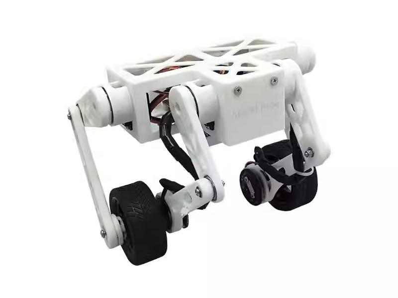
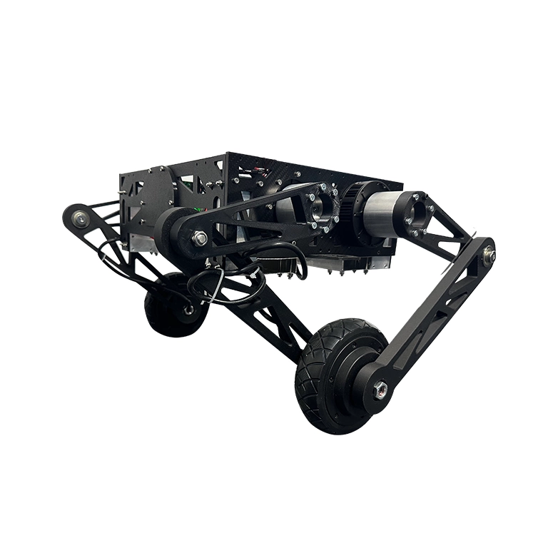

## 第1章 绪论

### 课程简介

本教程是一套面向工程实践的轮足机器人运动控制系统化学习课程，
以真实可运行的轮足机器人平台为载体，循序渐进地讲解从基础自平衡控制
到高级控制算法的完整技术路线。

课程内容紧密围绕轮足机器人的核心问题展开，包括：

- 俯仰自平衡与速度闭环控制  
- 姿态控制与地形自适应算法  
- 并联仿生腿控制实现高机动运动  
- LQR、VMC 等高级运动控制算法  
- 强化学习训练轮足机器人  
- 轮足机器人其他应用和算法开发  

本教程既包含抽象公式推导，又强调：

> 物理意义 → 控制逻辑 → 可落地代码  

帮助学习者真正理解每一个控制算法：
为什么这样设计、解决了什么问题、在机器人上如何体现。

教程默认读者具备一定的嵌入式或机器人基础，包括但不限于：

- IMU、编码器、电机与舵机的基本使用经验  
- 对 PID 控制等基础控制思想有初步了解  

在此基础上，本课程将引导你建立完整的轮足机器人运动控制认知体系，
具备独立调试、改进算法，甚至扩展到强化学习或更多智能控制的能力。

通过本教程的学习，你将能够：

- 从零实现一个稳定、可控的轮足机器人自平衡系统  
- 掌握工程中真实可用的运动控制方法  
- 为后续深入研究机器人控制、强化学习或产品级开发打下坚实基础  

---

### 教具轮足机器人介绍

#### StackForce Mini Wheeled-Legged Robot

StackForce Mini Wheeled-Legged Robot是一款双足轮式机器人，融合了先进的全身运动学模型和状态自适应自稳算法。它能够实现多姿态控制、复杂地形自稳以及下楼梯功能。该机器人支持多种控制方式，包括遥控器、蓝牙、串口和无线通信，用户可以根据需求进行编程和调节。产品还提供全面的安装教程和视频课程，使其成为一款极具性价比的桌面双足轮式机器人。

- 淘宝购买渠道 🛒（待补充）  
- 国际站购买渠道 🛒（待补充）  

| 类型         | 规格 |
|--------------|------|
| 主控板       | StackForce 主控板 |
| 电机驱动板   | 5A 双通道无刷电机驱动器（低功耗） |
| 电机         | 2208 云台无刷电机 |
| 舵机驱动板   | 集成 IMU 的多通道舵机驱动器 |
| 电源         | 12.6V 锂聚合物电池 |
| 编码器       | MT6701 14 位高精度磁编码器 |
| 无线控制     | WiFi 遥控 + PS4 蓝牙无线手柄 |
| 总重量       | 540 克 |
| 尺寸         | 10.5 × 21.0 厘米（长 × 宽），高度 12.0–21.0 厘米 |

其他参考资料：

- Wiki：[Stackforce Mini Wheeled-Legged Robot Wiki](https://wiki.seeedstudio.com/stackforce_mini_wheeled_legged_robot/)

---

#### StackForce High Torque Wheel-Legged Robot

StackForce 大轮腿机器人利用精确的运动学模型和自适应算法实时监控和调整姿态与速度，防止倾斜和翻倒。这确保了它在不平整的地面、急转弯或陡坡上，无论室内或室外，都能保持稳定运动。配备无刷电机，它提供平稳且稳定的运动能力。机器人还附带全面的安装指南和视频教程，帮助开发者快速入门开发，并实现各种创新应用，例如部署 LQR 控制算法、强化学习，或集成视觉识别和导航功能。

- 淘宝购买渠道 🛒（待补充）  
- 国际站购买渠道 🛒（待补充）  

| 规格项       | 详细说明 |
|--------------|----------|
| 主控制板     | StackForce 控制板 |
| 电机驱动板   | 25A 大功率无刷电机驱动器 |
| 电源         | 22.2V 6S 锂聚合物电池（航模级） |
| 电机         | 关节电机 + 轮式电机 |
| 总重量       | 10 千克 |
| 尺寸         | 50 cm × 56 cm（长 × 宽），高度：16–50 cm |

其他参考资料：

- Wiki：[StackForce High Torque Wheel-Legged Robot](https://wiki.seeedstudio.com/lerobot_starai_arm/)  

---

### Github

（待补充）
