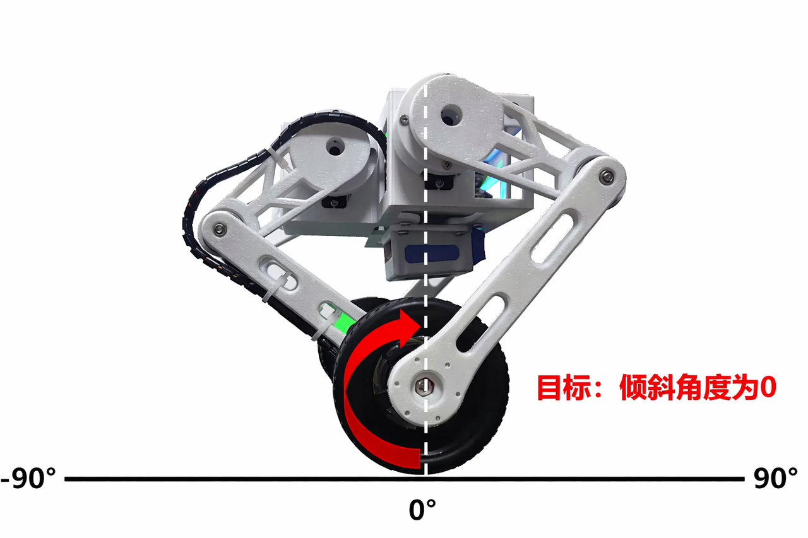
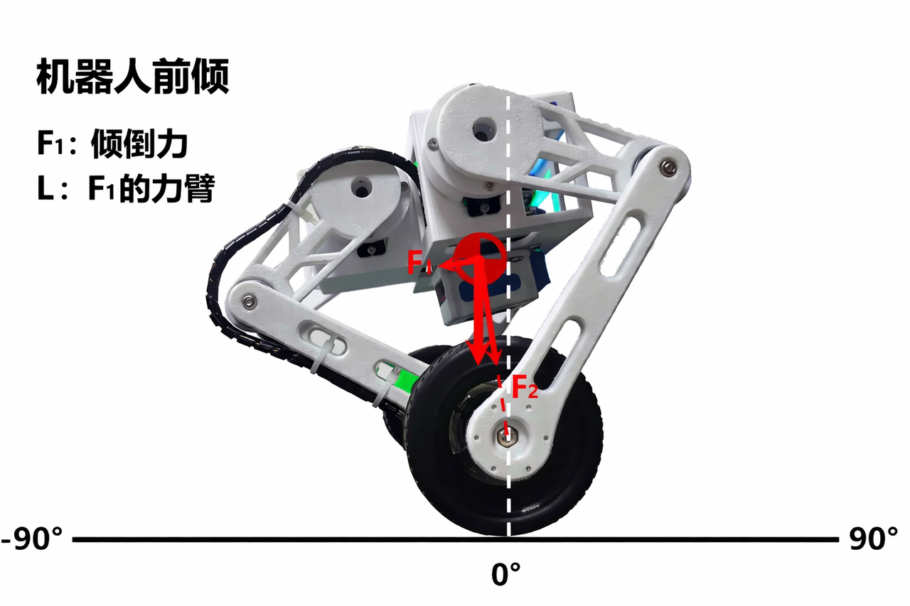
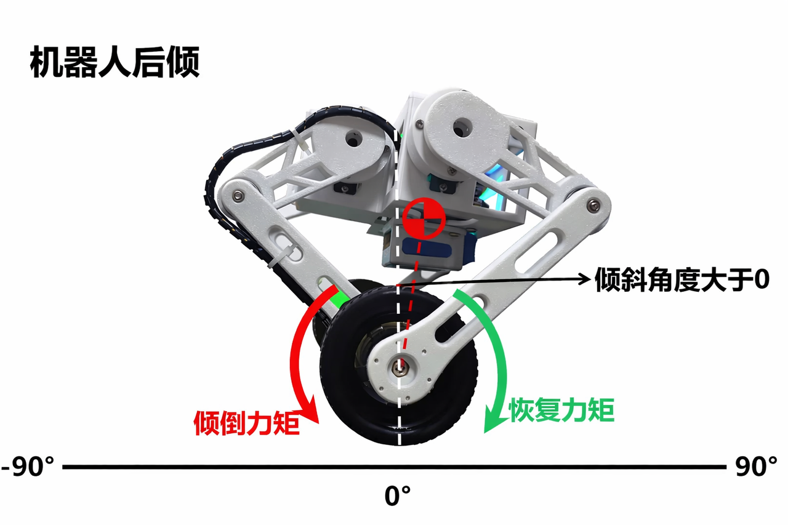
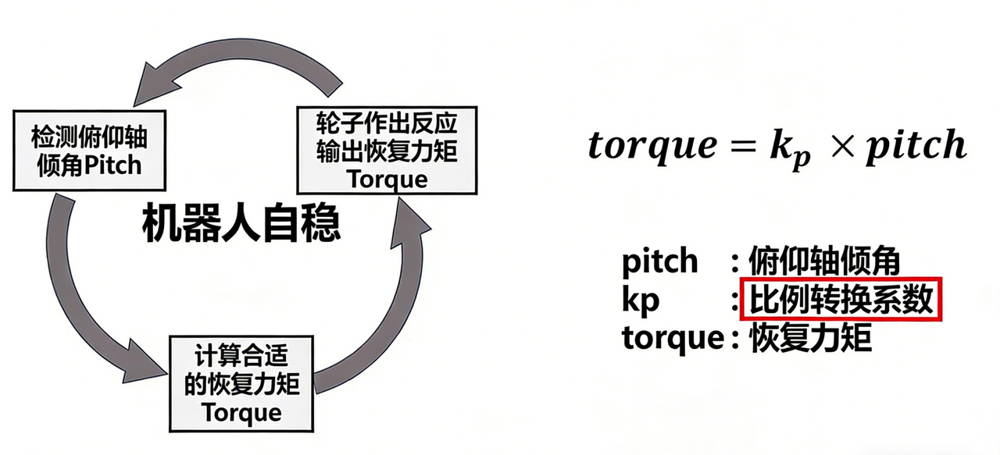
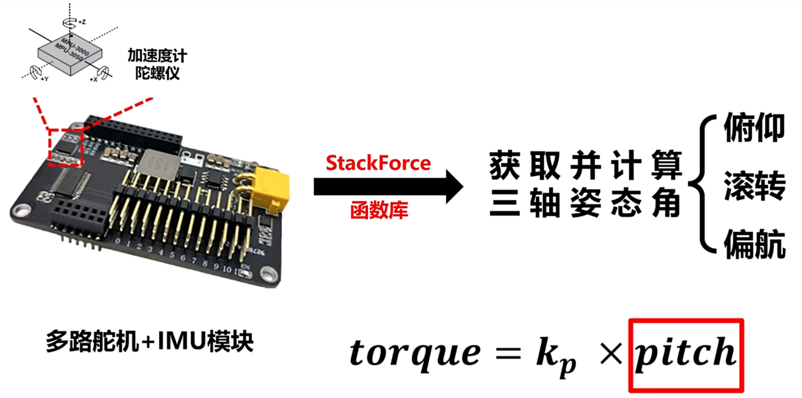
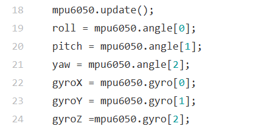
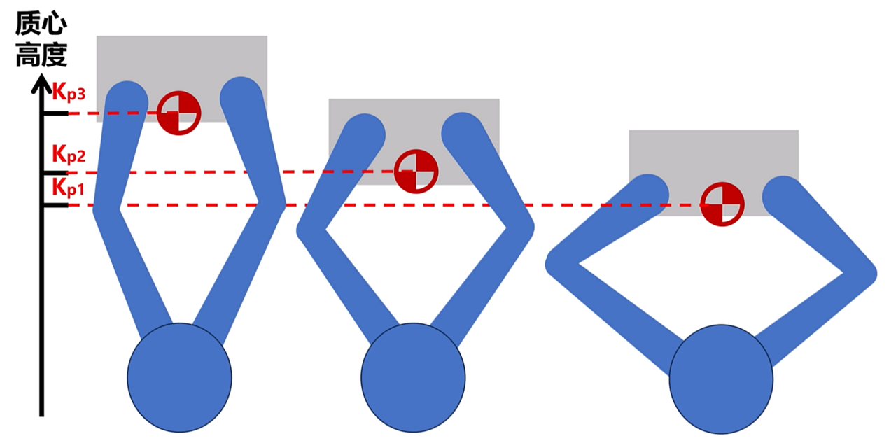
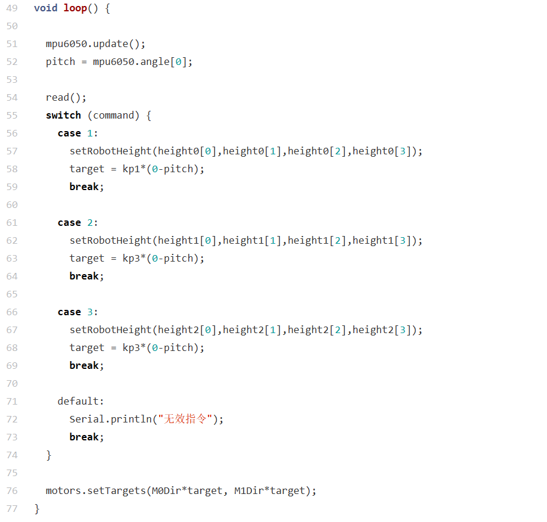

## 第2章 俯仰角自平衡移动

### 俯仰自稳定原理

轮足机器人自稳的效果是保持身体垂直于地面的平衡状态，其平衡本质上是**力矩的博弈**。

#### 1. 倾倒力矩

当机器人的重心（CoG）不在轮轴正上方时，重力会产生一个使机器人倒下的力矩。

* **物理分析**：当机器人前倾角度为$\theta$时，重力$G$会分解出一个垂直于腿部的分力$F_1$。

* **力臂 $L$**：质心到轮轴中心点的距离。

* **倾倒力矩 $T_1 = F_1 \cdot L$**。

* **结论**：倾角$\theta$越大或腿长$L$越长，倾倒力矩就越大，机器人倒得越快。

#### 2. 恢复力矩&#x20;

为了抵消 $T_1$，我们需要通过轮子的加速运动产生一个反向的力矩。

* **控制逻辑**：

  * **前倾时**：轮子必须迅速**向前**加速，使底盘跑向重心下方。

  * **后倾时**：轮子必须迅速**向后**加速。

* **目标**：使俯仰角（Pitch）始终趋近于 **0°**。

|||
|--------------|--------------|

#### 3. P 环控制

在该自稳系统中，**P环（比例控制）**&#x662F;最基础也最核心的部分。它的任务是根据当前&#x7684;**“倒下程度”（倾角）**，实时计算&#x51FA;**“扶正力度”（力矩）**。

**1. 核心公式**

我们建立倾角与力矩的线性比例关系：

$$\text{Torque} = k_p \times \text{Pitch}$$

* **Pitch (俯仰角)**：当前的姿态偏差（输入）。

* $k_p$**&#x20;(比例系数)**：比例转换系数，决定了机器人对倾斜的“敏感度”。

* **Torque (恢复力矩)**：轮子对地面输出的反作用力矩（输出）。

**2. 闭环反馈流程**

如上图所示，机器人的自稳是一个持续不断的闭环过程：

1.**检测**：开发板上的陀螺仪模块实时获取俯仰轴倾角 (Pitch)。

2.**计算**：通过 $k_p$ 将角度转化为目标恢复力矩 (Torque)。

3.**执行**：电机/轮子作出反应，输出力矩试图修正姿态。

4.**循环**：不断重复上述步骤，达到动态平衡。

> &#x20;lesson3\_poseRead / src / main.cpp
>
> 代码中展示了陀螺仪的数据读取，并保存到对应变量中。

**3. 调试关键：寻找完美的$k_p$**

调节 $k_p$ 的过程本质上是在**响应速度**与**稳定性**之间寻找平衡。

且**不同高度姿态**对应下的$k_p$也会不一样。

> &#x20;lesson3\_Stable / src / main.cpp&#x20;
>
> 代码中提供了3个不同的高度姿态，对应了$k_p1$ $k_p2$ $k_p3$，3个不同比例系数。

### 自稳优化+前后移动

#### 俯仰自稳定的缺陷

为了提升轮足机器人的稳定性，仅仅依&#x9760;**“纠正倾角”是不够的，很容易会导致机器人摔倒**。例如，机器人倾斜时，重力的水平分力会立即产生前进或后退的加速度。传感器只能在倾斜发生后捕捉角度，此时机器人已积累了一定量的前进速度。俯仰自稳程序虽然能产生恢复力矩将身体拉直，但它**无法消除已经存在的水平速度**。机器人会因为惯性持续加速，直到电机转速达到物理极限，无法再提供足够的力矩来维持平衡，最终导致摔倒 。

#### 轮速控制

要彻底解决稳定性问题，必须引入**轮速控制**，通过主动调整机器人的目标姿态来抵消累积的速度。

1. **后倾减速原理**

* 当机器人产生前进速度时，程序不再将目标倾角设定为 0。

* 程序会计算出一个适配的**后倾角度（减速倾角）**。

* 机器人通过主动向后倾斜，利用重力的反向分量作为“刹车”，抵消前进惯性，使速度逐渐回归至零。

* **算法逻辑实现**

控制程序通过以下两个核心环路实时运行：

A. 速度环：计算**目标角度（减速倾角）**

$$targetAngle = Kp \times (0 - speedAvg)$$

* **speedAvg**：通过编码器读取的轮子当前平均速度。

* **Kp**：比例转换系数，将速度差值转化为适配的倾角。

B. 角度环：计算恢复力矩

$$Torque = Kp \times (targetAngle - pitch)$$

* 程序根据**目标倾角**与**传感器实测倾角**的差值，计算出电机应输出的补偿力矩。

#### 前后移动

在之前的“原地自稳”逻辑中，我们将目标速度硬编码为 `0`。如果想要机器人动起来，只需要将公式中的 `0` 替换为一个动态变量 **targetSpeed**。

1. 动态变量替换

我们将速度环公式升级为：

$$targetAngle = Kp \times (targetSpeed - speedAvg)$$

* **targetSpeed**：这是我们希望机器人达到的目标行驶速度。

* **含义**：公式现在计算的是**目标速度**与**实际速度**之间的差值。机器人会为了消除这个差值，自动调整身体的倾斜角度。

角度环不变：

$$Torque = Kp \times (targetAngle - pitch)$$

* 移动过程详解

- **启动**阶段：当你设定 $targetSpeed > 0$（例如设定为前进 0.5m/s）时，由于 $speedAvg$ 此时为 0，公式会计算出一个正向的前倾目标角（$targetAngle$）。机器人随之前倾，**利用重力的向前分力开始加速**。

- **匀速**阶段：随着轮速增加，$speedAvg$逐渐接近$targetSpeed$，速度差值变小，**机器人的目标倾角也会自动回正**。当实际速度等于目标速度时，机器人将**保持微小的倾角以维持平衡移动**。

- **停止**阶段：当你重新将 $targetSpeed$ 设为 0，机器人会发现当前 $speedAvg$ 远大于目标值，从而计算出一个负向的后倾角（**后倾减速**），利用重力迅速“刹车”直到静止。

> &#x20;lesson4\_VelCtrl / src / main.cpp&#x20;
>
> 该代码通过motors.getBLDCData()获取轮子速度并计算机器人整体速度speedAvg，之后mpu6050.update()函数更新陀螺仪数据，setRobotHeight函数设置舵机角度，固定腿部姿态，最后根据轮速控制公式计算力矩torque，并用motors.setTargets函数发送轮子控制指令。

### 转弯控制

机器人实现转向功能，其原理和坦克一样，通过左右轮的**速度差**来实现转向。

在之前计算出的恢复力矩（$Torque$）基础上，叠加一个转向力矩（$turnTorque$）：

* **左轮输出** = $Torque + turnTorque$

* **右轮输出** = $Torque - turnTorque$

当 $turnTorque$ 为正时，左轮推力增大，右轮推力减小，机器人向右转；反之向左转。

> &#x20;lesson5\_TurnCtrl / src / main.cpp&#x20;
>
> 大致都与 lesson4\_VelCtrl / src / main.cpp 相同，只需接着引入转向力矩即可求出期望力矩。

