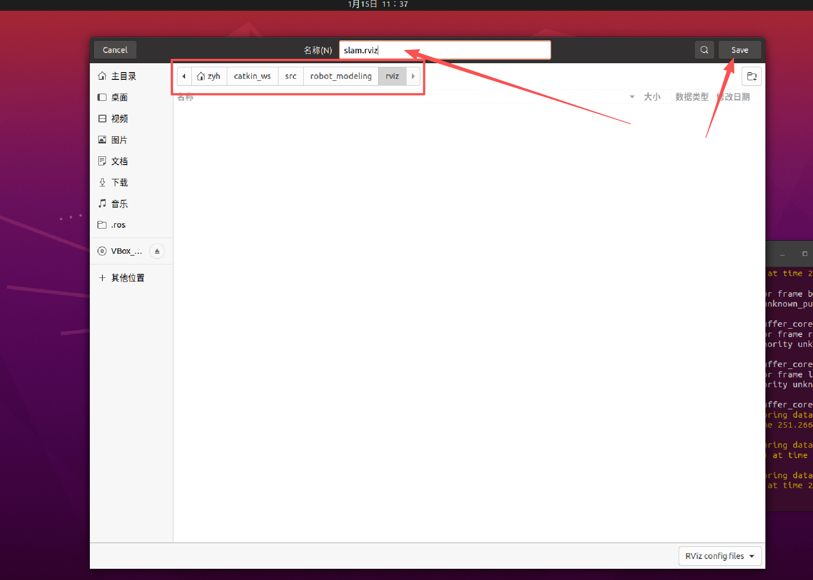
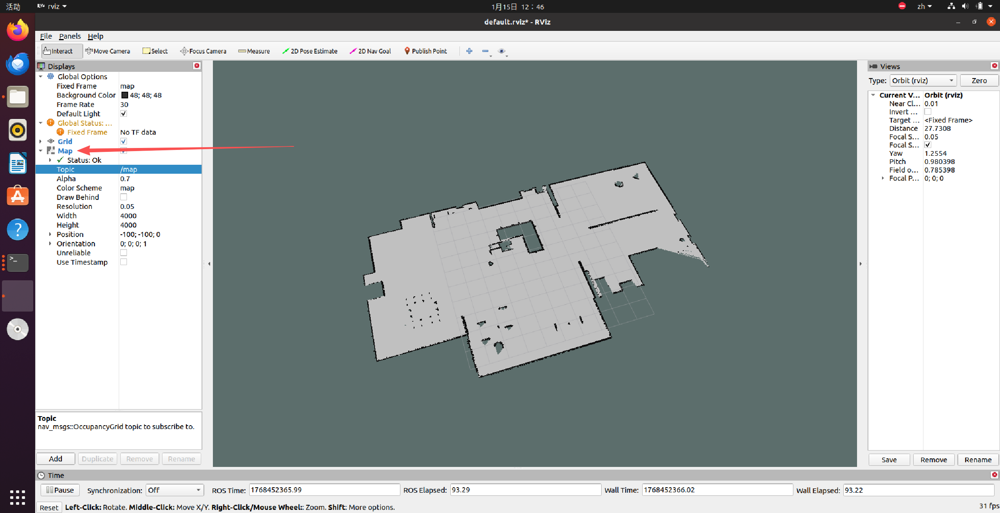

### 第二阶段：仿真与建图 (SLAM)

#### 1. 启动 Gazebo 环境

运行 `roslaunch robot_modeling gazebo_world.launch`。

<p align="center">
  <a>
    
  </a>
</p>


#### 2. 开启 SLAM 建图
我们需要运行 `gmapping` 算法。确保已安装：`sudo apt install ros-noetic-gmapping ros-noetic-map-server`。

新建 `~/catkin_ws/src/robot_modeling/launch/slam_gmapping.launch`：

```xml
<launch>
    <!-- 启动 Gmapping 节点 -->
    <node pkg="gmapping" type="slam_gmapping" name="slam_gmapping" output="screen">
        <param name="base_frame" value="base_footprint"/>
        <param name="odom_frame" value="odom"/>
        <param name="map_frame"  value="map"/>
        <param name="scan_topic" value="scan"/>
        <!-- 稍微调大一点更新间隔，降低CPU占用 -->
        <param name="map_update_interval" value="2.0"/>
        <param name="delta" value="0.05"/>
    </node>

    <!-- 启动 Rviz 用于观看建图过程 -->
    <node name="rviz" pkg="rviz" type="rviz" args="-d $(find robot_modeling)/rviz/slam.rviz"/>
</launch>
```


**体验 2 (建图实战)：**

1.  **终端 1:** 编译环境
```bash
cd ~/catkin_ws
catkin_make
source devel/setup.bash
```

2.  **终端 2:** 启动算法 `roslaunch robot_modeling slam_gmapping.launch`
    *   *注：第一次 Rviz 需要配置：Fixed Frame 选 map，Add Map (Topic: /map), Add RobotModel, Add LaserScan。配置好后保存为 `slam.rviz`。*

<p align="center">
  <a>
    
  </a>
</p>

<p align="center">
  <a>
    
  </a>
</p>

<p align="center">
  <a>
    
  </a>
</p>


<p align="center">
  <a>
    
  </a>
</p>

3.  **终端 3:** 键盘控制 `rosrun teleop_twist_keyboard teleop_twist_keyboard.py`
4.  **操作：** 控制小车在房间里转悠。你会看到 Rviz 里的灰色未知区域逐渐变成白色（路）和黑色（墙）。

<p align="center">
  <a>
    
  </a>
</p>


5.  **保存地图：** 地图建好后，开启新的终端运行：
    ```bash
    mkdir -p ~/catkin_ws/src/robot_modeling/maps
    rosrun map_server map_saver -f ~/catkin_ws/src/robot_modeling/maps/my_map
    ```

---

6. **查看地图** 地图保存后，可以`Ctrl+C`关闭终端所有节点,新建 `~/catkin_ws/src/robot_modeling/launch/map_publish.launch`：
```
<launch>
    <!-- 设置地图的配置文件 -->
    <arg name="map" default="my_map.yaml" />
    <!-- 运行地图服务器，并且加载设置的地图-->
    <node name="map_server" pkg="map_server" type="map_server" args="$(find robot_modeling)/maps/$(arg map)"/>
    
    <!-- 启动 Rviz 用于观看建图过程 -->
    <node name="rviz" pkg="rviz" type="rviz" args="-d $(find robot_modeling)/rviz/slam.rviz"/>
</launch>
```

运行`roslaunch robot_modeling slam_gmapping.launch`,通过`Add`添加`Map`，并订阅`map`话题

<p align="center">
  <a>
    
  </a>
</p>
