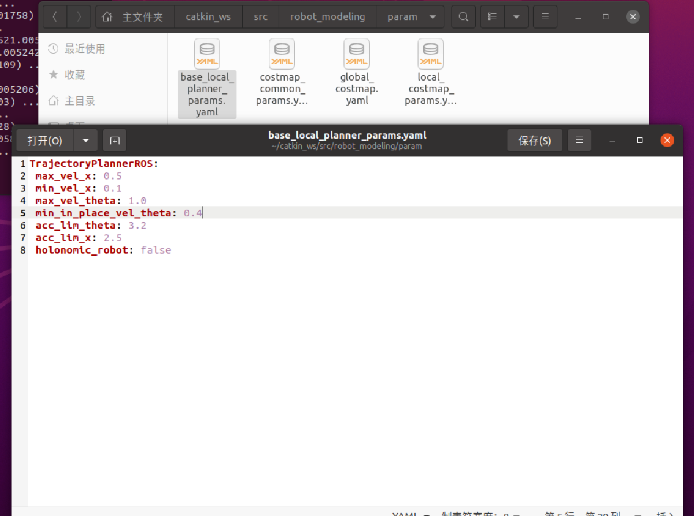

### 机器人定位AMCL
新建`~/catkin_ws/src/robot_modeling/launch/amcl.launch`

```
<launch>
<node pkg="amcl" type="amcl" name="amcl" output="screen">
  <!-- Publish scans from best pose at a max of 10 Hz -->
  <param name="odom_model_type" value="diff"/><!-- 里程计模式为差分 -->
  <param name="odom_alpha5" value="0.1"/>
  <param name="transform_tolerance" value="0.2" />
  <param name="gui_publish_rate" value="10.0"/>
  <param name="laser_max_beams" value="30"/>
  <param name="min_particles" value="500"/>
  <param name="max_particles" value="5000"/>
  <param name="kld_err" value="0.05"/>
  <param name="kld_z" value="0.99"/>
  <param name="odom_alpha1" value="0.2"/>
  <param name="odom_alpha2" value="0.2"/>
  <!-- translation std dev, m -->
  <param name="odom_alpha3" value="0.8"/>
  <param name="odom_alpha4" value="0.2"/>
  <param name="laser_z_hit" value="0.5"/>
  <param name="laser_z_short" value="0.05"/>
  <param name="laser_z_max" value="0.05"/>
  <param name="laser_z_rand" value="0.5"/>
  <param name="laser_sigma_hit" value="0.2"/>
  <param name="laser_lambda_short" value="0.1"/>
  <param name="laser_lambda_short" value="0.1"/>
  <param name="laser_model_type" value="likelihood_field"/>
  <!-- <param name="laser_model_type" value="beam"/> -->
  <param name="laser_likelihood_max_dist" value="2.0"/>
  <param name="update_min_d" value="0.2"/>
  <param name="update_min_a" value="0.5"/>

  <param name="odom_frame_id" value="odom"/><!-- 里程计坐标系 -->
  <param name="base_frame_id" value="base_footprint"/><!-- 添加机器人基坐标系 -->
  <param name="global_frame_id" value="map"/><!-- 添加地图坐标系 -->

  <param name="resample_interval" value="1"/>
  <param name="transform_tolerance" value="0.1"/>
  <param name="recovery_alpha_slow" value="0.0"/>
  <param name="recovery_alpha_fast" value="0.0"/>
</node>
</launch>
```

新建`~/catkin_ws/src/robot_modeling/launch/amcl_rviz.launch`
```
<launch>
    <!-- 设置地图的配置文件 -->
    <arg name="map" default="my_map.yaml" />
    <!-- 运行地图服务器，并且加载设置的地图-->
    <node name="map_server" pkg="map_server" type="map_server" args="$(find robot_modeling)/maps/$(arg map)"/>
    <!-- 启动AMCL节点 -->
    <include file="$(find robot_modeling)/launch/amcl.launch" />
    <!-- 运行rviz -->
    <node pkg="rviz" type="rviz" name="rviz"/>
</launch>
```


1.  **终端 1:** 启动 Gazebo `roslaunch robot_modeling gazebo_world.launch`
2.  **终端 2:** 启动导航 `roslaunch robot_modeling amcl_rviz.launch`
3.  **Rviz 配置 (nav.rviz):**
    *   Fixed Frame: `map`
    *   Add Map (Topic: `/map`) -> 这是你刚才建的图。
    *   Add RobotModel。
    *   Add LaserScan。
    *   Add PoseArray (Topic: `/particlecloud`) -> 显示红色箭头群（AMCL粒子）。
4.  **终端 3:** 启动键盘控制节点 `rosrun teleop_twist_keyboard teleop_twist_keyboard.py`
通过键盘控制机器人运动，会发现 posearray 也随之而改变，箭头越是密集，说明当前机器人处于此位置的概率越高。

<p align="center">
  <a>
    
  </a>
</p>


### 自主导航 (Navigation)

现在有了地图，我们要让小车自己去目的地。这需要 `move_base` 包。
安装依赖：`sudo apt install ros-noetic-navigation`

#### 1. 配置导航参数
在 `~/catkin_ws/src/robot_modeling` 下新建文件夹 `param`，并创建 4 个 `yaml` 配置文件。这是最劝退新手的步骤，我为你提供了**最简配置**。

<p align="center">
  <a>
    
  </a>
</p>

<p align="center">
  <a>
    
  </a>
</p>


*   **`costmap_common_params.yaml`** (公用参数)
    ```yaml
    obstacle_range: 2.5
    raytrace_range: 3.0
    footprint: [[-0.2, -0.12], [-0.2, 0.12], [0.2, 0.12], [0.2, -0.12]] # 车身轮廓
    inflation_radius: 0.55
    observation_sources: laser_scan_sensor
    laser_scan_sensor: {sensor_frame: laser_link, data_type: LaserScan, topic: scan, marking: true, clearing: true}
    ```

<p align="center">
  <a>
    
  </a>
</p>

*   **`local_costmap_params.yaml`** (局部地图 - 避障用)
    ```yaml
    local_costmap:
      global_frame: odom
      robot_base_frame: base_footprint
      update_frequency: 5.0
      publish_frequency: 2.0
      static_map: false
      rolling_window: true
      width: 6.0
      height: 6.0
      resolution: 0.05
    ```

<p align="center">
  <a>
    
  </a>
</p>

*   **`global_costmap_params.yaml`** (全局地图 - 规划路径用)
    ```yaml
    global_costmap:
      global_frame: map
      robot_base_frame: base_footprint
      update_frequency: 2.0
      static_map: true
    ```

<p align="center">
  <a>
    
  </a>
</p>


*   **`base_local_planner_params.yaml`** (轨迹规划器)
    ```yaml
    TrajectoryPlannerROS:
      max_vel_x: 0.5
      min_vel_x: 0.1
      max_vel_theta: 1.0
      min_in_place_vel_theta: 0.4
      acc_lim_theta: 3.2
      acc_lim_x: 2.5
      holonomic_robot: false
    ```

<p align="center">
  <a>
    
  </a>
</p>


#### 2. 编写导航 Launch 文件
新建 `~/catkin_ws/src/robot_modeling/launch/nav.launch`：

```xml
<launch>
    <!-- 1. 加载地图 -->
    <arg name="map_file" default="$(find robot_modeling)/maps/my_map.yaml"/>
    <node name="map_server" pkg="map_server" type="map_server" args="$(arg map_file)" />

    <!-- 2. 启动 AMCL (定位) -->
    <node pkg="amcl" type="amcl" name="amcl" output="screen">
        <param name="base_frame_id" value="base_footprint"/>
        <param name="odom_frame_id" value="odom"/>
        <param name="scan_topic"    value="scan"/>
    </node>

    <!-- 3. 启动 Move Base (路径规划) -->
    <node pkg="move_base" type="move_base" respawn="false" name="move_base" output="screen">
        <rosparam file="$(find robot_modeling)/param/costmap_common_params.yaml" command="load" ns="global_costmap" />
        <rosparam file="$(find robot_modeling)/param/costmap_common_params.yaml" command="load" ns="local_costmap" />
        <rosparam file="$(find robot_modeling)/param/local_costmap_params.yaml" command="load" />
        <rosparam file="$(find robot_modeling)/param/global_costmap_params.yaml" command="load" />
        <rosparam file="$(find robot_modeling)/param/base_local_planner_params.yaml" command="load" />
    </node>

    <!-- 4. Rviz -->
    <node name="rviz" pkg="rviz" type="rviz" args="-d $(find robot_modeling)/rviz/nav.rviz" />
</launch>
```

#### 3. 终极体验：自主导航
这是整个教程的高光时刻。

1.  **终端 1:** 启动 Gazebo `roslaunch robot_modeling gazebo_world.launch`
2.  **终端 2:** 启动导航 `roslaunch robot_modeling nav.launch`
3.  **Rviz 配置 (nav.rviz):**
    *   Fixed Frame: `map`
    *   Add Map (Topic: `/map`) -> 这是你刚才建的图。
    *   Add RobotModel。
    *   Add LaserScan。
    *   Add Path (Topic: `/move_base/NavFnROS/plan`) -> 显示规划的绿线。
    *   Add PoseArray (Topic: `/particlecloud`) -> 显示红色箭头群（AMCL粒子）。

**如何玩：**
1.  **初始化定位：** 点击 Rviz 顶部的 **"2D Pose Estimate"**，在地图上绿色箭头画出机器人现在大致的位置和朝向。你会看到红色的粒子群聚拢到车周围。
2.  **发布目标：** 点击 Rviz 顶部的 **"2D Nav Goal"**，在地图上任意点个位置，按住鼠标拖动设置朝向。
3.  **见证奇迹：**
    *   一条绿色的路径线会出现。
    *   小车会自动避开障碍物，向目标点移动。
    *   Gazebo 里的小车也在同步移动。

<p align="center">
  <a>
    
  </a>
</p>


