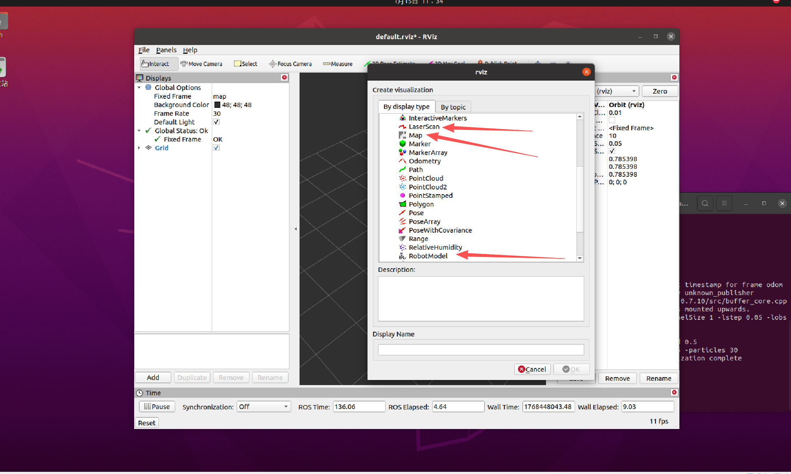
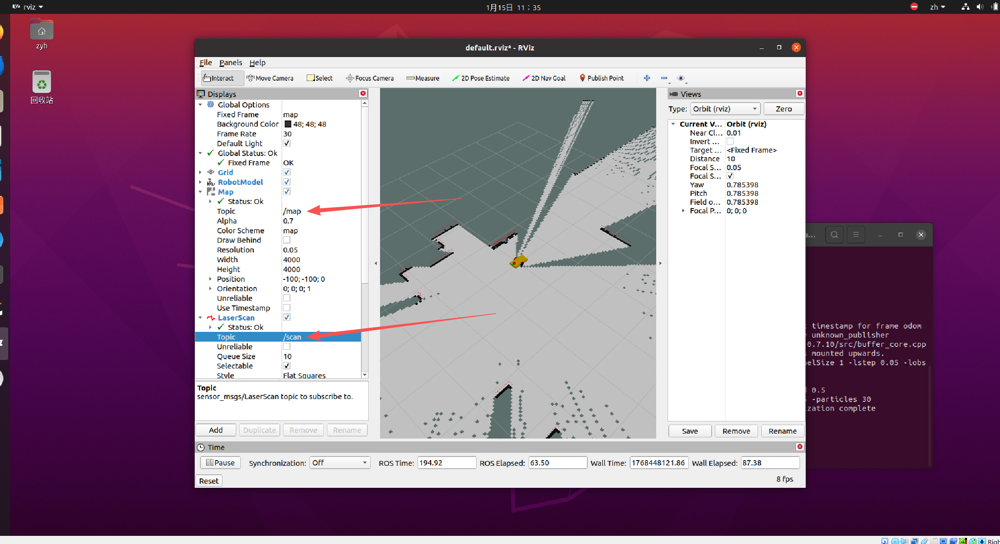
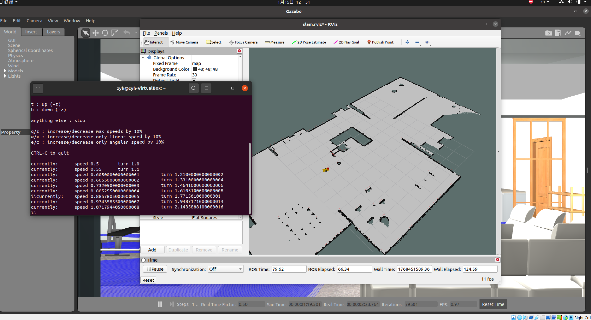
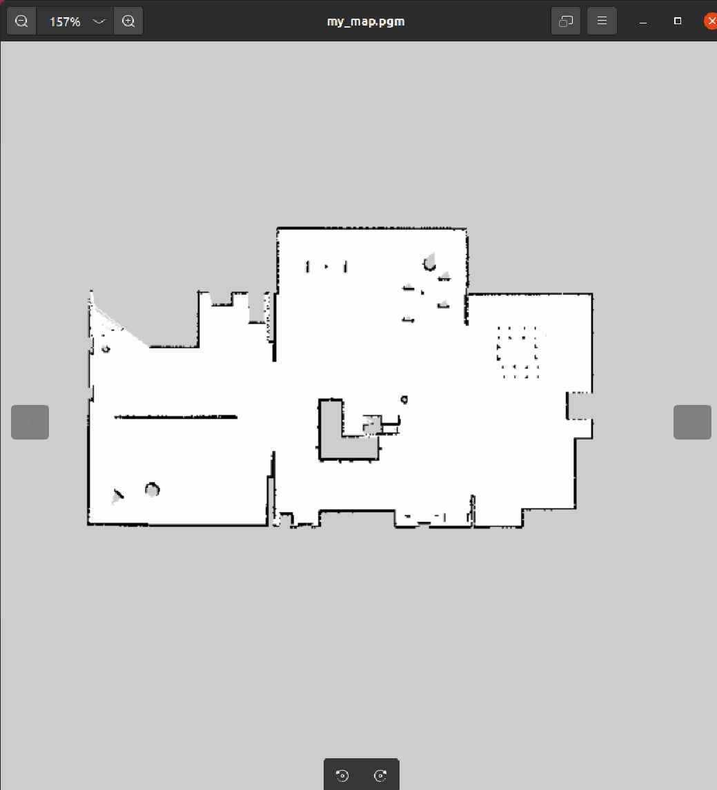

# SLAM 建图原理

在拥有了机器人模型（URDF）并让它在仿真环境动起来之后，我们要解决机器人的哲学三问：**“我是谁？我在哪？我要去哪？”**。而解决这些问题的基础，就是 **SLAM（建图）**。

## 1. 什么是 SLAM？（核心比喻）

**SLAM** 全称是 *Simultaneous Localization and Mapping*，中文译为：**即时定位与地图构建**。

**核心比喻：**
想象你被蒙上双眼，扔进了一个完全陌生的黑屋子。你手里只有一把**激光测距仪**（雷达）和你的**双脚**（里程计）。
1.  **移动：** 你向前走几步，心里估算着走了 2 米（这是**里程计**）。
2.  **感知：** 你用测距仪对着四周扫一下，发现正前方 3 米有一堵墙（这是**激光雷达**）。
3.  **对齐：** 如果你走了 2 米，原本在 5 米外的墙现在应该在 3 米处。如果测距仪显示的数字对得上，你就知道自己没走错；如果对不上（比如地板太滑，你以为走了 2 米其实只挪了 1 米），你就要**修正**你对自己位置的判断。
4.  **绘图：** 你在脑子里记下：这里有一堵墙。

**这就是 SLAM：边走边测，边测边修正，最后画出一张完整的地图。**


---

## 2. 机器人建图的三大“神兵利器”

要实现 SLAM，机器人必须具备以下三样东西：

### A. 眼睛：激光雷达 (LaserScan)
*   **作用：** 告诉机器人周围障碍物的距离和角度。
*   **数据格式：** `sensor_msgs/LaserScan`。
*   **局限：** 雷达只能看到“点”，它不知道这个点是墙还是桌腿。

### B. 体感：里程计 (Odometry)
*   **作用：** 通过编码器（数轮子转了多少圈）或惯性单元（IMU），估算机器人走过的距离和转过的角度。
*   **数据格式：** `nav_msgs/Odometry`。
*   **局限：** 轮子会打滑，时间久了会产生**累计误差**。

### C. 大脑：SLAM 算法 (如 Gmapping)
*   **作用：** 把“不完全准的里程计”和“有噪声的雷达”结合起来，通过复杂的数学（如粒子滤波），计算出机器人最可能的真实位置，并画出地图。


以下是 **SLAM（以 Gmapping 为例）的底层逻辑架构图** 以及详细的**四大核心逻辑**解析。

<p align="center">
  <a>
    
  </a>
</p>


### 1. 预测与观测的“博弈”（位姿估计逻辑）
这是 SLAM 最核心的逻辑。机器人时刻面临两个声音：
*   **里程计（预测）：** “根据轮子转速，我觉得我向前走了 1 米。”（由于打滑，通常**不准**）。
*   **激光雷达（观测）：** “根据我看到的墙壁形状，我发现我其实只走了 0.9 米。”（由于传感器噪点，也会有**偏差**）。

**底层逻辑：** SLAM 算法通过数学手段（如高斯分布或粒子滤波），将这两者结合。它倾向于相信雷达观测到的“环境特征”，并据此修正里程计的累积误差。

### 2. 粒子滤波：平行宇宙理论（Gmapping 特色）
Gmapping 算法内部维护着几十个“粒子”。
*   **逻辑：** 每个粒子都是机器人对自身位置的一个**“假设”**。
    *   粒子 A 认为：机器人在 (1.0, 0.5) 位置。
    *   粒子 B 认为：机器人在 (1.1, 0.5) 位置。
*   **优胜劣汰：** 算法对比雷达扫到的墙壁和地图的重合度。重合度高的粒子，**权重增加**；重合度低的粒子，**被杀掉（销毁）**。
*   **最终结果：** 剩下的粒子会聚集在最真实的位置，机器人就此锁定了自己的坐标。

### 3. 栅格地图的“概率论”（地图构建逻辑）
SLAM 算法生成的地图叫做 **栅格地图 (Grid Map)**。它像一张巨大的 Excel 表格，每一个小方格（Pixel）代表现实世界中的一小块面积（比如 5cm x 5cm）。

在 ROS 的 `nav_msgs/OccupancyGrid` 消息中，每个格子的取值如下：
*   **0 (白色)：** **空闲 (Free)**。机器人可以安全通过。
*   **100 (黑色)：** **占用 (Occupied)**。这里有墙或障碍物，撞上去会宕机。
*   **-1 (灰色)：** **未知 (Unknown)**。雷达还没扫到过这里，可能是墙，也可能是路。

地图不是一次性画好的，而是多次“涂抹”的结果。
*   **逻辑：** 地图里的每个格子（5cm x 5cm）都有一个“占用概率”。
    *   雷达光束穿过的格子，**占用概率降低**（变白，代表路）。
    *   雷达光束末端击中的格子，**占用概率增加**（变黑，代表墙）。
*   **抗噪：** 如果一次噪点导致雷达误报前方有墙，没关系。因为在后续的 100 次扫描中，该位置都是空的，概率会重新降下来。这保证了地图的鲁棒性。

### 4. TF 坐标系的“动态补差”（坐标补偿逻辑）

在建图过程中，理解坐标系变换 (TF) 是新手的“第一道坎”。SLAM 的运行依赖于一套严密的“父子关系”：

1.  **`map` (地图坐标系)：** 整个世界的坐标原点。它是不动的。
2.  **`odom` (里程计坐标系)：** 机器人出发的起点。理想状态下它和 `map` 重合，但因为轮子打滑，它会相对于 `map` 漂移。
3.  **`base_link` (机器人基坐标系)：** 机器人的中心点。它随着机器人移动而移动。
4.  **`laser_frame` (雷达坐标系)：** 雷达安装的位置。

**关键点：** 
*   `base_link` 到 `laser_frame` 的变换由你的 **URDF** 决定（固定不变）。
*   `odom` 到 `base_link` 的变换由 **机器人的驱动程序/仿真插件** 发布（告诉你走了多远）。
*   **`map` 到 `odom` 的变换由 SLAM 算法（如 Gmapping）发布。** 

**为什么 SLAM 要发布 `map -> odom` 的坐标变换？**

*   **现状：** 机器人的里程计（`odom -> base_link`）会随着时间不断漂移。
*   **逻辑：** 
    *   如果你发现地图上的机器人“瞬移”了，那是因为 SLAM 算法计算出：*“里程计发给我的位置错了 0.1 米，我要发布一个 `map` 到 `odom` 的 0.1 米补偿值，把机器人拽回正确的位置。”*
*   **直观感受：** 在 Rviz 里，你会看到坐标轴 `odom` 相对于 `map` 在不停地细微跳动，那就是 SLAM 在帮你修正误差。


---

## 3. 准备工作：安装 Gmapping

在开始实操前，请确保你已经安装了 Gmapping 功能包：

```bash
# 请将 <ros_distro> 替换为你的版本，如 noetic 或 melodic
sudo apt install ros-<ros_distro>-gmapping ros-<ros_distro>-map-server
```

### 为什么选择 Gmapping？
*   **成熟稳定：** 它是 ROS 社区使用最广的 2D SLAM 算法。
*   **配置简单：** 它是初学者理解 SLAM 流程的最佳教材。
*   **性能平衡：** 对计算资源要求不高，普通的笔记本电脑就能流畅运行。

---

## 4. SLAM 建图的关键参数（避坑指南）

当你配置建图节点时，这几个参数直接决定了地图的好坏：

*   **`map_update_interval`：** 地图多久更新一次？设得太快（如 0.1s）电脑会卡死，太慢（如 10s）你开完一圈了地图还没出来。
*   **`maxUrange`：** 雷达能看多远？设得太短，大房间中间会是一片空白。
*   **`delta` (分辨率)：** 地图每个格子的尺寸。默认 0.05（5厘米）。设得太小会极度消耗内存。

---

## 5. 启动 Gazebo 环境

运行 `roslaunch robot_modeling gazebo_world.launch`。

<p align="center">
  <a>
    
  </a>
</p>


## 6. 开启 SLAM 建图
我们需要运行 `gmapping` 算法。确保已安装：`sudo apt install ros-noetic-gmapping ros-noetic-map-server`。

新建 `~/catkin_ws/src/robot_modeling/launch/slam_gmapping.launch`：

```xml
<launch>
    <!-- 启动 Gmapping 节点 -->
    <node pkg="gmapping" type="slam_gmapping" name="slam_gmapping" output="screen">
        <param name="base_frame" value="base_footprint"/>
        <param name="odom_frame" value="odom"/>
        <param name="map_frame"  value="map"/>
        <param name="scan_topic" value="scan"/>
        <!-- 稍微调大一点更新间隔，降低CPU占用 -->
        <param name="map_update_interval" value="2.0"/>
        <param name="delta" value="0.05"/>
    </node>

    <!-- 启动 Rviz 用于观看建图过程 -->
    <node name="rviz" pkg="rviz" type="rviz" args="-d $(find robot_modeling)/rviz/slam.rviz"/>
</launch>
```


**体验 2 (建图实战)：**

1.  **终端 1:** 编译环境
```bash
cd ~/catkin_ws
catkin_make
source devel/setup.bash
```

2.  **终端 2:** 启动算法 `roslaunch robot_modeling slam_gmapping.launch`
    *   *注：第一次 Rviz 需要配置：Fixed Frame 选 map，Add Map (Topic: /map), Add RobotModel, Add LaserScan。配置好后保存为 `slam.rviz`。*

<p align="center">
  <a>
    
  </a>
</p>

<p align="center">
  <a>
    
  </a>
</p>

<p align="center">
  <a>
    
  </a>
</p>


<p align="center">
  <a>
    
  </a>
</p>

3.  **终端 3:** 键盘控制 `rosrun teleop_twist_keyboard teleop_twist_keyboard.py`
4.  **操作：** 控制小车在房间里转悠。你会看到 Rviz 里的灰色未知区域逐渐变成白色（路）和黑色（墙）。

<p align="center">
  <a>
    
  </a>
</p>


5.  **保存地图：** 地图建好后，开启新的终端运行：
    ```bash
    mkdir -p ~/catkin_ws/src/robot_modeling/maps
    rosrun map_server map_saver -f ~/catkin_ws/src/robot_modeling/maps/my_map
    ```

- map_saver节点说明：
map_saver节点会去订阅map(nav_msgs/OccupancyGrid)这个Topic来生成地图文件，我们可打开`~/catkin_ws/src/robot_modeling/maps`路径下生成的`my_map.yaml`和`my_map.pgm`文件进行查看。

<p align="center">
  <a>
    
  </a>
</p>

<p align="center">
  <a>
    
  </a>
</p>


  - image:图片保存路径，它可以是绝对值也可以是相对值。

  -  resolution: 图片分片率(单位: m/像素)。

  -  origin: 地图中左下像素的二维姿势，为（x，y，偏航），偏航为逆时针旋转（偏航= 0表示无旋转）。

  - occupied_thresh: 占用概率大于此阈值的像素被视为完全占用。

  - free_thresh: 占用率小于此阈值的像素被视为完全空闲。

  - negate: 是否应该颠倒白色/黑色自由/占用的语义。


---


6. **查看地图** 地图保存后，可以`Ctrl+C`关闭终端所有节点,新建 `~/catkin_ws/src/robot_modeling/launch/map_publish.launch`：
    ```xml
    <launch>
        <!-- 设置地图的配置文件 -->
        <arg name="map" default="my_map.yaml" />
        <!-- 运行地图服务器，并且加载设置的地图-->
        <node name="map_server" pkg="map_server" type="map_server" args="$(find robot_modeling)/maps/$(arg map)"/>
        
        <!-- 启动 Rviz 用于观看建图过程 -->
        <node name="rviz" pkg="rviz" type="rviz" args="-d $(find robot_modeling)/rviz/slam.rviz"/>
    </launch>
    ```

运行`roslaunch robot_modeling slam_gmapping.launch`,通过`Add`添加`Map`，并订阅`map`话题

<p align="center">
  <a>
    
  </a>
</p>

你可以看到刚才扫描的一张完整的地图被发布并可视化在Rviz中。下一节课，我们让机器人能够自主的点到点进行路径规划和避障。