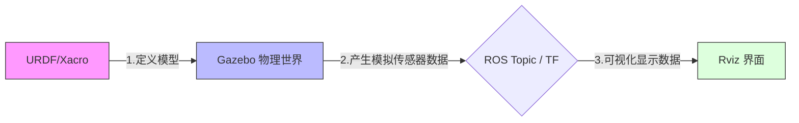

这里为您提供两份独立的文档，一份为纯中文版，另一份为纯英文版。
# 第2章 ROS机器人仿真：开启虚拟世界的大门

在机器人开发领域，直接在实体硬件上运行代码往往面临着“高成本、高风险、低效率”的困境。为了解决“买不起、不敢撞、场地难找”等痛点，**仿真（Simulation）**成为了ROS开发的核心环节。
在开始这节课之前请确保你已经通过了ROS基础入门课程，这将帮助你更高效的学习机器人仿真。

---

### 1.1 为什么要进行仿真？

机器人仿真是通过计算机软件模拟物理实体的技术。在代码部署到真机之前，仿真环境充当了“沙盒”的角色。

#### 核心优势
*   **成本控制**：无需购买昂贵的机器人，一台电脑即可验证算法。
*   **安全兜底**：撞墙、跌落或失控不会造成硬件损坏，降低试错成本。
*   **环境灵活**：可以瞬间切换迷宫、办公楼或户外环境。

#### 局限性（仿真与现实的差距）
*   **物理引擎误差**：摩擦力、阻力等在仿真中是近似计算。
*   **理想化数据**：仿真中的传感器数据通常过于完美，没有现实中的电磁干扰或粉尘噪声。

---

### 1.2 仿真三剑客：URDF, Rviz 与 Gazebo

在ROS仿真体系中，我们主要依赖三个核心工具。理解它们的分工是新手的首要任务。

#### 1. 机器人的“DNA”：URDF
*   **作用**：定义机器人的外观（长宽高）、物理属性（质量、惯性）以及关节结构。
*   **比喻**：它是机器人的**解剖图**或**说明书**。它是静态的 XML 描述文件。
*   **核心逻辑**：回答了“**我是谁？**”的问题。

#### 2. 机器人的“监视器”：Rviz
*   **作用**：**数据可视化工具**。它把雷达的点云、摄像头的画面、坐标系（TF）“画”在屏幕上给人看。
*   **底层逻辑**：**Rviz不进行任何物理计算**。它只是一个单纯的显示器，数据发过来它就画，没发它就空。
*   **核心逻辑**：回答了“**我看到了什么？**”的问题。

#### 3. 机器人的“元宇宙”：Gazebo
*   **作用**：**3D物理仿真引擎**。它模拟重力、阻力、碰撞、光照等真实世界的物理规则。
*   **底层逻辑**：在Gazebo里，机器人会因为重心不稳而倒下，会因为撞墙而停下。它是真正的物理模拟器。
*   **核心逻辑**：回答了“**我在哪？物理环境如何？**”的问题。

---

### 1.3 核心工作流：它们如何协同工作？

理解这三者的配合逻辑是理解 ROS 导航的关键：



1.  **URDF** 告诉 **Gazebo**：“请在这个世界里生成一个重10kg、带雷达的机器人”。
2.  **Gazebo** 计算物理反馈，并通过 Topic 发出消息：“雷达检测到前方1米有墙”。
3.  **Rviz** 接收 Topic 并显示：“在屏幕上画一个红点，告知开发者前方1米有障碍物”。

---

### 1.4 环境配置与避坑指南

如果你安装的是全功能版 ROS（desktop-full），工具通常已预装。

#### ⚠️ 常见问题修复

**1. 虚拟机中Gazebo闪退或黑屏**
*   *解法*：禁用硬件加速。
    ```bash
    echo "export SVGA_VGPU10=0" >> ~/.bashrc
    source ~/.bashrc
    ```

**2. Gazebo启动极慢（卡在准备界面）**
*   *原因*：正在尝试从海外服务器下载模型。
*   *解法*：修改配置文件。
    ```bash
    sudo gedit ~/.ignition/fuel/config.yaml
    # 将 url: https://api.ignitionfuel.org 替换为:
    # url: https://api.ignitionrobotics.org
    ```
