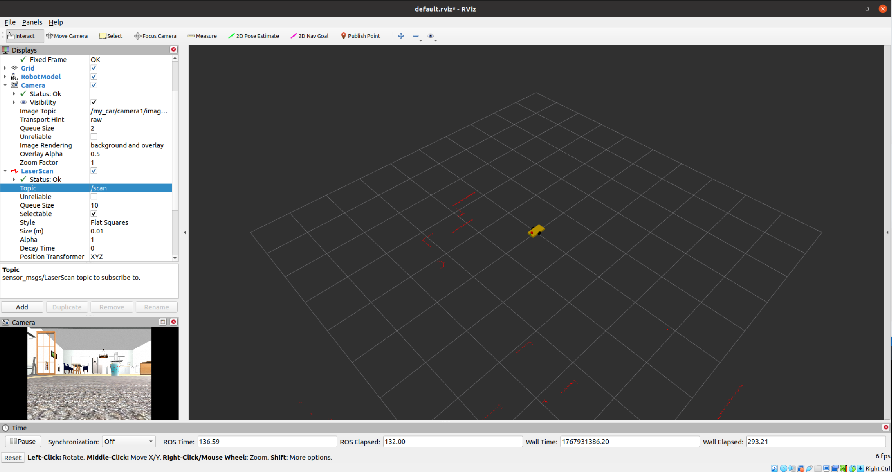

#  物理觉醒 (配置 Gazebo 宏的使用)

之前的 URDF 只有“皮囊”（Visual），没有“灵魂”（Inertial 和 Plugins）。Gazebo 是物理引擎，如果物体没有质量（Inertia），它就会被忽略或者乱飞。

## 1. 修改 `my_car.xacro` 添加惯性矩阵
请打开 `src/robot_modeling/urdf/my_car.xacro`，我们需要做两件事：
1.  **定义惯性宏**（放在文件最前面，属性定义之后）。
2.  **给每个 Link 加上 `<inertial>`**。

**将以下代码插入到 `my_car.xacro` 的属性定义下方：**

```xml
    <!-- 惯性矩阵宏 (直接复制即可) -->
    <xacro:macro name="box_inertia" params="m w h d">
        <inertial>
            <mass value="${m}"/>
            <inertia ixx="${m/12*(h*h+d*d)}" ixy="0" ixz="0" iyy="${m/12*(w*w+d*d)}" iyz="0" izz="${m/12*(w*w+h*h)}"/>
        </inertial>
    </xacro:macro>

    <xacro:macro name="cylinder_inertia" params="m r h">
        <inertial>
            <mass value="${m}"/>
            <inertia ixx="${m*(3*r*r+h*h)/12}" ixy="0" ixz="0" iyy="${m*(3*r*r+h*h)/12}" iyz="0" izz="${m*r*r/2}"/>
        </inertial>
    </xacro:macro>
```

**然后修改各个 Link，添加惯性调用（在 collision 标签后面添加）：**

*   **对于 `base_link`:**
    ```xml
    <xacro:box_inertia m="2.0" w="${base_width}" h="${base_height}" d="${base_len}"/>
    ```
*   **对于 `wheel_func` 宏里的 link:**
    ```xml
    <xacro:cylinder_inertia m="0.2" r="${wheel_radius}" h="${wheel_width}"/>
    ```
*   **对于 `laser_link`:**
    ```xml
    <xacro:cylinder_inertia m="0.1" r="0.05" h="0.1"/>
    ```
*   **对于 `camera_link`:**
    ```xml
    <xacro:box_inertia m="0.05" w="0.02" h="0.02" d="0.04"/>
    ```

完整的代码如下 

```xml
<?xml version="1.0"?>
<robot name="my_car" xmlns:xacro="http://www.ros.org/wiki/xacro">

    <!-- ================================================================== -->
    <!-- 1. 参数配置 (Properties) -->
    <!-- ================================================================== -->
    <xacro:property name="base_len" value="0.4"/>
    <xacro:property name="base_width" value="0.2"/>
    <xacro:property name="base_height" value="0.05"/>
    <xacro:property name="wheel_radius" value="0.05"/>
    <xacro:property name="wheel_width" value="0.02"/>
    <xacro:property name="caster_radius" value="0.015"/> <!-- 万向轮半径 -->

    <!-- 颜色定义 -->
    <material name="yellow"><color rgba="1 0.8 0 1"/></material>
    <material name="black"><color rgba="0 0 0 1"/></material>
    <material name="red"><color rgba="1 0 0 1"/></material>
    <material name="green"><color rgba="0 1 0 1"/></material>

    <!-- ================================================================== -->
    <!-- 2. 惯性矩阵宏 (Inertia Macros) - 物理引擎的核心 -->
    <!-- ================================================================== -->
    
    <!-- 盒子惯性公式 -->
    <xacro:macro name="box_inertia" params="m w h d">
        <inertial>
            <mass value="${m}"/>
            <inertia ixx="${m/12*(h*h+d*d)}" ixy="0" ixz="0" 
                     iyy="${m/12*(w*w+d*d)}" iyz="0" 
                     izz="${m/12*(w*w+h*h)}"/>
        </inertial>
    </xacro:macro>

    <!-- 圆柱体惯性公式 -->
    <xacro:macro name="cylinder_inertia" params="m r h">
        <inertial>
            <mass value="${m}"/>
            <inertia ixx="${m*(3*r*r+h*h)/12}" ixy="0" ixz="0" 
                     iyy="${m*(3*r*r+h*h)/12}" iyz="0" 
                     izz="${m*r*r/2}"/>
        </inertial>
    </xacro:macro>
    
    <!-- 球体惯性公式 (用于万向轮) -->
    <xacro:macro name="sphere_inertia" params="m r">
        <inertial>
            <mass value="${m}"/>
            <inertia ixx="${2*m*r*r/5}" ixy="0" ixz="0" 
                     iyy="${2*m*r*r/5}" iyz="0" 
                     izz="${2*m*r*r/5}"/>
        </inertial>
    </xacro:macro>

    <!-- ================================================================== -->
    <!-- 3. 机器人本体 (Robot Body) -->
    <!-- ================================================================== -->

    <!-- Base Footprint: 虚拟根节点 -->
    <link name="base_footprint">
        <visual>
            <geometry>
                <sphere radius="0.001"/>
            </geometry>
        </visual>
        <inertial>
            <mass value="0.0001"/>
            <inertia ixx="0.0001" ixy="0" ixz="0" iyy="0.0001" iyz="0" izz="0.0001"/>
        </inertial>
    </link>

    <joint name="base_joint" type="fixed">
        <parent link="base_footprint"/>
        <child link="base_link"/>
        <!-- 修正高度：让车轮底端刚好接触地面 -->
        <origin xyz="0 0 ${wheel_radius}" rpy="0 0 0"/>
    </joint>

    <!-- Base Link: 车身 -->
    <link name="base_link">
        <visual>
            <geometry>
                <box size="${base_len} ${base_width} ${base_height}"/>
            </geometry>
            <material name="yellow"/>
        </visual>
        <collision>
            <geometry>
                <box size="${base_len} ${base_width} ${base_height}"/>
            </geometry>
        </collision>
        <!-- 调用宏：车身重 2kg -->
        <xacro:box_inertia m="2.0" w="${base_width}" h="${base_height}" d="${base_len}"/>
    </link>

    <!-- ================================================================== -->
    <!-- 4. 轮子宏 (Wheels) -->
    <!-- ================================================================== -->
    <xacro:macro name="wheel_func" params="name reflect">
        <link name="${name}_wheel">
            <visual>
                <geometry>
                    <cylinder radius="${wheel_radius}" length="${wheel_width}"/>
                </geometry>
                <origin xyz="0 0 0" rpy="${pi/2} 0 0"/> 
                <material name="black"/>
            </visual>
            <collision>
                <geometry>
                    <cylinder radius="${wheel_radius}" length="${wheel_width}"/>
                </geometry>
                <origin xyz="0 0 0" rpy="${pi/2} 0 0"/>
            </collision>
            <!-- [重要修复] 轮子必须有惯性，否则Gazebo会忽略它 -->
            <xacro:cylinder_inertia m="0.2" r="${wheel_radius}" h="${wheel_width}"/>
        </link>

        <joint name="${name}_wheel_joint" type="continuous">
            <parent link="base_link"/>
            <child link="${name}_wheel"/>
            <origin xyz="0 ${reflect * (base_width/2 + wheel_width/2)} 0" rpy="0 0 0"/>
            <axis xyz="0 1 0"/>
        </joint>
    </xacro:macro>

    <!-- 生成左右驱动轮 -->
    <xacro:wheel_func name="left" reflect="1"/>
    <xacro:wheel_func name="right" reflect="-1"/>

    <!-- ================================================================== -->
    <!-- 5. 万向轮宏 (Caster Wheels) - 防止翻车 -->
    <!-- ================================================================== -->
    <xacro:macro name="caster_func" params="name location_x">
        <link name="${name}_caster">
            <visual>
                <geometry>
                    <sphere radius="${caster_radius}"/>
                </geometry>
                <material name="black"/>
            </visual>
            <collision>
                <geometry>
                    <sphere radius="${caster_radius}"/>
                </geometry>
            </collision>
            <xacro:sphere_inertia m="0.05" r="${caster_radius}"/>
        </link>

        <joint name="${name}_caster_joint" type="fixed">
            <parent link="base_link"/>
            <child link="${name}_caster"/>
            <!-- 核心计算：Z = 0.015 - 0.05 = -0.035，让小球刚好接触地面 -->
            <origin xyz="${location_x} 0 ${caster_radius - wheel_radius}" rpy="0 0 0"/>
        </joint>
    </xacro:macro>

    <!-- 生成前后万向轮 -->
    <xacro:caster_func name="front" location_x="0.18"/>
    <xacro:caster_func name="rear" location_x="-0.18"/>

    <!-- ================================================================== -->
    <!-- 6. 传感器 (Sensors) -->
    <!-- ================================================================== -->

    <!-- 雷达 -->
    <link name="laser_link">
        <visual>
            <geometry>
                <cylinder radius="0.05" length="0.1"/>
            </geometry>
            <material name="red"/>
        </visual>
        <collision>
            <geometry>
                <cylinder radius="0.05" length="0.1"/>
            </geometry>
        </collision>
        <xacro:cylinder_inertia m="0.1" r="0.05" h="0.1/>
    </link>

    <joint name="laser_joint" type="fixed">
        <parent link="base_link"/>
        <child link="laser_link"/>
        <origin xyz="0.15 0 ${base_height/2 + 0.05}" rpy="0 0 0"/>
    </joint>

    <!-- 摄像头 -->
    <link name="camera_link">
        <visual>
            <geometry>
                <box size="0.02 0.04 0.02"/>
            </geometry>
            <material name="green"/>
        </visual>
        <collision>
            <geometry>
                <box size="0.02 0.04 0.02"/>
            </geometry>
        </collision>
        <xacro:box_inertia m="0.05" w="0.02" h="0.02" d="0.04"/>
    </link>

    <joint name="camera_joint" type="fixed">
        <parent link="base_link"/>
        <child link="camera_link"/>
        <origin xyz="${base_len/2} 0 ${base_height/2}" rpy="0 0 0"/>
    </joint>

    <!-- ================================================================== -->
    <!-- 7. 引入外部插件文件 (Controller) -->
    <!-- ================================================================== -->
    <xacro:include filename="$(find robot_modeling)/urdf/gazebo_plugins.xacro"/>

</robot>
```


## 2. 创建 Gazebo 插件文件
为了保持代码整洁，我们新建一个文件 `src/robot_modeling/urdf/gazebo_plugins.xacro`，专门放控制器。

```xml
<?xml version="1.0"?>
<robot xmlns:xacro="http://www.ros.org/wiki/xacro">

    <!-- ================================================================== -->
    <!-- 1. 颜色修正 (Gazebo Color Fix) -->
    <!-- ================================================================== -->
    <!-- 原理：URDF 中的 <material> 标签只对 Rviz 有效。 -->
    <!-- Gazebo 是独立的物理引擎，它需要自己的 <gazebo> 标签来指定材质/颜色。 -->
    
    <!-- 设置车身颜色为 Gazebo 内置的黄色 -->
    <gazebo reference="base_link"><material>Gazebo/Yellow</material></gazebo>
    <!-- 设置车轮颜色为黑色 -->
    <gazebo reference="left_wheel"><material>Gazebo/Black</material></gazebo>
    <gazebo reference="right_wheel"><material>Gazebo/Black</material></gazebo>
    <!-- 设置万向轮颜色为黑色 -->
    <gazebo reference="front_caster"><material>Gazebo/Black</material></gazebo>
    <gazebo reference="rear_caster"><material>Gazebo/Black</material></gazebo>
    <!-- 设置雷达为红色 -->
    <gazebo reference="laser_link"><material>Gazebo/Red</material></gazebo>
    <!-- 设置摄像头为绿色 -->
    <gazebo reference="camera_link"><material>Gazebo/Green</material></gazebo>


    <!-- ================================================================== -->
    <!-- 2. 差速驱动插件 (Differential Drive Controller) -->
    <!-- ================================================================== -->
    <!-- 作用：订阅 cmd_vel 速度话题，控制两个轮子转动，并计算里程计(Odom) -->
    <gazebo>
        <plugin name="differential_drive_controller" filename="libgazebo_ros_diff_drive.so">
            
            <!-- 插件始终保持运行 -->
            <alwaysOn>true</alwaysOn>
            <!-- 控制器的更新频率：50Hz (每秒计算50次) -->
            <updateRate>50.0</updateRate>
            
            <!-- [重要] 绑定关节：必须和 my_car.xacro 中定义的 joint name 完全一致 -->
            <leftJoint>left_wheel_joint</leftJoint>
            <rightJoint>right_wheel_joint</rightJoint>
            
            <!-- [物理参数] 用于运动学计算 -->
            <!-- 轮间距：左右轮中心的距离 (引用 xacro 变量) -->
            <wheelSeparation>${base_width + wheel_width}</wheelSeparation>
            <!-- 轮直径：轮子有多大 (引用 xacro 变量) -->
            <wheelDiameter>${wheel_radius * 2}</wheelDiameter>
            
            <!-- 轮子力矩：电机劲儿有多大 (单位: N*m)，太小爬不动坡 -->
            <torque>10</torque>
            
            <!-- [通信接口] -->
            <!-- 订阅的话题：接收速度指令 -->
            <commandTopic>cmd_vel</commandTopic>
            <!-- 发布的话题：发布里程计信息 -->
            <odometryTopic>odom</odometryTopic>
            
            <!-- [坐标系设置] -->
            <!-- 里程计坐标系的名字 (通常叫 odom) -->
            <odometryFrame>odom</odometryFrame>
            <!-- 机器人的根坐标系名字 (通常叫 base_footprint 或 base_link) -->
            <robotBaseFrame>base_footprint</robotBaseFrame>
            
            <!-- [TF发布] -->
            <!-- 是否发布轮子相对于车身的 TF 变换 (看到轮子转动) -->
            <publishWheelTF>true</publishWheelTF>
            <!-- 是否发布 odom 到 base_footprint 的 TF 变换 (这是定位的核心) -->
            <publishOdomTF>true</publishOdomTF>
            
        </plugin>
    </gazebo>


    <!-- ================================================================== -->
    <!-- 3. 雷达插件 (Laser Sensor Plugin) -->
    <!-- ================================================================== -->
    <!-- 作用：模拟激光雷达发射射线，检测障碍物距离 -->
    
    <!-- 绑定到 laser_link 这个部件上 -->
    <gazebo reference="laser_link">
        <!-- 声明这是一个射线(ray)类型的传感器 -->
        <sensor type="ray" name="head_hokuyo_sensor">
            <!-- 传感器的相对位置 (x y z r p y)，这里设为0，即与 link 重合 -->
            <pose>0 0 0 0 0 0</pose>
            <!-- 是否在 Gazebo 画面中显示蓝色的扫描射线 (调试时很有用) -->
            <visualize>true</visualize>
            <!-- 数据更新频率：20Hz (每秒扫描20圈) -->
            <update_rate>20</update_rate>
            
            <ray>
                <scan>
                    <horizontal>
                        <!-- 采样数：转一圈采集多少个点 -->
                        <samples>720</samples>
                        <!-- 分辨率：1表示每个点都保留 -->
                        <resolution>1</resolution>
                        <!-- 扫描范围：从 -180度 到 +180度 (单位是弧度) -->
                        <min_angle>-3.14</min_angle>
                        <max_angle>3.14</max_angle>
                    </horizontal>
                </scan>
                <range>
                    <!-- 最小探测距离：太近了看不见 (0.1米) -->
                    <min>0.10</min>
                    <!-- 最大探测距离：太远了看不见 (10.0米) -->
                    <max>10.0</max>
                    <!-- 精度：0.01米 -->
                    <resolution>0.01</resolution>
                </range>
                <!-- 噪声模拟：为了更真实，加入高斯白噪声 -->
                <noise>
                    <type>gaussian</type>
                    <mean>0.0</mean>
                    <stddev>0.01</stddev>
                </noise>
            </ray>
            
            <!-- 加载 ROS 插件，把上面的物理数据转换成 ROS 话题 -->
            <plugin name="gazebo_ros_head_hokuyo_controller" filename="libgazebo_ros_laser.so">
                <!-- 发布的话题名：/scan -->
                <topicName>/scan</topicName>
                <!-- 数据的坐标系名称 -->
                <frameName>laser_link</frameName>
            </plugin>
        </sensor>
    </gazebo>


    <!-- ================================================================== -->
    <!-- 4. 摄像头插件 (Camera Sensor Plugin) -->
    <!-- ================================================================== -->
    <!-- 作用：模拟摄像头拍摄画面 -->

    <!-- 绑定到 camera_link 这个部件上 -->
    <gazebo reference="camera_link">
        <!-- 声明这是一个相机类型的传感器 -->
        <sensor type="camera" name="camera1">
            <!-- 帧率：30 FPS (每秒30张图) -->
            <update_rate>30.0</update_rate>
            
            <camera name="head">
                <!-- 水平视场角 (Field Of View)：约80度 (1.39弧度) -->
                <horizontal_fov>1.3962634</horizontal_fov>
                <image>
                    <!-- 图片宽度 (像素) -->
                    <width>800</width>
                    <!-- 图片高度 (像素) -->
                    <height>600</height>
                    <!-- 图片格式：红绿蓝8位 -->
                    <format>R8G8B8</format>
                </image>
                <clip>
                    <!-- 裁剪平面：最近能看到 0.02米 -->
                    <near>0.02</near>
                    <!-- 裁剪平面：最远能看到 300米 -->
                    <far>300</far>
                </clip>
                <!-- 图像噪点模拟 -->
                <noise>
                    <type>gaussian</type>
                    <mean>0.0</mean>
                    <stddev>0.007</stddev>
                </noise>
            </camera>
            
            <!-- 加载 ROS 插件，发布图像话题 -->
            <plugin name="camera_controller" filename="libgazebo_ros_camera.so">
                <alwaysOn>true</alwaysOn>
                <updateRate>0.0</updateRate> <!-- 0.0 表示跟随传感器的 update_rate -->
                
                <!-- 摄像头的命名空间 -->
                <cameraName>my_car/camera1</cameraName>
                <!-- 原始图像话题：/my_car/camera1/image_raw -->
                <imageTopicName>image_raw</imageTopicName>
                <!-- 相机内参话题 -->
                <cameraInfoTopicName>camera_info</cameraInfoTopicName>
                <!-- 坐标系名称 -->
                <frameName>camera_link</frameName>
                
                <!-- 以下参数通常用于双目相机，单目相机保持默认即可 -->
                <hackBaseline>0.07</hackBaseline>
                <distortionK1>0.0</distortionK1>
                <distortionK2>0.0</distortionK2>
                <distortionK3>0.0</distortionK3>
                <distortionT1>0.0</distortionT1>
                <distortionT2>0.0</distortionT2>
            </plugin>
        </sensor>
    </gazebo>

</robot>
```

## 3. 启动 Gazebo 环境

下载一个仿真场景，
```bash
cd ~/catkin_ws/src
# 克隆 AWS 的小房子世界
git clone https://github.com/aws-robotics/aws-robomaker-small-house-world.git 
# 还需要克隆它的依赖库（家具模型等）
git clone https://github.com/aws-robotics/aws-robomaker-racetrack-world.git
```

刷新环境
```bash
cd ~/catkin_ws
catkin_make
source devel/setup.bash
```


新建 `launch/gazebo_world.launch`：

```xml
<launch>
    <!-- 1. 加载机器人模型 -->
    <param name="robot_description" command="$(find xacro)/xacro $(find robot_modeling)/urdf/my_car.xacro" />

    <!-- 2. 启动 Gazebo -->
    <include file="$(find gazebo_ros)/launch/empty_world.launch">
        <!-- 修改这里：指向刚下载的 AWS 小房子世界文件 -->
        <arg name="world_name" value="$(find aws_robomaker_small_house_world)/worlds/small_house.world"/>
        <arg name="paused" value="false"/>
        <arg name="use_sim_time" value="true"/>
        <arg name="gui" value="true"/>
    </include>
    
    <!-- 3. 在 Gazebo 中生成机器人 -->
    <!-- 调整小车出生位置：因为房子里东西多，我们把车生在客厅中间，避免卡墙里 -->
    <node name="spawn_model" pkg="gazebo_ros" type="spawn_model" 
          args="-urdf -model my_car -param robot_description -x 0.0 -y 0.0 -z 0.1" 
          output="screen" />

    <!-- 4. 发布 TF -->
    <node name="robot_state_publisher" pkg="robot_state_publisher" type="robot_state_publisher" />
</launch>
```

**体验 1：** 运行 `roslaunch robot_modeling gazebo_world.launch`。


<p align="center">
  <a>
    
  </a>
</p>


你应该能看到小车出现在一个环境中，雷达在发射蓝色的光线。

-  运行 `rqt_image_view`。
你可以看到小车的摄像头画面

-  运行 `rosrun teleop_twist_keyboard teleop_twist_keyboard.py`。
可以通过键盘控制小车移动
你可能需要提前安装`sudo apt-get install ros-noetic-teleop-twist-keyboard`


-  运行 `rviz rviz`。
    -  `Fixed Frame`修改为`base_footprint`。
    -  `Add`添加一个`RobotModel`。
    -  `Add`添加一个`Camera`并把左侧`Camera`参数中的`Image Topic`选择为`/my_car/camera1/image_raw`,你可以看到小车摄像头画面。
    -  `Add`添加一个`LaserScan`并把左侧`LserScan`参数中的`Topic`选择为`/scan`,你可以看到小车扫描到的房间轮廓。

<p align="center">
  <a>
    
  </a>
</p>


