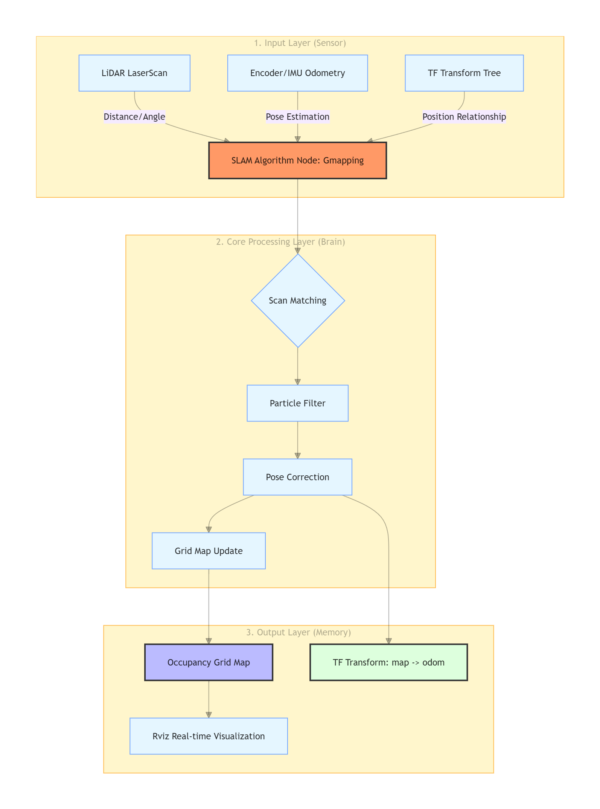
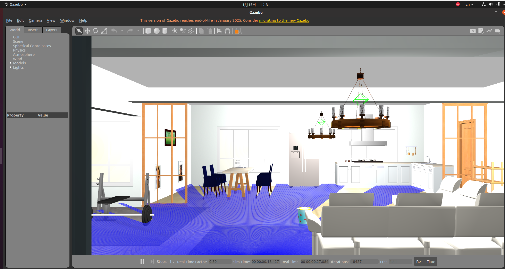
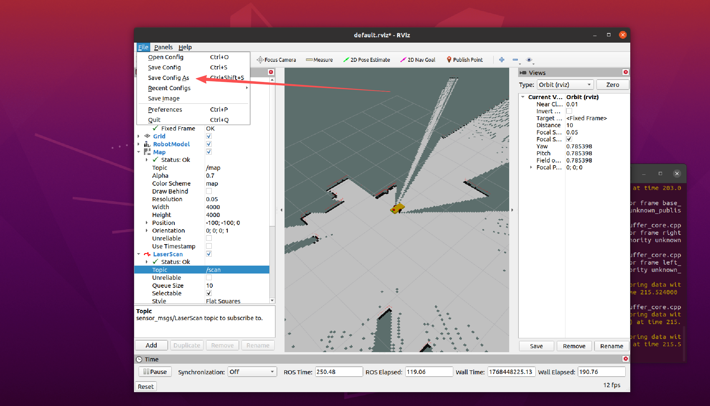

# Principles of SLAM Mapping

After having a robot model (URDF) and making it move in a simulation environment, we need to solve the three philosophical questions of robotics: **"Who am I? Where am I? Where am I going?"** The foundation for solving these questions is **SLAM (Mapping)**.

## 1. What is SLAM? (The Core Analogy)

**SLAM** stands for *Simultaneous Localization and Mapping*.

**The Core Analogy:**
Imagine you are blindfolded and thrown into a completely strange dark room. You only have a **laser rangefinder** (Lidar) in your hand and your **feet** (Odometry).
1.  **Movement:** You walk forward a few steps and estimate in your mind that you have traveled 2 meters (this is **Odometry**).
2.  **Perception:** You use the rangefinder to scan around and find that there is a wall 3 meters directly in front of you (this is **Lidar**).
3.  **Alignment:** If you walked 2 meters, the wall that was originally 5 meters away should now be at 3 meters. If the number displayed by the rangefinder matches, you know you didn't walk the wrong way; if it doesn't match (e.g., the floor was too slippery, and you thought you walked 2 meters but only moved 1 meter), you must **correct** your judgment of your position.
4.  **Mapping:** You note down in your mind: "There is a wall here."

**This is SLAM: measure while walking, correct while measuring, and finally draw a complete map.**

---

## 2. The Three "Powerful Assets" of Robot Mapping

To implement SLAM, a robot must possess the following three things:

### A. Eyes: Laser Lidar (LaserScan)
*   **Role:** Tells the robot the distance and angle of surrounding obstacles.
*   **Data Format:** `sensor_msgs/LaserScan`.
*   **Limitation:** Lidar only sees "points"; it doesn't know if a point is a wall or a table leg.

### B. Physical Sense: Odometry
*   **Role:** Estimates the distance traveled and the angle turned by the robot through encoders (counting wheel rotations) or an Inertial Measurement Unit (IMU).
*   **Data Format:** `nav_msgs/Odometry`.
*   **Limitation:** Wheels can slip, leading to **accumulated errors** over time.

### C. Brain: SLAM Algorithm (e.g., Gmapping)
*   **Role:** Combines the "not-entirely-accurate odometry" and the "noisy Lidar" through complex mathematics (such as Particle Filtering) to calculate the robot's most likely true position and draw the map.

Below is the **underlying logical architecture diagram of SLAM (using Gmapping as an example)** and a detailed analysis of the **four core logics**.

<p align="center">
  <a>
    
  </a>
</p>

### 1. The "Game" between Prediction and Observation (Pose Estimation Logic)
This is the most core logic of SLAM. The robot constantly faces two voices:
*   **Odometry (Prediction):** "Based on the wheel speed, I think I moved forward 1 meter." (Usually **inaccurate** due to slipping).
*   **Laser Lidar (Observation):** "Based on the shape of the walls I see, I found that I actually only moved 0.9 meters." (Also has **deviations** due to sensor noise).

**Underlying Logic:** The SLAM algorithm combines these two using mathematical means (such as Gaussian distribution or Particle Filtering). It tends to trust the "environmental features" observed by the Lidar and corrects the accumulated error of the odometry accordingly.

### 2. Particle Filter: Parallel Universe Theory (Gmapping Specialty)
The Gmapping algorithm maintains dozens of "particles" internally.
*   **Logic:** Each particle is a **"hypothesis"** the robot has about its own position.
    *   Particle A thinks: The robot is at (1.0, 0.5).
    *   Particle B thinks: The robot is at (1.1, 0.5).
*   **Survival of the Fittest:** The algorithm compares the overlap between the walls scanned by Lidar and the existing map. Particles with high overlap get an **increase in weight**; particles with low overlap are **"killed" (destroyed)**.
*   **Final Result:** The remaining particles cluster at the most realistic position, allowing the robot to lock onto its coordinates.

### 3. The "Probability Theory" of Grid Maps (Mapping Logic)
The map generated by the SLAM algorithm is called a **Grid Map**. It is like a giant Excel spreadsheet where each small square (Pixel) represents a small area in the real world (e.g., 5cm x 5cm).

In ROS's `nav_msgs/OccupancyGrid` message, the value of each grid is as follows:
*   **0 (White):** **Free**. The robot can pass safely.
*   **100 (Black):** **Occupied**. There is a wall or obstacle; hitting it will cause a crash.
*   **-1 (Gray):** **Unknown**. The Lidar hasn't scanned here yet; it could be a wall or a path.

The map is not drawn all at once but is the result of multiple "strokes."
*   **Logic:** Each grid (5cm x 5cm) in the map has an "occupancy probability."
    *   For grids the Lidar beam passes through, the **occupancy probability decreases** (turns white, representing a path).
    *   For the grid hit by the end of the Lidar beam, the **occupancy probability increases** (turns black, representing a wall).
*   **Noise Resistance:** If a single noisy point causes the Lidar to falsely report a wall, it's fine. In the subsequent 100 scans, if that position is empty, the probability will drop back down. This ensures the robustness of the map.

### 4. "Dynamic Offset" of TF Frames (Coordinate Compensation Logic)

In the mapping process, understanding Coordinate Frame Transformations (TF) is the "first hurdle" for beginners. SLAM relies on a strict "parent-child relationship":

1.  **`map` (Map Frame):** The coordinate origin of the entire world. It is stationary.
2.  **`odom` (Odometry Frame):** The starting point where the robot began. Ideally, it overlaps with `map`, but it drifts relative to `map` because of wheel slip.
3.  **`base_link` (Robot Base Frame):** The center point of the robot. It moves as the robot moves.
4.  **`laser_frame` (Lidar Frame):** The position where the Lidar is installed.

**Key Points:** 
*   The transform from `base_link` to `laser_frame` is determined by your **URDF** (fixed).
*   The transform from `odom` to `base_link` is published by the **robot's driver/simulation plugin** (telling you how far you've traveled).
*   **The transform from `map` to `odom` is published by the SLAM algorithm (such as Gmapping).** 

**Why does SLAM publish the `map -> odom` coordinate transformation?**

*   **Current State:** The robot's odometry (`odom -> base_link`) drifts continuously over time.
*   **Logic:** If you find that the robot on the map has "teleported," it is because the SLAM algorithm calculated: *"The position sent to me by the odometry was wrong by 0.1 meters. I need to publish a 0.1-meter compensation value from `map` to `odom` to pull the robot back to the correct position."*
*   **Intuitive Feeling:** In RViz, you will see the `odom` axis jittering slightly relative to the `map`. That is SLAM correcting the error for you.

---

## 3. Preparation: Installing Gmapping

Before starting the practical operation, please ensure you have installed the Gmapping package:

```bash
# Please replace <ros_distro> with your version, such as noetic or melodic
sudo apt install ros-<ros_distro>-gmapping ros-<ros_distro>-map-server
```

### Why choose Gmapping?
*   **Mature and Stable:** It is the most widely used 2D SLAM algorithm in the ROS community.
*   **Simple Configuration:** It is the best teaching material for beginners to understand the SLAM process.
*   **Balanced Performance:** It has low requirements for computing resources and can run smoothly on an ordinary laptop.

---

## 4. Key Parameters for SLAM Mapping (Pitfall Guide)

When you configure the mapping node, these parameters directly determine the quality of the map:

*   **`map_update_interval`:** How often is the map updated? Setting it too fast (e.g., 0.1s) will freeze the computer; too slow (e.g., 10s) and you'll finish a lap before the map appears.
*   **`maxUrange`:** How far can the Lidar see? If set too short, the middle of a large room will be blank.
*   **`delta` (Resolution):** The size of each grid in the map. Default is 0.05 (5cm). Setting it too small will consume extreme amounts of memory.

---

## 5. Starting the Gazebo Environment

Run `roslaunch robot_modeling gazebo_world.launch`.

<p align="center">
  <a>
    
  </a>
</p>

## 6. Enabling SLAM Mapping
We need to run the `gmapping` algorithm. Ensure it is installed: `sudo apt install ros-noetic-gmapping ros-noetic-map-server`.

Create `~/catkin_ws/src/robot_modeling/launch/slam_gmapping.launch`:

```xml
<launch>
    <!-- Start Gmapping Node -->
    <node pkg="gmapping" type="slam_gmapping" name="slam_gmapping" output="screen">
        <param name="base_frame" value="base_footprint"/>
        <param name="odom_frame" value="odom"/>
        <param name="map_frame"  value="map"/>
        <param name="scan_topic" value="scan"/>
        <!-- Increase the update interval slightly to reduce CPU usage -->
        <param name="map_update_interval" value="2.0"/>
        <param name="delta" value="0.05"/>
    </node>

    <!-- Start RViz to watch the mapping process -->
    <node name="rviz" pkg="rviz" type="rviz" args="-d $(find robot_modeling)/rviz/slam.rviz"/>
</launch>
```

**Experience 2 (Mapping Practical):**

1.  **Terminal 1:** Compile the environment
```bash
cd ~/catkin_ws
catkin_make
source devel/setup.bash
```

2.  **Terminal 2:** Start the algorithm `roslaunch robot_modeling slam_gmapping.launch`
    *   *Note: For the first time in RViz, you need to configure: Select `map` for Fixed Frame, Add Map (Topic: /map), Add RobotModel, and Add LaserScan. Save the configuration as `slam.rviz` once finished.*

<p align="center">
  <a>
    
  </a>
</p>

<p align="center">
  <a>
    
  </a>
</p>

<p align="center">
  <a>
    
  </a>
</p>

<p align="center">
  <a>
    
  </a>
</p>

3.  **Terminal 3:** Keyboard control `rosrun teleop_twist_keyboard teleop_twist_keyboard.py`
4.  **Operation:** Control the car to wander around the room. You will see the gray unknown areas in RViz gradually turn white (path) and black (wall).

<p align="center">
  <a>
    
  </a>
</p>

5.  **Saving the Map:** After the map is built, open a new terminal and run:
    ```bash
    mkdir -p ~/catkin_ws/src/robot_modeling/maps
    rosrun map_server map_saver -f ~/catkin_ws/src/robot_modeling/maps/my_map
    ```

- **map_saver Node Description:**
The `map_saver` node subscribes to the `map` (nav_msgs/OccupancyGrid) Topic to generate map files. You can check the generated `my_map.yaml` and `my_map.pgm` files in the `~/catkin_ws/src/robot_modeling/maps` directory.

<p align="center">
  <a>
    
  </a>
</p>

<p align="center">
  <a>
    
  </a>
</p>

  - **image:** Image storage path; it can be absolute or relative.
  - **resolution:** Map resolution (Unit: meters/pixel).
  - **origin:** The 2D pose of the bottom-left pixel in the map, represented as (x, y, yaw). Yaw is counter-clockwise rotation (yaw = 0 means no rotation).
  - **occupied_thresh:** Pixels with an occupancy probability greater than this threshold are considered fully occupied.
  - **free_thresh:** Pixels with an occupancy probability less than this threshold are considered completely free.
  - **negate:** Whether to reverse the white/black free/occupied semantics.

---

6. **Viewing the Map:** After the map is saved, you can press `Ctrl+C` to close all nodes in the terminals. Create a new file `~/catkin_ws/src/robot_modeling/launch/map_publish.launch`:
    ```xml
    <launch>
        <!-- Set the map configuration file -->
        <arg name="map" default="my_map.yaml" />
        <!-- Run the map server and load the set map -->
        <node name="map_server" pkg="map_server" type="map_server" args="$(find robot_modeling)/maps/$(arg map)"/>
        
        <!-- Start RViz to view the published map -->
        <node name="rviz" pkg="rviz" type="rviz" args="-d $(find robot_modeling)/rviz/slam.rviz"/>
    </launch>
    ```

Run `roslaunch robot_modeling map_publish.launch`, add `Map` via the `Add` button, and subscribe to the `map` topic.

<p align="center">
  <a>
    
  </a>
</p>

You can see the complete map scanned earlier being published and visualized in RViz. In the next lesson, we will enable the robot to perform autonomous point-to-point path planning and obstacle avoidance.