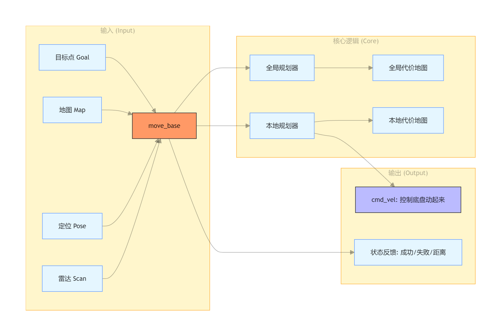

# Path Planning: How Does a Robot Plan a "Path to Survival"?

If SLAM is the mapmaker and AMCL is the tour guide, then **move_base** is the "expert driver" sitting in the driver's seat. It not only looks at the map (Global Planning) but also keeps its eyes on the road to avoid pedestrians who might suddenly appear (Local Planning).

## 1. move_base Logical Architecture: The Driver's Dual Thinking

`move_base` doesn't just simply draw a line. It actually runs two sets of logic internally:

1.  **Global Planner:**
    *   **Analogy:** GPS navigation on a phone. Based on the existing static map, it calculates a theoretical shortest path from the current point to the target point.
    *   **Characteristics:** Long-term vision, but does not see real-time changes (it doesn't know there is a car parked in the middle of the road right now).
2.  **Local Planner:**
    *   **Analogy:** The driver's eyes. While following the global path, it stares at the real-time sensor data (Lidar).
    *   **Characteristics:** Short-term vision (only looking at a few meters around), but extremely fast reaction. If an obstacle suddenly appears in front, it will immediately turn the steering wheel to bypass it.

---

## 2. Underlying Logic Flow of move_base

Understanding how data flows inside `move_base` is key to troubleshooting:

<p align="center">
  <a>
    
  </a>
</p>

---

## 3. Costmap: Danger Levels in the Eyes of a Robot

**Why can't the black-and-white SLAM map be used directly?**
SLAM maps only show "wall" or "no wall." But for a robot, even a place without a wall is dangerous if it's too close to one (what if the robot's rear end scrapes the wall during a turn?).

### A. The "Layer" Logic of Costmaps
Much like Photoshop, a costmap is composed of several overlapping layers:
1.  **Static Layer:** Based on the black-and-white map drawn by SLAM; it is the foundation.
2.  **Obstacle Layer:** Based on real-time Lidar data. If a trash can suddenly appears in the middle of the road, this layer updates immediately.
3.  **Inflation Layer:** **The most critical layer.** It draws a "warning zone" around all obstacles to prevent the robot from driving too close to the edges.

### B. Inflation Algorithm: The Robot's "Personal Space"
The costmap describes the degree of danger using values (0-255). Imagine an obstacle is a heat source—the closer you are, the hotter it is:

*   **Lethal Obstacle (254):** The actual obstacle. It must never be stepped on.
*   **Inscribed Obstacle (253):** Too close to the obstacle; the robot will collide if it simply rotates.
*   **Inflation Zone:** The cost gradually drops from 252 to 0. The robot will try to avoid high-cost areas and choose the "coolest" (lowest cost) path.
*   **Free Zone (0):** Safe, move freely.

---

## 4. Key Interaction: The Action Mechanism

`move_base` does not use standard Topic communication to receive goals; instead, it uses **ActionLib**.

**Why use Action instead of Topic?**
*   **Topic (Asynchronous Publishing):** After sending a goal, you don't know if the robot received it, where the robot is currently, or if it ended up hitting a wall or succeeding.
*   **Action (Action Mechanism):** 
    1.  **Goal:** Send the destination.
    2.  **Feedback:** Real-time reports: "I am 2 meters from the destination... 1.5 meters...".
    3.  **Result:** When finished, it tells you: "I arrived safely" or "I am blocked and cannot reach the goal."

---

## 5. Parameter Configuration Pitfall Guide

In the upcoming experiments, you will encounter many `.yaml` configuration files. The most common errors occur in:

1.  **Robot Radius:** 
    *   If set too small, the robot will constantly scrape against walls.
    *   If set too large, the robot will think all doorways are too narrow and won't enter rooms.
2.  **Inflation Radius:** 
    *   It is recommended to set this to **2-3 times** the robot's radius.
3.  **Max Velocity/Acceleration:** 
    *   If set too high, the robot will have too much inertia when trying to stop, leading to localization loss or collisions.

---

## 6. Summary: The Path Planning Workflow

1.  **Observe the Map:** Obtain the Global Costmap (Static + Inflation).
2.  **Determine the Line:** The Global Planner draws a long line connecting the start and end points.
3.  **Observe the Immediate Surroundings:** The Local Planner refers to Lidar data to obtain the Local Costmap.
4.  **Issue Commands:** Calculate the current linear and angular velocities and send them to `cmd_vel`.
5.  **Correction:** If the local planner discovers the global path is blocked by a new obstacle, it triggers a "Re-plan."

---

## 7. Final Experience: Configuration, Startup, and Autonomous Navigation

This is the "Final Boss" of the navigation tutorial. Having prepared the map, localization, and planning logic, we will now integrate them all.

### 1. Core Configuration Files (YAML)
Create a `param` folder under `~/catkin_ws/src/robot_modeling`. These files serve as the driving rules for the "driver," `move_base`.

#### A. `costmap_common_params.yaml` (Shared Parameters)
**Logic:** The robot's **physical dimensions** and **Lidar detection range** remain constant regardless of whether the map is global or local.
```yaml
# Obstacle detection range (Real-time avoidance within 2.5m)
obstacle_range: 2.5
# Sensor clearing range (If no obstacle within 3.0m, the road is considered clear)
raytrace_range: 3.0

# Robot footprint (outline coordinates): Assuming a 40cm x 24cm rectangle
# [Front-Left, Back-Left, Back-Right, Front-Right] origin at center
footprint: [[-0.2, -0.12], [-0.2, 0.12], [0.2, 0.12], [0.2, -0.12]]

# Inflation radius: Draw a 0.55m warning zone around obstacles
inflation_radius: 0.55

# Sensor configuration
observation_sources: laser_scan_sensor
laser_scan_sensor: {sensor_frame: laser_link, data_type: LaserScan, topic: scan, marking: true, clearing: true}
```

#### B. `local_costmap_params.yaml` (Local Costmap)
**Logic:** Sets a "rolling window" centered on the robot that moves with it to avoid dynamic obstacles in real-time.
```yaml
local_costmap:
  global_frame: odom          # Local planning is based on odometry
  robot_base_frame: base_footprint
  update_frequency: 5.0       # Higher frequency = more sensitive avoidance
  publish_frequency: 2.0
  static_map: false           # Local map does not depend on the static map
  rolling_window: true        # Enable rolling window mode
  width: 4.0                  # Local observation range 4m x 4m
  height: 4.0
  resolution: 0.05
```

#### C. `global_costmap_params.yaml` (Global Costmap)
**Logic:** This map covers the entire known world and is used to calculate the optimal long-distance path.
```yaml
global_costmap:
  global_frame: map           # Global planning is based on the map frame
  robot_base_frame: base_footprint
  update_frequency: 2.0
  static_map: true            # Must be based on the static map built by SLAM
```

#### D. `base_local_planner_params.yaml` (Local Planner Parameters)
**Logic:** Defines the robot's dynamic limits (max speed, acceleration) to prevent it from flipping over due to high speed.
```yaml
TrajectoryPlannerROS:
  # Velocity limits
  max_vel_x: 0.5              # Max forward speed 0.5m/s
  min_vel_x: 0.1
  max_vel_theta: 1.0          # Max rotation speed
  min_in_place_vel_theta: 0.4 # Min speed for rotating in place

  # Acceleration limits
  acc_lim_theta: 3.2
  acc_lim_x: 2.5

  holonomic_robot: false      # Is it a holonomic robot? (False for standard differential drive)
```

---

### 2. Integrated Navigation Launch File
This Launch file is the "Commander-in-Chief," pulling up the map server, AMCL localization, and move_base planner all at once.

```xml
<launch>
    <!-- 1. Load Map -->
    <arg name="map_file" default="$(find robot_modeling)/maps/my_map.yaml"/>
    <node name="map_server" pkg="map_server" type="map_server" args="$(arg map_file)" />

    <!-- 2. Start AMCL (Localization) -->
    <include file="$(find robot_modeling)/launch/amcl.launch" />

    <!-- 3. Start Move Base (Path Planning) -->
    <node pkg="move_base" type="move_base" respawn="false" name="move_base" output="screen">
        <!-- Note: costmap_common_params must be loaded into both global and local namespaces -->
        <rosparam file="$(find robot_modeling)/param/costmap_common_params.yaml" command="load" ns="global_costmap" />
        <rosparam file="$(find robot_modeling)/param/costmap_common_params.yaml" command="load" ns="local_costmap" />
        
        <rosparam file="$(find robot_modeling)/param/local_costmap_params.yaml" command="load" />
        <rosparam file="$(find robot_modeling)/param/global_costmap_params.yaml" command="load" />
        <rosparam file="$(find robot_modeling)/param/base_local_planner_params.yaml" command="load" />
    </node>
</launch>
```

---

### 3. Autonomous Navigation Practical Guide

#### Step 1: Run Environment
```bash
# Terminal 1: Start Gazebo Simulation
roslaunch robot_modeling gazebo_world.launch

# Terminal 2: Start Navigation Launch
roslaunch robot_modeling nav.launch
```

#### Step 2: RViz Visual Configuration (The Cool Part)
In RViz, click **Add** to include the following components and observe their meanings:
1.  **Map:** Select `/map` (Black-and-white static map).
2.  **Map:** Select `/move_base/global_costmap/costmap` (Colored global costmap). **You will see colored shadows (Inflation Zones) around the walls.**
3.  **Path:** Select `/move_base/NavFnROS/plan` (The green line shown is the planned path).
4.  **RobotModel & LaserScan:** Real-time observation of the robot status.

#### Step 3: Issue Commands
1.  **2D Pose Estimate:** Initial localization. Click the button and specify the robot's current position on the map.
2.  **2D Nav Goal:** Send a target. Click any free spot on the map, hold and drag the arrow for direction.

#### Step 4: Observe the Robot's "Thinking"
*   **Global Green Line:** Once a goal is set, you will see a green line instantly connect the start and end points.
*   **Dynamic Avoidance:** Try dropping a block (obstacle) in front of the car in Gazebo. You will notice the local costmap in RViz turns red immediately, and the car will immediately re-plan a path to go around it.

---

## 4. Conclusion: Congratulations, ROS Player!
Up to this point, you have completed the entire workflow from "hand-drawing a URDF" to "autonomous obstacle avoidance and navigation."

*   **URDF** gave it a body;
*   **Gmapping** gave it a memory;
*   **AMCL** gave it a sense of space;
*   **Move_base** gave it a brain.

**Next Steps:** Try modifying the velocity parameters in `base_local_planner_params.yaml` to see if the robot becomes more agile or more prone to hitting walls. This is the daily life of a parameter tuning engineer!

<p align="center">
  <a>
    
    <br>
    <em>Final Navigation Result: The green line is the global path; the robot is autonomously planning along the line while avoiding obstacles.</em>
  </a>
</p>