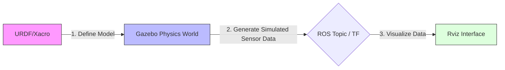

# Chapter 2: ROS Robot Simulation - Opening the Virtual World

In robot development, running code directly on physical hardware often leads to high costs, high risks, and low efficiency. To solve the pain points of expensive hardware, fear of crashes, and limited testing environments, **Simulation** has become an indispensable part of ROS development.
Before starting this course, please ensure that you have completed the ["ROS Basics 8 lectures"](../1.%20ROS%20Basics%208%20lectures/README.md), as this will help you learn robot simulation more efficiently.


## Course Directory

| Chapter | Title | Core Content | Quick Link |
| :--- | :--- | :--- | :--- |
| **01** | **First Experience with URDF** | Learn the standard robot modeling format; understand Links and Joints. | [View Details](./2.1-Learn%20URDF/README.md) |
| **02** | **First Experience with Xacro** | Use macro definitions and variables to optimize XML code, improving modeling efficiency and reusability. | [View Details](./2.2-Learn%20Xacro/README.md) |
| **03** | **Build Your Own Differential Drive Robot** | Hands-on practice: Step-by-step construction of a differential drive car with wheels, Lidar, and a camera. | [View Details](./2.3-Build%20%20Your%20Robot/README.md) |
| **04** | **Configuring the Physics Engine** | Import models into Gazebo; configure collision properties, gravity, and transmission system controls. | [View Details](./2.4-Gazebo%20Simulation%20Physics%20Engine/README.md) |
| **05** | **SLAM Mapping Principles** | Practical session on Simultaneous Localization and Mapping; generate environment maps using algorithms like Gmapping. | [View Details](./2.5-Robot%20Mapping/README.md) |
| **06** | **AMCL Localization** | Practical session on Monte Carlo Localization; teach the robot how to determine its position on the map. | [View Details](./2.6-Robot%20Location/README.md) |
| **07** | **Robot Path Planning** | Configure the `move_base` navigation stack to achieve autonomous obstacle avoidance and point-to-point path planning. | [View Details](./2.7-Robot%20Navigation/README.md) |

---

### 1.1 Why Simulation?

Robot simulation is the technology of simulating physical entities through computer software. Before deploying code to a real robot, the simulation environment acts as a "Sandbox."

#### Key Advantages
*   **Cost Control**: No need to buy expensive robots; a single PC is enough to verify algorithms.
*   **Safety Net**: Crashes, falls, or loss of control won't cause hardware damage, reducing the cost of trial and error.
*   **Environmental Flexibility**: Instantly switch between a maze, an office building, or an outdoor environment.

#### Limitations (Sim-to-Real Gap)
*   **Physics Engine Errors**: Friction, air resistance, etc., are approximate calculations in simulation.
*   **Idealized Data**: Sensor data in simulation is usually perfect, lacking the electromagnetic interference or dust noise found in the real world.

---

### 1.2 The Three Musketeers: URDF, Rviz, and Gazebo

In the ROS simulation ecosystem, we mainly rely on three core tools. Understanding their roles is the first task for any beginner.

#### 1. The Robot's DNA: URDF
*   **Role**: Defines the robot's appearance (dimensions), physical properties (mass, inertia), and joint structure.
*   **Analogy**: It is the **anatomy chart** or **instruction manual** of the robot. It is a static XML description file.
*   **Logic**: It answers the question: **"Who am I?"**

#### 2. The Monitor: Rviz
*   **Role**: A **data visualization tool**. It "draws" LIDAR point clouds, camera feeds, and coordinate frames (TF) on the screen for humans to see.
*   **Logic**: **Rviz does not perform any physics calculations.** It is purely a monitor. If data is sent, it displays it; if not, the screen remains empty.
*   **Logic**: It answers the question: **"What do I see?"**

#### 3. The Metaverse: Gazebo
*   **Role**: A **3D dynamic physics engine**. It simulates real-world physical rules such as gravity, friction, collisions, and lighting.
*   **Logic**: In Gazebo, a robot will fall if it's off-balance and stop if it hits a wall. It is a true physical simulator.
*   **Logic**: It answers the question: **"Where am I, and what are the physics of the environment?"**

---

### 1.3 Core Workflow: How do they work together?

Understanding the coordination between these three is key to mastering ROS navigation:



1.  **URDF** tells **Gazebo**: "Please spawn a 10kg robot with a LIDAR in this world."
2.  **Gazebo** calculates the physical feedback and publishes a message: "LIDAR detects a wall 1 meter ahead."
3.  **Rviz** receives the topic and displays: "Draw a red dot on the screen to inform the developer of an obstacle 1 meter ahead."

---

### 1.4 Setup and Troubleshooting

If you have installed the ROS desktop-full version, these tools are usually pre-installed.

#### ⚠️ Troubleshooting Common Issues

**1. Gazebo crashes or shows a black screen in a Virtual Machine**
*   *Solution*: Disable hardware 3D acceleration.
    ```bash
    echo "export SVGA_VGPU10=0" >> ~/.bashrc
    source ~/.bashrc
    ```

**2. Gazebo loads extremely slowly (stuck at the splash screen)**
*   *Cause*: It is trying to download models from an overseas server.
*   *Solution*: Modify the configuration file.
    ```bash
    sudo gedit ~/.ignition/fuel/config.yaml
    # Replace url: https://api.ignitionfuel.org with:
    # url: https://api.ignitionrobotics.org
    ```