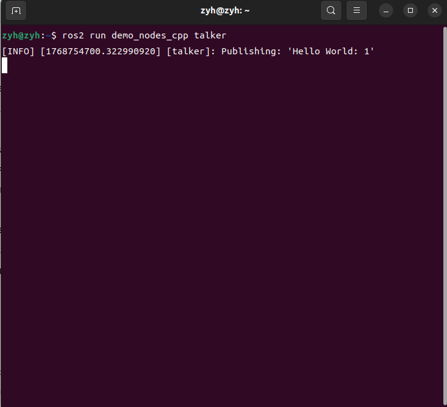
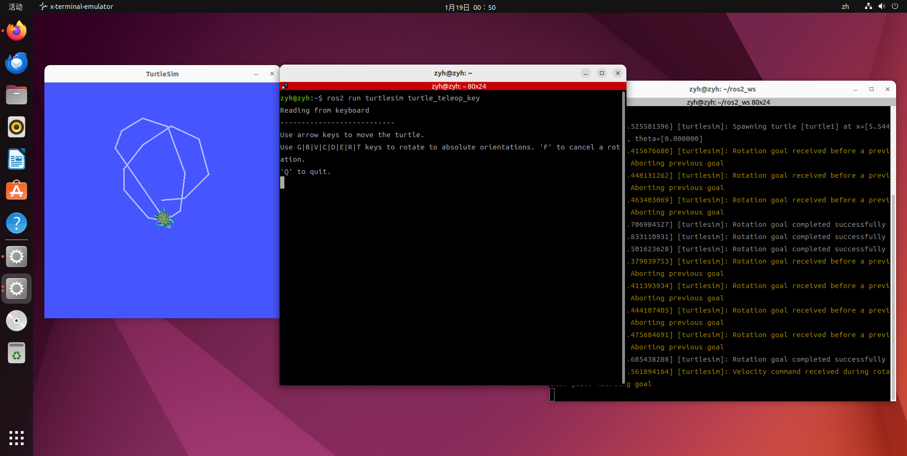

# 1.1 - ROS 2 概述与环境搭建

## 简介

本教程简要概述了 ROS 2（Robot Operating System 2，第二代机器人操作系统），并指导您在 [reComputer Nvidia Jetson Orin](https://www.seeedstudio.com/reComputer-J3010-w-o-power-adapter-p-5631.html) 或 Ubuntu 电脑上快速安装和体验 ROS 2。在本教程结束时，您将拥有一个可以运行的 ROS 2 环境，并能够运行一个简单的 ROS 2 示例演示。

### 前提条件

为了学习本教程，您需要以下硬件和软件：
- **硬件：** [reComputer Nvidia Jetson Orin](https://www.seeedstudio.com/reComputer-J3010-w-o-power-adapter-p-5631.html) 或其他搭载 Ubuntu 22.04 (推荐) / 20.04 的设备。
- **软件：** Jetpack 6.x (Ubuntu 22.04) 或 Ubuntu 22.04 LTS、**ROS 2 Humble**、Python 3 和 C++。
  *(注：如果您的系统是 Ubuntu 20.04，则对应安装 ROS 2 Foxy，但建议升级至 22.04 以使用长期支持版 Humble)*

<p align="center">
  <a href="https://wiki.seeedstudio.com/reComputer_Intro/">
    
  </a>
</p>

## ROS 2 开发简介

### [什么是 ROS 2？](https://docs.ros.org/en/humble/index.html)

ROS 2 是机器人操作系统的最新版本，旨在解决 ROS 1 在实时性、安全性和嵌入式支持方面的局限性。它基于 DDS（数据分发服务）标准，提供了去中心化的通信架构。

与 ROS 1 相比，ROS 2 的主要变化包括：
- **去中心化：** 不再需要 `roscore` (Master 节点)，节点之间通过 DDS 自动发现。
- **实时性：** 更好的实时控制支持，适用于工业级应用。
- **跨平台：** 更好地支持 Linux, Windows, macOS 和 RTOS。
- **多语言支持：** 使用现代 C++ (C++14/17) 和 Python 3。


### [为什么选择 ROS 2？](https://design.ros2.org/articles/why_ros2.html)

ROS 2 继承了 ROS 1 的生态优势，同时针对现代机器人需求进行了重构：

- **工业级可靠性：** 专为生产环境设计，支持多机器人协作和不可靠网络环境。
- **DDS 通信中间件：** 利用工业标准的 DDS 提供服务质量（QoS）配置，确保数据传输的可靠性或实时性。
- **安全性 (SROS 2)：** 原生支持安全特性，如加密、身份验证和访问控制。
- **生命周期管理：** 引入节点生命周期（Managed Nodes），让系统状态管理更加可控。
- **未来标准：** ROS 1 已停止功能更新，ROS 2 是目前及未来的主流开发标准。

### ROS 的历史与演进

从 ROS 1 到 ROS 2 的转变是机器人技术发展的必然结果：

- **2007-2010 (ROS 1 初期)：** 诞生于斯坦福和 Willow Garage，主要用于学术研究和原型验证。
- **2014 (ROS 2 启动)：** 开始设计 ROS 2，旨在解决 ROS 1 无法满足的商业化、产品化需求。
- **2017 (ROS 2 Ardent)：** 发布第一个 ROS 2 正式版本。
- **2020 (ROS 1 Noetic)：** ROS 1 的最后一个版本发布，标志着时代的交接。
- **2022 (ROS 2 Humble)：** 目前最稳定、使用最广泛的长期支持版本 (LTS)。

### [ROS 2 版本发布时间线](https://docs.ros.org/en/humble/Releases.html)

ROS 2 的版本代号通常按字母顺序排列。**推荐使用 Humble Hawksbill (搭配 Ubuntu 22.04)。**

| 版本名称 | 适用 OS | 发布日期 | 停止维护日期 (EOL) | 状态 |
|--------------|--------------|--------------|----------------|------|
| Foxy Fitzroy | Ubuntu 20.04 | 2020年6月    | 2023年6月      | EOL (停止维护) |
| Galactic Geochelone | Ubuntu 20.04 | 2021年5月 | 2022年11月 | EOL |
| **Humble Hawksbill** | **Ubuntu 22.04** | **2022年5月** | **2027年5月** | **当前推荐 (LTS)** |
| Iron Irwini | Ubuntu 22.04 | 2023年5月 | 2024年11月 | 过渡版本 |
| Jazzy Jalisco | Ubuntu 24.04 | 2024年5月 | 2029年5月 | 最新 LTS |

## ROS 2 环境安装与快速体验

> **注意：** 本教程以 **ROS 2 Humble** (推荐) 为例。如果您必须在 Ubuntu 20.04 上运行，请参考 Foxy 版本安装文档，但步骤逻辑大体相同。

### 安装 ROS 2 (Humble)

- **步骤 1：** 检查 Locale 设置（确保支持 UTF-8）。
  ```bash
  locale  # 检查是否为 UTF-8
  
  sudo apt update && sudo apt install locales
  sudo locale-gen en_US.UTF-8
  sudo update-locale LC_ALL=en_US.UTF-8 LANG=en_US.UTF-8
  export LANG=en_US.UTF-8
  ```

- **步骤 2：** 启用 Ubuntu Universe 存储库。
  ```bash
  sudo apt install software-properties-common
  sudo add-apt-repository universe
  ```

- **步骤 3：** 添加 ROS 2 GPG 密钥和存储库。
  ```bash
  sudo apt update && sudo apt install curl -y
  sudo curl -sSL https://raw.githubusercontent.com/ros/rosdistro/master/ros.key -o /usr/share/keyrings/ros-archive-keyring.gpg
  
  echo "deb [arch=$(dpkg --print-architecture) signed-by=/usr/share/keyrings/ros-archive-keyring.gpg] http://packages.ros.org/ros2/ubuntu $(. /etc/os-release && echo $UBUNTU_CODENAME) main" | sudo tee /etc/apt/sources.list.d/ros2.list > /dev/null
  ```

- **步骤 4：** 更新并安装 ROS 2 Desktop。
  ```bash
  sudo apt update
  sudo apt upgrade
  sudo apt install ros-humble-desktop
  ```

- **步骤 5：** 安装开发工具和 colcon 构建系统。
  *(ROS 2 使用 `colcon` 替代了 ROS 1 的 `catkin`)*
  ```bash
  sudo apt install python3-colcon-common-extensions python3-rosdep
  ```

- **步骤 6：** 初始化 rosdep。
  ```bash
  sudo rosdep init
  rosdep update
  ```

- **步骤 7：** 设置环境变量。
  ```bash
  echo "source /opt/ros/humble/setup.bash" >> ~/.bashrc
  source ~/.bashrc
  ```

- **步骤 8：** 测试安装。
  在 ROS 2 中，不需要运行 `roscore`。直接运行示例节点：
  ```bash
  ros2 run demo_nodes_cpp talker
  ```
  *(若看到 "Publishing: 'Hello World...'" 则安装成功)*

<p align="center">
  <a>
    
  </a>
</p>

### ROS 2 快速入门

为了快速体验 ROS 2，让我们创建一个工作空间并运行经典的小乌龟演示。

1. **创建 ROS 2 工作空间**
   ROS 2 使用 `colcon` 进行编译，目录结构与 ROS 1 略有不同, 打开一个终端，或者键盘`Ctrl+Alt+T`弹出终端。
   ```bash
   mkdir -p ~/ros2_ws/src
   cd ~/ros2_ws/
   colcon build
   ```

2. **加载环境设置文件**
   ```bash
   source install/setup.bash
   ```

3. **运行小乌龟演示 (Turtlesim)**
   ROS 2 不需要 `roscore`，直接运行节点。
   
   **终端 1 (启动模拟器):**
   ```bash
   ros2 run turtlesim turtlesim_node
   ```
   
   **终端 2 (启动键盘控制):**
   ```bash
   ros2 run turtlesim turtle_teleop_key
   ```

  <div align="center">
      
  </div>

这个演示展示了 ROS 2 的基础通信。你会发现虽然命令从 `rosrun` 变成了 `ros2 run`，但体验依然熟悉。

### ROS 2 常用开发软件安装

#### 安装 VSCode 及 ROS 开发扩展
1. **安装VSCode**: 
- 浏览器打开[VSCode官方](https://code.visualstudio.com/)，下载deb版本的Linux安装包
<p align="center">
  <a">
    
  </a>
</p>
- 将安装包复制到主目录下，然后打开终端运行如下指令来安装vscode.

```bash
sudo dpkg -i code_xxxx_amd64.deb
# For example: sudo dpkg -i code_1.60.0-1630504426_amd64.deb
```

- 完成上一步后，你讲在你的软件集合中看到Vscode的图标。
<p align="center">
  <a">
    
  </a>
</p>


2. **安装扩展：**
   - **ROS2 (Microsoft):** 此插件自动支持 ROS 2，可以识别 `colcon` 工作空间。
   - **C++ / Python / CMake Tools:** 是必装插件。
   - **Msg Language Support:**用于高亮 `.msg` 和 `.srv` 文件。
- 搜索ROS2,并点击Install进行安装。
<p align="center">
  <a">
    
  </a>
</p>

- 接着依次搜索`C++`、`Python`、`CMake Tools`和`Msg Language Support`插件进行安装。
<p align="center">
  <a">
    
  </a>
</p>

#### 安装 Terminator 多功能终端
Terminator 在 ROS 2 开发中依然是神器，用于同时监视多个节点的输出。

1. **安装**
    ```bash
    sudo apt update
    sudo apt install terminator
    ```

<p align="center">
  <a">
    
  </a>
</p>
    

2. **显示应用程序 ---> 搜索 "Terminator" ---> 右键点击并选择 "添加到收藏夹"**

3. **Terminator 常用快捷键**
    - **Alt + Up**: 移动到上方的终端
    - **Alt + Down**: 移动到下方的终端
    - **Alt + Left**: 移动到左侧的终端
    - **Alt + Right**: 移动到右侧的终端
    - **Ctrl + Shift + O**: 水平拆分终端
    - **Ctrl + Shift + E**: 垂直拆分终端
    - **Ctrl + Shift + Right**: 在垂直拆分的终端中向右移动分割线
    - **Ctrl + Shift + Left**: 在垂直拆分的终端中向左移动分割线
    - **Ctrl + Shift + Up**: 在水平拆分的终端中向上移动分割线
    - **Ctrl + Shift + Down**: 在水平拆分的终端中向下移动分割线
    - **Ctrl + Shift + S**: 隐藏/显示滚动条
    - **Ctrl + Shift + F**: 查找
    - **Ctrl + Shift + C**: 复制选中内容到剪贴板
    - **Ctrl + Shift + V**: 粘贴剪贴板内容
    - **Ctrl + Shift + W**: 关闭当前终端
    - **Ctrl + Shift + Q**: 退出当前窗口，关闭其中所有终端
    - **Ctrl + Shift + X**: 最大化当前终端
    - **Ctrl + Shift + Z**: 最大化当前终端并放大字体
    - **Ctrl + Shift + N 或 Ctrl + Tab**: 切换到下一个终端
    - **Ctrl + Shift + P 或 Ctrl + Shift + Tab**: 切换到上一个终端
    - **F11**: 切换全屏
    - **Ctrl + Shift + T**: 打开新标签页
    - **Ctrl + PageDown**: 切换到下一个标签页
    - **Ctrl + PageUp**: 切换到上一个标签页
    - **Ctrl + Shift + PageDown**: 将当前标签页与下一个交换位置
    - **Ctrl + Shift + PageUp**: 将当前标签页与上一个交换位置
    - **Ctrl + Plus (+)**: 增大字体
    - **Ctrl + Minus (-)**: 减小字体
    - **Ctrl + Zero (0)**: 重置字体大小为默认
    - **Ctrl + Shift + R**: 重置终端状态
    - **Ctrl + Shift + G**: 重置终端状态并清屏
    - **Super + g**: 广播所有终端（在所有终端同步输入内容）
    - **Super + Shift + G**: 取消广播所有终端
    - **Super + t**: 广播当前标签页的所有终端
    - **Super + Shift + T**: 取消广播当前标签页的终端
    - **Ctrl + Shift + I**: 打开新窗口（与原窗口共享进程）
    - **Super + i**: 打开新窗口（独立进程）

2. **ROS 2 开发常用技巧**
    - 在 Terminator 中拆分窗口，分别运行 `ros2 topic list` (查看话题)、`ros2 node list` (查看节点) 和实际的程序。
    - 快捷键与 ROS 1 教程中介绍的一致（Alt+方向键切换，Ctrl+Shift+O/E 拆分）。

---

**下一节预告：** 在 1.2 章节中，我们将深入学习如何编写第一个 ROS 2 的 "Hello World" 程序，并了解 `package.xml` 和 `CMakeLists.txt` 在 ROS 2 中的变化。