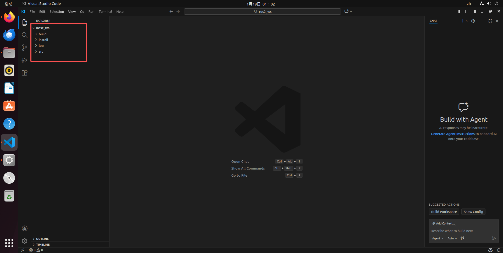
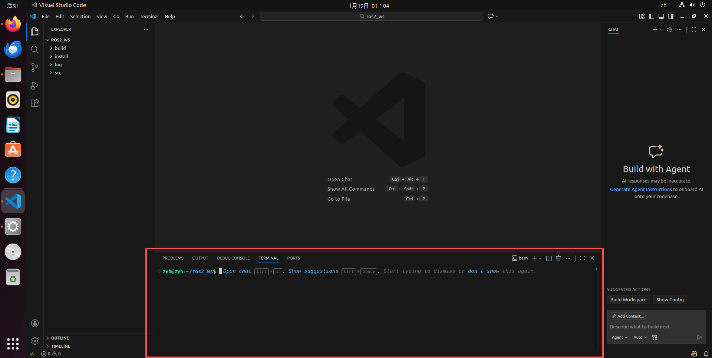
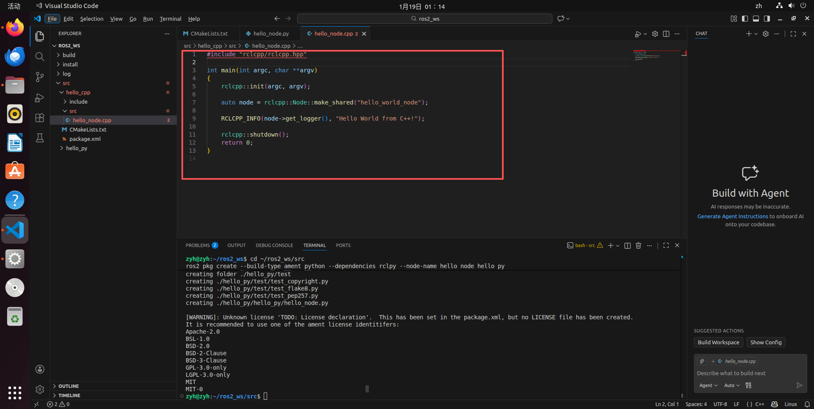
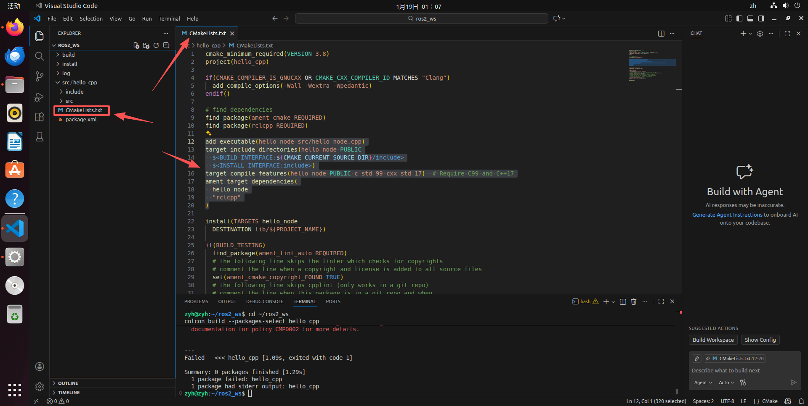
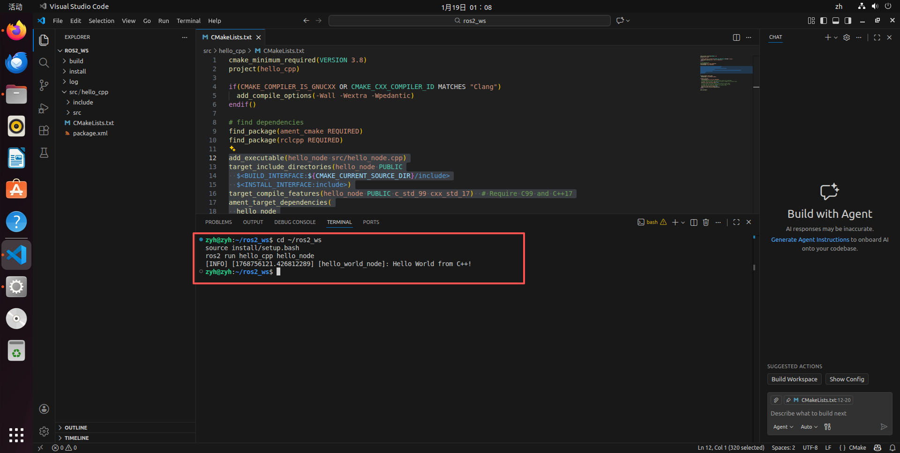
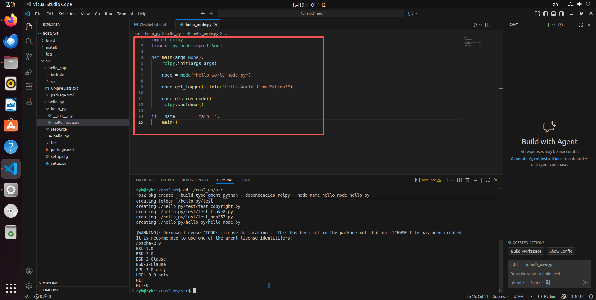
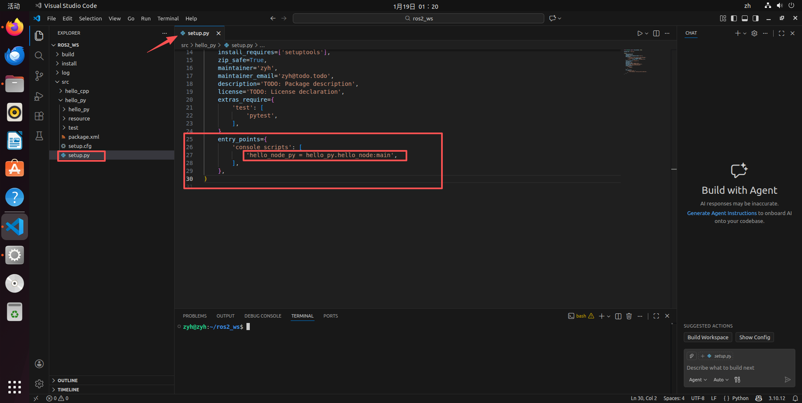
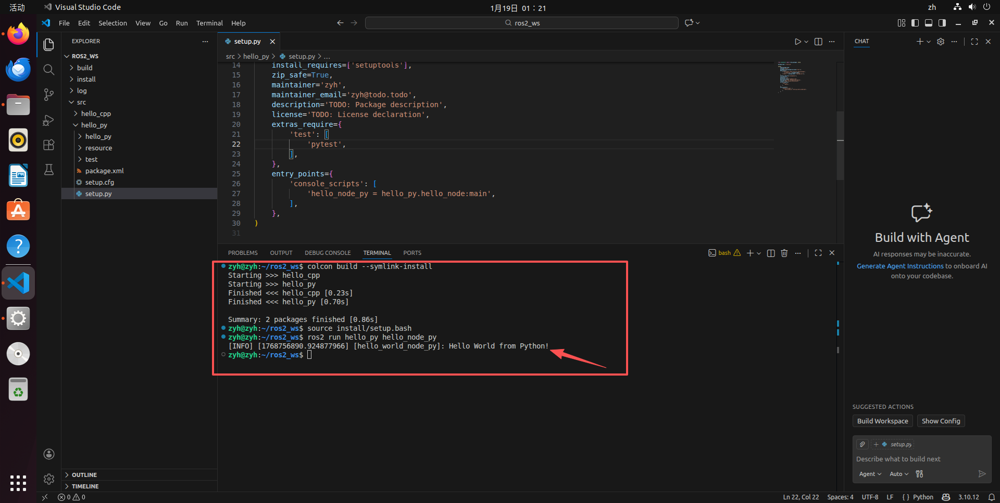

**ROS1->ROS2核心变化说明：**
1.  **构建系统**：从 `catkin_make` 变为 `colcon build`。
2.  **包类型**：ROS 2 建议将 C++ 和 Python 分开为不同类型的包 (`ament_cmake` vs `ament_python`)，这是与 ROS 1 最大的结构区别。
3.  **无 Master**：去掉了 `roscore` 步骤。
4.  **配置文件**：Python 包不再使用 `CMakeLists.txt`，而是使用 standard Python 的 `setup.py` 配置入口点。

# 1.2 - HelloWorld 实现概述

ROS 2 编程同样主要使用 C++ 和 Python。在 ROS 2 中，为了更好的依赖管理和构建效率，通常建议根据编程语言选择不同的**构建类型 (Build Type)**：C++ 包使用 `ament_cmake`，而 Python 包使用 `ament_python`。

本教程将分别展示如何创建一个 C++ 软件包和一个 Python 软件包来实现 HelloWorld。

主要流程如下：
1.  创建工作空间（Colcon Workspace）。
2.  创建软件包（指定构建类型）。
3.  编辑源文件。
4.  编辑配置文件（`CMakeLists.txt` 或 `setup.py`）。
5.  编译并执行。

## HelloWorld (C++ 版本)

### 1. 创建并初始化工作空间
ROS 2 使用 `colcon` 作为构建工具。

```bash
mkdir -p ~/ros2_ws/src
cd ~/ros2_ws
colcon build
```
这会在工作空间中生成 `build`, `install`, `log` 三个目录。

为了方便增删改查文件，你可以在终端中输入如下指令来打开vscode编译器。
```bash
cd ~/ros2_ws
code .
```

<p align="center">
  <a">
    
  </a>
</p>
    
并按下键盘输入Ctrl+Shift+`打开Vscode中的终端。

<p align="center">
  <a">
    
  </a>
</p>
    

### 2. 创建 C++ 软件包
我们使用 `ros2 pkg create` 命令，并指定构建类型为 `ament_cmake`, 在终端中输入如下指令。

```bash
cd ~/ros2_ws/src
ros2 pkg create --build-type ament_cmake --dependencies rclcpp --node-name hello_node hello_cpp
```
*   `--build-type ament_cmake`: 指定这是一个 C++ 包。
*   `--dependencies rclcpp`: 自动添加 ROS 2 C++ 客户端库依赖。
*   `--node-name hello_node`: 自动创建一个名为 `hello_node.cpp` 的源文件（为了演示，我们下面会手动修改它，但这个参数很方便）。
*   `hello_cpp`: 软件包的名称。

### 3. 编辑源文件
导航到软件包的 `src` 目录。如果你在上一步使用了 `--node-name`，里面已经有一个 `hello_node.cpp`，我们可以直接编辑它，或者新建一个。

文件路径：`~/ros2_ws/src/hello_cpp/src/hello_node.cpp`

将内容修改为：
```cpp
#include "rclcpp/rclcpp.hpp"

int main(int argc, char **argv)
{
    // 1. 初始化 ROS 2 通信
    rclcpp::init(argc, argv);

    // 2. 创建节点
    auto node = rclcpp::Node::make_shared("hello_world_node");

    // 3. 打印日志 (ROS 2 中使用 RCLCPP_INFO 替代 ROS_INFO)
    // get_logger() 获取节点的日志记录器
    RCLCPP_INFO(node->get_logger(), "Hello World from C++!");

    // 4. 关闭 ROS 2 通信
    rclcpp::shutdown();
    return 0;
}
```

<p align="center">
  <a>
  
  </a>
</p>


### 4. 编辑 `CMakeLists.txt`
通常 `ros2 pkg create` 会自动生成大部分内容，但我们需要确保可执行文件被正确编译和**安装**。

打开 `~/ros2_ws/src/hello_cpp/CMakeLists.txt`，确认包含以下关键部分（通常在 `find_package` 之后）：

```cmake
# 添加可执行文件
add_executable(hello_node src/hello_node.cpp)

# 添加目标依赖 (这步非常重要，链接 rclcpp)
ament_target_dependencies(hello_node rclcpp)

# 安装规则 (ROS 2 必须显式安装目标，否则 ros2 run 找不到)
install(TARGETS
  hello_node
  DESTINATION lib/${PROJECT_NAME}
)
```
<p align="center">
  <a>
  
  </a>
</p>

### 5. 编译工作空间
回到工作空间根目录进行编译。
```bash
cd ~/ros2_ws
colcon build --packages-select hello_cpp
```
*   `--packages-select`: 只编译指定的包，节省时间。如果不加则编译所有包。

### 6. 运行程序
**ROS 2 不需要运行 roscore。**

打开终端，加载环境并运行：
```bash
cd ~/ros2_ws
source install/setup.bash
ros2 run hello_cpp hello_node
```
您应该会看到输出：
`[INFO] [1678945200.123456789] [hello_world_node]: Hello World from C++!`

<p align="center">
  <a>
  
  </a>
</p>


---

## HelloWorld (Python 版本)

ROS 2 的 Python 包结构与 ROS 1 不同，它使用 `setup.py` 进行管理，遵循标准 Python 包规范。

### 1. 创建 Python 软件包
在 `src` 目录下创建一个新的包，指定构建类型为 `ament_python`,在终端中输入如下指令。

```bash
cd ~/ros2_ws/src
ros2 pkg create --build-type ament_python --dependencies rclpy --node-name hello_node hello_py
```
*   `hello_py`: 软件包名称。

### 2. 编辑 Python 源文件
ROS 2 Python 包的源码位于与包名同名的子目录中：`~/ros2_ws/src/hello_py/hello_py/hello_py/hello_node.py`。

编辑该文件：
```python
import rclpy
from rclpy.node import Node

def main(args=None):
    # 1. 初始化 ROS 2
    rclpy.init(args=args)
    
    # 2. 创建节点
    # 在 ROS 2 中，并不强制要求继承 Node 类，但为了后续功能的扩展，推荐使用面向对象方式
    node = Node("hello_world_node_py")
    
    # 3. 打印日志
    node.get_logger().info("Hello World from Python!")
    
    # 4. 销毁节点并关闭
    node.destroy_node()
    rclpy.shutdown()

if __name__ == '__main__':
    main()
```

<p align="center">
  <a>
  
  </a>
</p>


### 3. 编辑 `setup.py` (配置入口点)
这是 ROS 2 Python 包的核心配置文件。打开 `~/ros2_ws/src/hello_py/setup.py`。

找到 `entry_points` 字段，配置可执行文件名称与 Python 函数的映射关系：

```python
    entry_points={
        'console_scripts': [
            # 格式: '可执行文件名 = 包名.文件名:函数名'
            'hello_node_py = hello_py.hello_node:main',
        ],
    },
```
<p align="center">
  <a>
  
  </a>
</p>

### 4. 编译工作空间
即使是 Python，在 ROS 2 中也建议使用 `colcon` 进行构建，以便将脚本正确安装到系统路径中。

```bash
cd ~/ros2_ws
# --symlink-install 是 Python 开发的神器，它使用软链接安装
# 修改 Python 代码后无需重新编译即可生效
colcon build --packages-select hello_py --symlink-install
```

### 5. 运行程序
```bash
cd ~/ros2_ws
source install/setup.bash
ros2 run hello_py hello_node_py
```
您应该会看到输出：
`[INFO] [1678945211.987654321] [hello_world_node_py]: Hello World from Python!`

<p align="center">
  <a>
  
  </a>
</p>

---

## 关键差异总结 (ROS 1 vs ROS 2)

| 特性 | ROS 1 (Noetic) | ROS 2 (Humble) |
| :--- | :--- | :--- |
| **构建工具** | `catkin_make` | `colcon build` |
| **主节点** | 需要 `roscore` | **不需要** (去中心化) |
| **环境加载** | `source devel/setup.bash` | `source install/setup.bash` |
| **Python 配置** | `CMakeLists.txt` | `setup.py` |
| **节点句柄** | `ros::NodeHandle` | `rclcpp::Node` / `self` |
| **日志输出** | `ROS_INFO(...)` | `RCLCPP_INFO(logger, ...)` |

## 💡 开发小技巧

为了避免每次打开终端都要手动 source 环境文件，可以将 ROS 2 的环境设置添加到 `.bashrc`：

```bash
# 1. 添加 ROS 2 系统环境
echo "source /opt/ros/humble/setup.bash" >> ~/.bashrc

# 2. 添加你的工作空间环境
echo "source ~/ros2_ws/install/setup.bash" >> ~/.bashrc

source ~/.bashrc
```