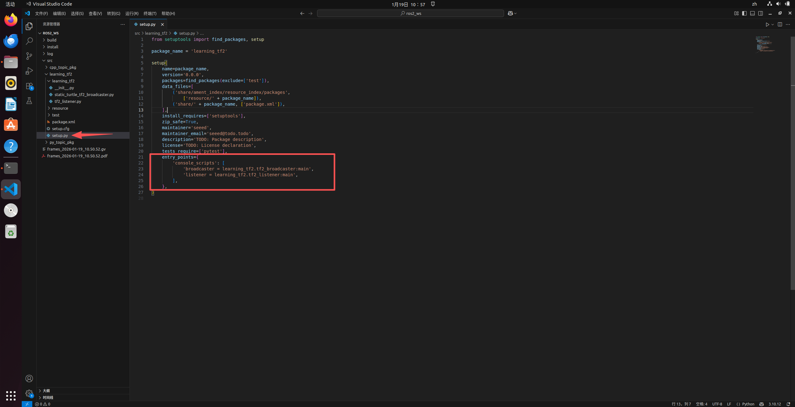

# 1.8 - ROS 2 TF2 坐标变换教程

## 1. 引子：为什么需要 TF？（用人体做比喻）

**话术：**
“想象一下，你的眼睛看到前方一米处有一个苹果。你的大脑怎么知道手要伸多远才能拿到它？
1.  眼睛告诉大脑：苹果在**眼睛**的前方 1 米。
2.  大脑知道：眼睛长在**头**上。
3.  大脑知道：头连接在**身体**上。
4.  大脑知道：手连接在**身体**上。
通过这一系列的‘连接关系’，大脑才能算出‘手’相对于‘苹果’的位置。

ROS 2 的 **TF2 (Transform Framework 2)** 就是这个‘大脑’，它维护了机器人各个部件之间的**相对位置**和**相对角度**，并能在任意两个坐标系之间进行数学转换。”

## 2. 核心概念：TF 树 (The TF Tree)

**核心知识点：**
*   **父子关系 (Parent/Child)：** TF 是一个树状结构，**绝对不允许有闭环**。每个坐标系（Frame）只能有一个父节点，但可以有多个子节点。
*   **变换 (Transform)：** 包含了**平移 (Translation, x/y/z)** 和 **旋转 (Rotation, Quaternion)**。即：子坐标系相对于父坐标系移动了多少，转动了多少。
*   **时间戳 (Timestamp)：** 机器人在动，坐标关系在变，所以每个 TF 数据都带有时间，TF2 库会自动帮你处理时间插值（比如：我想知道 100 毫秒前雷达在哪里）。

## 3. ROS 中的“标准坐标系全家桶” (REP-105)

<p align="center">
  <a>
    
  </a>
</p>

*   **`map` (地图坐标系)**
    *   **角色：** 世界的绝对中心，上帝视角。
    *   **特点：** 用于导航，是一个固定不动的参考系。
*   **`odom` (里程计坐标系)**
    *   **角色：** 机器人以为自己走过的路。
    *   **特点：** 它是连续的（平滑），但会随时间产生累积误差（漂移）。
*   **`base_link` (基座坐标系)**
    *   **角色：** 机器人的物理中心（通常是两轮轴中心）。
    *   **关系：** `base_link` 在 `odom` 中的位置，就是机器人的**里程计推算位置**。
*   **`laser_link` / `camera_link` (传感器坐标系)**
    *   **角色：** 传感器的安装位置。
    *   **特点：** 它们相对于 `base_link` 通常是固定的（静态变换）。

## 4. 举个例子：雷达数据上墙

**场景描述：**
雷达（`laser_link`）扫到了前方障碍物，数据里写着：“前方 x=2.0 米 有障碍”。

**TF2 的工作流：**
1.  **雷达说：** 我（`laser_link`）看到 (2, 0, 0) 处有东西。
2.  **TF2 查询：** `laser_link` 离 `base_link` 多远？（假设雷达装在车头前 0.5 米）。
    *   推算：障碍物离车中心 `2.0 + 0.5 = 2.5` 米。
3.  **TF2 查询：** `base_link` 现在在 `map` 的哪里？（假设车在地图的 (10, 10) 位置，朝向东）。
    *   推算：障碍物在地图的 `(12.5, 10)` 位置。

**总结：** 只要有 TF 树，TF2 帮你完成所有的矩阵乘法和坐标变换。

## 5. 常用工具 (Tools)

在 ROS 2 中，TF 工具包名称变成了 `tf2_tools` 和 `tf2_ros`。

1.  **查看树结构（生成 PDF 图）：**
    ```bash
    ros2 run tf2_tools view_frames
    ```
    运行后会在当前目录生成 `frames.pdf`，打开它可以看到谁连着谁。

2.  **实时监测变换关系：**
    ```bash
    # 语法: ros2 run tf2_ros tf2_echo [source_frame] [target_frame]
    ros2 run tf2_ros tf2_echo map base_link
    ```
    *这会告诉你机器人现在的绝对坐标。*

3.  **Rviz2 可视化：**
    *   启动 Rviz2：`ros2 run rviz2 rviz2`
    *   点击左下角 **Add** -> 找到 **TF** 并添加。
    *   勾选 `Show Names`。
    *   你会看到屏幕上出现红绿蓝（RGB对应XYZ）的坐标轴，直观展示了 TF 关系。

## 6. 动手实操：动态坐标变换

我们将设计一个场景：
1.  **`base_link`**：机器人的基座，不动。
2.  **`radar_link`**：安装在基座上的雷达，它会绕着 Z 轴一直旋转。

### 准备工作

创建一个 Python 类型的 ROS 2 包：
```bash
cd ~/ros2_ws/src
# 注意依赖项的变化
ros2 pkg create --build-type ament_python learning_tf2 --dependencies rclpy tf2_ros geometry_msgs turtlesim
```

---

### 第一步：发布坐标系 (The Broadcaster)

**任务：** 告诉 ROS 2，`radar_link` 相对于 `base_link` 在哪里。

在 `~/ros2_ws/src/learning_tf2/learning_tf2/` 目录下新建 `tf2_broadcaster.py`。

```python
import math
import rclpy
from rclpy.node import Node
from geometry_msgs.msg import TransformStamped
from tf2_ros import TransformBroadcaster

# 欧拉角转四元数辅助函数
def quaternion_from_euler(roll, pitch, yaw):
    qx = math.sin(roll/2) * math.cos(pitch/2) * math.cos(yaw/2) - math.cos(roll/2) * math.sin(pitch/2) * math.sin(yaw/2)
    qy = math.cos(roll/2) * math.sin(pitch/2) * math.cos(yaw/2) + math.sin(roll/2) * math.cos(pitch/2) * math.sin(yaw/2)
    qz = math.cos(roll/2) * math.cos(pitch/2) * math.sin(yaw/2) - math.sin(roll/2) * math.sin(pitch/2) * math.cos(yaw/2)
    qw = math.cos(roll/2) * math.cos(pitch/2) * math.cos(yaw/2) + math.sin(roll/2) * math.sin(pitch/2) * math.sin(yaw/2)
    return [qx, qy, qz, qw]

class DynamicFrameBroadcaster(Node):
    def __init__(self):
        super().__init__('dynamic_frame_broadcaster')
        
        # 创建广播器
        self.tf_broadcaster = TransformBroadcaster(self)
        
        # 创建定时器，10Hz (0.1秒)
        self.timer = self.create_timer(0.1, self.broadcast_timer_callback)
        self.angle = 0.0

    def broadcast_timer_callback(self):
        # 1. 更新角度
        self.angle += 0.05
        
        # 2. 创建 TF 消息
        t = TransformStamped()

        # 头部信息
        t.header.stamp = self.get_clock().now().to_msg()
        t.header.frame_id = 'base_link'    # 父坐标系
        t.child_frame_id = 'radar_link'    # 子坐标系

        # 平移 (Translation): 假设雷达在前方 1.0 米，高 0.5 米
        t.transform.translation.x = 1.0
        t.transform.translation.y = 0.0
        t.transform.translation.z = 0.5

        # 旋转 (Rotation): 绕 Z 轴旋转
        q = quaternion_from_euler(0, 0, self.angle)
        t.transform.rotation.x = q[0]
        t.transform.rotation.y = q[1]
        t.transform.rotation.z = q[2]
        t.transform.rotation.w = q[3]

        # 3. 发布
        self.tf_broadcaster.sendTransform(t)

def main():
    rclpy.init()
    node = DynamicFrameBroadcaster()
    try:
        rclpy.spin(node)
    except KeyboardInterrupt:
        pass
    rclpy.shutdown()

if __name__ == '__main__':
    main()
```

---

### 第二步：监听并换算坐标 (The Listener)

**任务：** 雷达发现前方 2 米处有障碍物。请问这个障碍物在机器人基座坐标系下，具体坐标是多少？

在同级目录下新建 `tf2_listener.py`：

```python
import rclpy
from rclpy.node import Node
from tf2_ros import TransformException
from tf2_ros.buffer import Buffer
from tf2_ros.transform_listener import TransformListener
# 注意：tf2_geometry_msgs 必须导入，用于支持 do_transform_point
import tf2_geometry_msgs 
from geometry_msgs.msg import PointStamped

class FrameListener(Node):
    def __init__(self):
        super().__init__('frame_listener')

        # 1. 创建缓存区 (Buffer) 和监听器 (Listener)
        self.tf_buffer = Buffer()
        self.tf_listener = TransformListener(self.tf_buffer, self)

        # 创建定时器，1Hz
        self.timer = self.create_timer(1.0, self.on_timer)

    def on_timer(self):
        try:
            # 2. 查找坐标变换 (base_link -> radar_link)
            # 意思：我想知道怎么把 radar_link 里的数据转换到 base_link 里去
            # 参数：目标坐标系，源坐标系，时间
            trans = self.tf_buffer.lookup_transform(
                'base_link',
                'radar_link',
                rclpy.time.Time())

            # 3. 定义一个虚拟障碍物点 (在雷达正前方 2 米)
            radar_point = PointStamped()
            radar_point.header.frame_id = 'radar_link'
            radar_point.header.stamp = rclpy.time.Time().to_msg()
            radar_point.point.x = 2.0
            radar_point.point.y = 0.0
            radar_point.point.z = 0.0

            # 4. 执行坐标变换
            # 使用 buffer 的 transform 方法直接转换消息
            base_point = self.tf_buffer.transform(radar_point, 'base_link')

            self.get_logger().info(
                f'\n雷达看到点: ({radar_point.point.x:.2f}, {radar_point.point.y:.2f})'
                f'\n基座推算点: ({base_point.point.x:.2f}, {base_point.point.y:.2f})'
                f'\n-----------------------------------'
            )

        except TransformException as ex:
            self.get_logger().info(f'无法获取坐标变换: {ex}')

def main():
    rclpy.init()
    node = FrameListener()
    try:
        rclpy.spin(node)
    except KeyboardInterrupt:
        pass
    rclpy.shutdown()

if __name__ == '__main__':
    main()
```

<p align="center">
  <a>
    
  </a>
</p>

---

### 第三步：配置 setup.py

对于 ROS 2 Python 包，必须在 `setup.py` 的 `entry_points` 中注册节点。
打开 `~/ros2_ws/src/learning_tf2/setup.py`：

```python
    entry_points={
        'console_scripts': [
            'broadcaster = learning_tf2.tf2_broadcaster:main',
            'listener = learning_tf2.tf2_listener:main',
        ],
    },
```

<p align="center">
  <a>
    
  </a>
</p>

---

### 第四步：编译与运行

1.  **编译工作空间：**
    ```bash
    cd ~/ros2_ws
    colcon build --packages-select learning_tf2
    source install/setup.bash
    ```

2.  **启动广播器 (Broadcaster):**
    ```bash
    ros2 run learning_tf2 broadcaster
    ```

3.  **启动 Rviz2 查看 (Visualizer):**
    打开新终端：
    ```bash
    ros2 run rviz2 rviz2
    ```
    *   Set **Fixed Frame** = `base_link`
    *   **Add** -> **TF**
    *   你将看到 `radar_link` 正在绕着 `base_link` 旋转。

<p align="center">
  <a>
    
  </a>
</p>


4.  **启动监听器 (Listener):**
    打开新终端：
    ```bash
    source install/setup.bash
    ros2 run learning_tf2 listener
    ```

**预期输出：**
```text
[INFO] [frame_listener]: 
雷达看到点: (2.00, 0.00)
基座推算点: (2.99, 0.15)
-----------------------------------
[INFO] [frame_listener]: 
雷达看到点: (2.00, 0.00)
基座推算点: (2.87, 0.48)
```
你会发现，虽然雷达看到的点永远是 (2, 0)，但随着雷达旋转，该点在机器人基座坐标系下的位置一直在变化。

---

## 7. 静态坐标变换 (Static TF)

很多时候，传感器是焊死在机器人上的（例如摄像头相对于底盘的位置永远不变）。此时不需要写代码一直广播，可以使用 **Static Transform Publisher**。

**CLI 命令：**
```bash
# 语法：ros2 run tf2_ros static_transform_publisher x y z yaw pitch roll parent_frame child_frame
# 例如：在 base_link 上方 0.5 米处安装一个 camera_link
ros2 run tf2_ros static_transform_publisher 0 0 0.5 0 0 0 base_link camera_link
```

**Launch 文件写法 (推荐)：**
```python
from launch import LaunchDescription
from launch_ros.actions import Node

def generate_launch_description():
    return LaunchDescription([
        Node(
            package='tf2_ros',
            executable='static_transform_publisher',
            arguments = ['0', '0', '0.5', '0', '0', '0', 'base_link', 'camera_link']
        ),
    ])
```