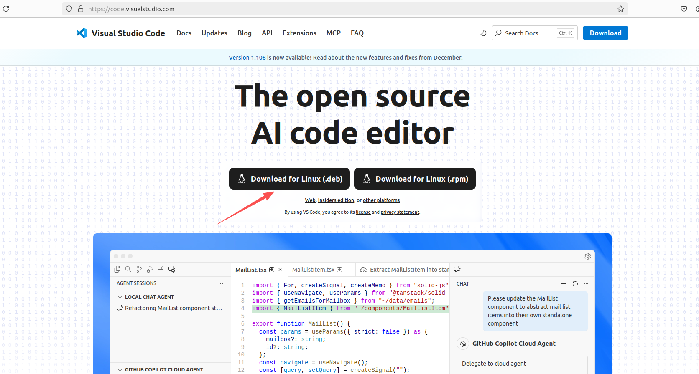
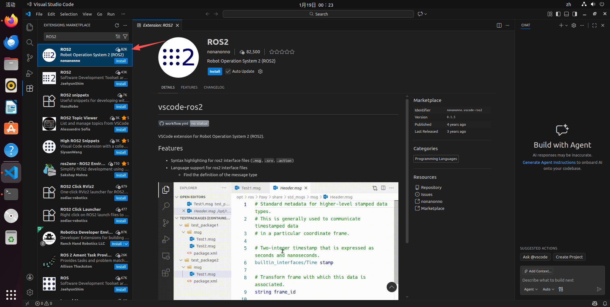
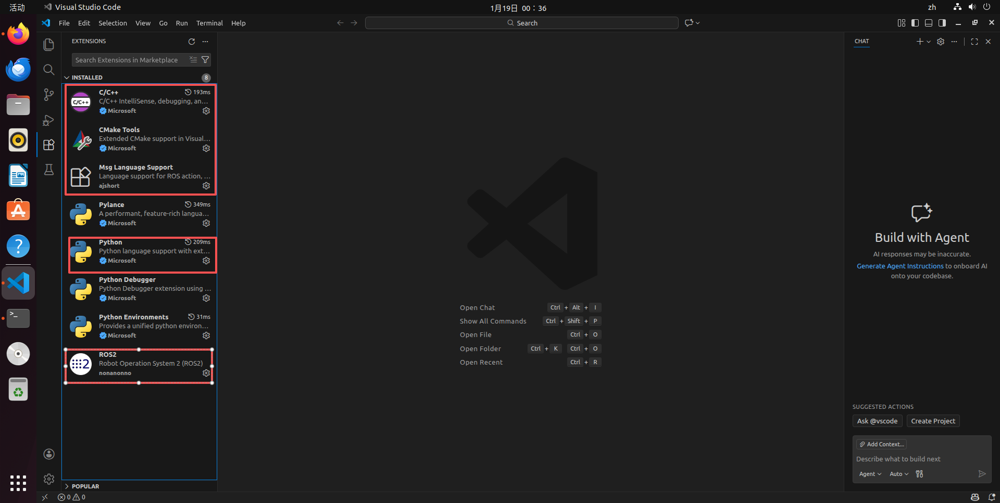

# 1.1 - ROS 2 Overview and Environment Setup

## Introduction

This tutorial provides a brief overview of ROS 2 (Robot Operating System 2) and guides you through the process of quickly installing and experiencing ROS 2 on a [reComputer Nvidia Jetson Orin](https://www.seeedstudio.com/reComputer-J3010-w-o-power-adapter-p-5631.html) or an Ubuntu computer. By the end of this tutorial, you will have a working ROS 2 environment and be able to run a simple ROS 2 demo.

### Prerequisites

To follow this tutorial, you will need the following hardware and software:
- **Hardware:** [reComputer Nvidia Jetson Orin](https://www.seeedstudio.com/reComputer-J3010-w-o-power-adapter-p-5631.html) or another device running Ubuntu 22.04 (Recommended) / 20.04.
- **Software:** Jetpack 6.x (Ubuntu 22.04) or Ubuntu 22.04 LTS, **ROS 2 Humble**, Python 3, and C++.
  *(Note: If your system is Ubuntu 20.04, you should install ROS 2 Foxy, but upgrading to 22.04 to use the Long Term Support version Humble is recommended)*

<p align="center">
  <a href="https://wiki.seeedstudio.com/reComputer_Intro/">
    
  </a>
</p>

## Introduction to ROS 2 Development

### [What is ROS 2?](https://docs.ros.org/en/humble/index.html)

ROS 2 is the latest version of the Robot Operating System, designed to address the limitations of ROS 1 regarding real-time performance, security, and embedded system support. It is built on the DDS (Data Distribution Service) standard, providing a decentralized communication architecture.

Compared to ROS 1, the main changes in ROS 2 include:
- **Decentralization:** No longer requires `roscore` (Master node); nodes discover each other automatically via DDS.
- **Real-time:** Better support for real-time control, suitable for industrial applications.
- **Cross-platform:** Improved support for Linux, Windows, macOS, and RTOS.
- **Multi-language Support:** Uses modern C++ (C++14/17) and Python 3.

### [Why Choose ROS 2?](https://design.ros2.org/articles/why_ros2.html)

ROS 2 inherits the ecological advantages of ROS 1 while being refactored for modern robotics needs:

- **Industrial Reliability:** Designed for production environments, supporting multi-robot collaboration and unreliable network environments.
- **DDS Communication Middleware:** Utilizes the industrial-standard DDS to provide Quality of Service (QoS) configurations, ensuring data transmission reliability or real-time performance.
- **Security (SROS 2):** Native support for security features such as encryption, authentication, and access control.
- **Lifecycle Management:** Introduces Managed Nodes, making system state management more controllable.
- **Future Standard:** ROS 1 has stopped feature updates; ROS 2 is the current and future mainstream development standard.

### History and Evolution of ROS

The transition from ROS 1 to ROS 2 is a natural result of the development of robotics technology:

- **2007-2010 (Early ROS 1):** Born at Stanford and Willow Garage, primarily used for academic research and prototyping.
- **2014 (ROS 2 Kickoff):** Design of ROS 2 began, aiming to meet commercial and productization needs that ROS 1 could not satisfy.
- **2017 (ROS 2 Ardent):** The first official version of ROS 2 was released.
- **2020 (ROS 1 Noetic):** The final version of ROS 1 was released, marking the transition of eras.
- **2022 (ROS 2 Humble):** Currently the most stable and widely used Long Term Support (LTS) version.

### [ROS 2 Release Timeline](https://docs.ros.org/en/humble/Releases.html)

ROS 2 release codenames are usually arranged in alphabetical order. **Humble Hawksbill (paired with Ubuntu 22.04) is recommended.**

| Release Name | Supported OS | Release Date | End of Life (EOL) | Status |
|--------------|--------------|--------------|----------------|------|
| Foxy Fitzroy | Ubuntu 20.04 | June 2020    | June 2023      | EOL |
| Galactic Geochelone | Ubuntu 20.04 | May 2021 | Nov 2022 | EOL |
| **Humble Hawksbill** | **Ubuntu 22.04** | **May 2022** | **May 2027** | **Current Recommended (LTS)** |
| Iron Irwini | Ubuntu 22.04 | May 2023 | Nov 2024 | Transitional |
| Jazzy Jalisco | Ubuntu 24.04 | May 2024 | May 2029 | Latest LTS |

## ROS 2 Environment Installation and Quick Experience

> **Note:** This tutorial uses **ROS 2 Humble** (recommended) as an example. If you must run on Ubuntu 20.04, please refer to the Foxy installation documentation, though the logic remains largely the same.

### Installing ROS 2 (Humble)

- **Step 1:** Check Locale settings (Ensure UTF-8 support).
  ```bash
  locale  # Check if it is UTF-8
  
  sudo apt update && sudo apt install locales
  sudo locale-gen en_US.UTF-8
  sudo update-locale LC_ALL=en_US.UTF-8 LANG=en_US.UTF-8
  export LANG=en_US.UTF-8
  ```

- **Step 2:** Enable Ubuntu Universe repository.
  ```bash
  sudo apt install software-properties-common
  sudo add-apt-repository universe
  ```

- **Step 3:** Add ROS 2 GPG key and repository.
  ```bash
  sudo apt update && sudo apt install curl -y
  sudo curl -sSL https://raw.githubusercontent.com/ros/rosdistro/master/ros.key -o /usr/share/keyrings/ros-archive-keyring.gpg
  
  echo "deb [arch=$(dpkg --print-architecture) signed-by=/usr/share/keyrings/ros-archive-keyring.gpg] http://packages.ros.org/ros2/ubuntu $(. /etc/os-release && echo $UBUNTU_CODENAME) main" | sudo tee /etc/apt/sources.list.d/ros2.list > /dev/null
  ```

- **Step 4:** Update and install ROS 2 Desktop.
  ```bash
  sudo apt update
  sudo apt upgrade
  sudo apt install ros-humble-desktop
  ```

- **Step 5:** Install development tools and colcon build system.
  *(ROS 2 uses `colcon` instead of ROS 1's `catkin`)*
  ```bash
  sudo apt install python3-colcon-common-extensions python3-rosdep
  ```

- **Step 6:** Initialize rosdep.
  ```bash
  sudo rosdep init
  rosdep update
  ```

- **Step 7:** Set up environment variables.
  ```bash
  echo "source /opt/ros/humble/setup.bash" >> ~/.bashrc
  source ~/.bashrc
  ```

- **Step 8:** Test the installation.
  In ROS 2, you do not need to run `roscore`. Run the example node directly:
  ```bash
  ros2 run demo_nodes_cpp talker
  ```
  *(If you see "Publishing: 'Hello World...'", the installation was successful)*

<p align="center">
  <a>
    
  </a>
</p>

### ROS 2 Quick Start

To quickly experience ROS 2, let's create a workspace and run the classic Turtlesim demo.

1. **Create a ROS 2 Workspace**
   ROS 2 uses `colcon` for compilation. The directory structure is slightly different from ROS 1. Open a terminal or press `Ctrl+Alt+T`.
   ```bash
   mkdir -p ~/ros2_ws/src
   cd ~/ros2_ws/
   colcon build
   ```

2. **Source the Environment Setup File**
   ```bash
   source install/setup.bash
   ```

3. **Run the Turtlesim Demo**
   ROS 2 does not require `roscore`; run the nodes directly.
   
   **Terminal 1 (Start Simulator):**
   ```bash
   ros2 run turtlesim turtlesim_node
   ```
   
   **Terminal 2 (Start Keyboard Control):**
   ```bash
   ros2 run turtlesim turtle_teleop_key
   ```

  <div align="center">
      
  </div>

This demo demonstrates basic ROS 2 communication. You will notice that while the command changed from `rosrun` to `ros2 run`, the experience remains familiar.

### Installation of Common ROS 2 Development Software

#### Install VSCode and ROS Development Extensions
1. **Install VSCode**: 
- Open the [Official VSCode Website](https://code.visualstudio.com/) in your browser and download the `.deb` Linux installation package.
<p align="center">
  <a">
    
  </a>
</p>
- Copy the installation package to your Home directory, then open a terminal and run the following command to install VSCode.

```bash
sudo dpkg -i code_xxxx_amd64.deb
# For example: sudo dpkg -i code_1.60.0-1630504426_amd64.deb
```

- After completing the previous step, you will see the VSCode icon in your applications list.
<p align="center">
  <a">
    
  </a>
</p>

2. **Install Extensions:**
   - **ROS2 (Microsoft):** This plugin automatically supports ROS 2 and can recognize `colcon` workspaces.
   - **C++ / Python / CMake Tools:** Essential plugins.
   - **Msg Language Support:** Used for highlighting `.msg` and `.srv` files.
- Search for "ROS2" and click Install.
<p align="center">
  <a">
    
  </a>
</p>

- Next, search and install `C++`, `Python`, `CMake Tools`, and `Msg Language Support` plugins in order.
<p align="center">
  <a">
    
  </a>
</p>

#### Install Terminator (Multi-functional Terminal)
Terminator remains an essential tool in ROS 2 development for monitoring outputs from multiple nodes simultaneously.

1. **Installation**
    ```bash
    sudo apt update
    sudo apt install terminator
    ```

<p align="center">
  <a">
    
  </a>
</p>
    

2. **Show Applications ---> Search "Terminator" ---> Right-click and select "Add to Favorites"**

3. **Common Terminator Shortcuts**
    - **Alt + Up**: Move to the terminal above
    - **Alt + Down**: Move to the terminal below
    - **Alt + Left**: Move to the terminal on the left
    - **Alt + Right**: Move to the terminal on the right
    - **Ctrl + Shift + O**: Split terminals horizontally
    - **Ctrl + Shift + E**: Split terminals vertically
    - **Ctrl + Shift + Right**: Move the divider line right in vertically split terminals
    - **Ctrl + Shift + Left**: Move the divider line left in vertically split terminals
    - **Ctrl + Shift + Up**: Move the divider line up in horizontally split terminals
    - **Ctrl + Shift + Down**: Move the divider line down in horizontally split terminals
    - **Ctrl + Shift + S**: Hide/Show scrollbar
    - **Ctrl + Shift + F**: Find
    - **Ctrl + Shift + C**: Copy selected text to clipboard
    - **Ctrl + Shift + V**: Paste from clipboard
    - **Ctrl + Shift + W**: Close current terminal
    - **Ctrl + Shift + Q**: Quit current window (closes all terminals inside)
    - **Ctrl + Shift + X**: Maximize current terminal
    - **Ctrl + Shift + Z**: Maximize current terminal and zoom font
    - **Ctrl + Shift + N or Ctrl + Tab**: Switch to next terminal
    - **Ctrl + Shift + P or Ctrl + Shift + Tab**: Switch to previous terminal
    - **F11**: Toggle fullscreen
    - **Ctrl + Shift + T**: Open new tab
    - **Ctrl + PageDown**: Switch to next tab
    - **Ctrl + PageUp**: Switch to previous tab
    - **Ctrl + Shift + PageDown**: Swap current tab with next
    - **Ctrl + Shift + PageUp**: Swap current tab with previous
    - **Ctrl + Plus (+)**: Increase font size
    - **Ctrl + Minus (-)**: Decrease font size
    - **Ctrl + Zero (0)**: Reset font size to default
    - **Ctrl + Shift + R**: Reset terminal state
    - **Ctrl + Shift + G**: Reset terminal state and clear screen
    - **Super + g**: Broadcast to all terminals (sync input across all terminals)
    - **Super + Shift + G**: Cancel broadcast to all terminals
    - **Super + t**: Broadcast to all terminals in the current tab
    - **Super + Shift + T**: Cancel broadcast to terminals in the current tab
    - **Ctrl + Shift + I**: Open new window (shares process with original)
    - **Super + i**: Open new window (independent process)

2. **Common ROS 2 Development Tips**
    - Split windows in Terminator to run `ros2 topic list` (view topics), `ros2 node list` (view nodes), and your actual program separately.
    - Shortcuts are consistent with those introduced in ROS 1 tutorials (Alt + arrow keys to switch, Ctrl + Shift + O/E to split).

---

**Next Section Preview:** In section 1.2, we will dive deep into writing your first "Hello World" program in ROS 2 and understand the changes in `package.xml` and `CMakeLists.txt` in the ROS 2 environment.