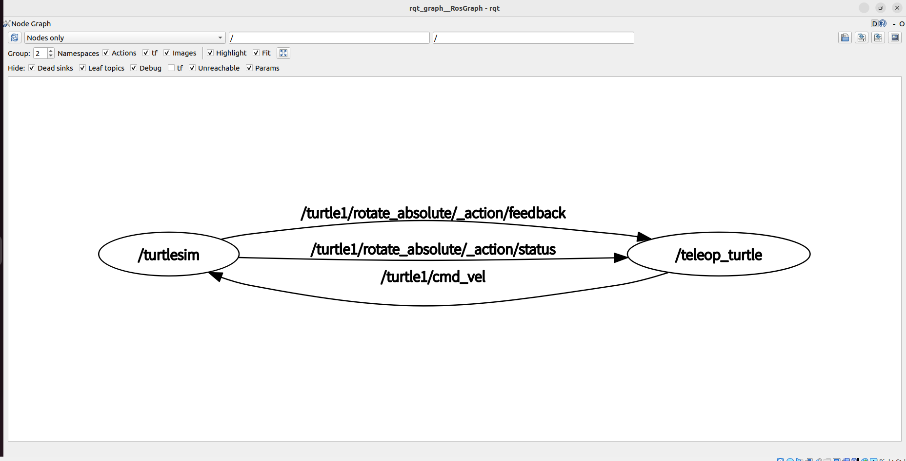

# 1.3 - ROS 2 Architecture and File System

## ROS 2 File System

The workspace structure in ROS 2 is slightly different from ROS 1. The most significant change is the introduction of the `install` directory to replace the `devel` directory, and the addition of a `log` directory.

The ROS 2 workspace structure on the disk is organized as follows:

```text
WorkSpace --- Custom Workspace (e.g., ~/ros2_ws)

    |--- build: Build space. Stores intermediate build files. Each package has its own independent subfolder here.
    |--- install: Install space. This is a core change in ROS 2.
    |        |--- setup.bash: Environment setup script (you must source this file before running programs).
    |        |--- <package_name>: Executables, libraries, headers, and launch files generated during build are stored here.
    |--- log: Log space. Contains logs from the Colcon build process and ROS 2 runtime log files.
    |--- src: Source space (similar to ROS 1)

        |-- <package_name>: ROS 2 Package
            |-- package.xml: Package manifest file (defines dependencies, version, etc.).
            |-- CMakeLists.txt: (C++ package only) Compilation rules configuration.
            |-- setup.py: (Python package only) Installation configuration for Python packages.
            |-- src: (C++ package) Stores .cpp source files.
            |-- <package_name>: (Python package) Stores .py source files.
            |-- include: Header file directory.
            |-- msg/srv/action: Directory for custom communication interface definitions.
            |-- launch: Stores launch files in Python (.py) or XML (.xml) formats.
            |-- config: Stores .yaml parameter configuration files.
```

### package.xml (Package Manifest)

`package.xml` defines the package metadata and dependencies. **Note: ROS 2 uses `format="3"`**.

The main difference between C++ and Python packages in `package.xml` lies in the `<buildtool_depend>` tag.

**Example (C++ Package `package.xml`):**
```xml
<?xml version="1.0"?>
<?xml-model href="http://download.ros.org/schema/package_format3.xsd" schematypens="http://www.w3.org/2001/XMLSchema"?>
<package format="3">
  <name>hello_cpp</name>
  <version>0.0.0</version>
  <description>ROS 2 C++ example package</description>
  <maintainer email="user@todo.todo">user</maintainer>
  <license>Apache-2.0</license>

  <!-- Build tool dependency: C++ uses ament_cmake -->
  <buildtool_depend>ament_cmake</buildtool_depend>

  <!-- Dependencies -->
  <depend>rclcpp</depend>
  <depend>std_msgs</depend>

  <test_depend>ament_lint_auto</test_depend>
  <test_depend>ament_lint_common</test_depend>

  <export>
    <build_type>ament_cmake</build_type>
  </export>
</package>
```

For a Python package, `<buildtool_depend>` is typically `ament_python` (though sometimes included implicitly), and the `<export><build_type>` will be `ament_python`.

### Build Configuration Files (Language-specific)

In ROS 1, all packages relied on `CMakeLists.txt`. In ROS 2, configuration files differ based on the language:

#### 1. C++ Package: `CMakeLists.txt`
Uses the `ament_cmake` build system.

```cmake
cmake_minimum_required(VERSION 3.8)
project(hello_cpp)

# 1. Find dependencies
find_package(ament_cmake REQUIRED)
find_package(rclcpp REQUIRED)

# 2. Add executables
add_executable(hello_node src/hello_node.cpp)
ament_target_dependencies(hello_node rclcpp)

# 3. Installation rules (ROS 2 requires explicit installation of targets)
install(TARGETS
  hello_node
  DESTINATION lib/${PROJECT_NAME}
)

# 4. Mark package completion
ament_package()
```

#### 2. Python Package: `setup.py`
Uses the standard Python `setuptools` mechanism.

```python
from setuptools import setup

package_name = 'hello_py'

setup(
    name=package_name,
    version='0.0.0',
    packages=[package_name],
    data_files=[
        ('share/ament_index/resource_index/packages', ['resource/' + package_name]),
        ('share/' + package_name, ['package.xml']),
    ],
    install_requires=['setuptools'],
    zip_safe=True,
    maintainer='user',
    description='ROS 2 Python example',
    license='Apache-2.0',
    tests_require=['pytest'],
    entry_points={
        'console_scripts': [
            # Format: 'executable_name = package_name.module_name:function_name'
            'hello_node_py = hello_py.hello_node:main',
        ],
    },
)
```

## Common ROS 2 Commands (CLI)

ROS 2 command-line tools have been unified; they all start with `ros2`, following the format `ros2 <verb> <sub-verb>`.

| Operation | ROS 1 Command | **ROS 2 Command** |
| :--- | :--- | :--- |
| **Create Package** | `catkin_create_pkg <name> <deps>` | `ros2 pkg create <name> --build-type <type> --dependencies <deps>` |
| **Build** | `catkin_make` | `colcon build` (from workspace root) |
| **List Packages** | `rospack list` | `ros2 pkg list` |
| **Find Package Path**| `rospack find <pkg>` | `ros2 pkg prefix <pkg>` |
| **Run Node** | `rosrun <pkg> <node>` | `ros2 run <pkg> <executable>` |
| **Run Launch File**| `roslaunch <pkg> <file>` | `ros2 launch <pkg> <file>` |
| **Core Services** | `roscore` | **(None)** ROS 2 uses auto-discovery; no Master needed |
| **List Nodes** | `rosnode list` | `ros2 node list` |
| **List Topics** | `rostopic list` | `ros2 topic list` |

**Useful Tips:**
*   **Installing Packages:** `sudo apt install ros-humble-<package_name>` (replace underscores with hyphens, e.g., `ros-humble-turtlesim`).
*   **Auto-completion:** ROS 2 commands support Tab auto-completion, which is very convenient.

## ROS 2 Computational Graph

The ROS 2 Computational Graph still illustrates the topological relationship between Nodes and Topics. However, the underlying layer no longer relies on a Master node; instead, it is based on DDS (Data Distribution Service) for decentralized auto-discovery.

### Computational Graph Demo

We will use the Turtlesim simulation to demonstrate the ROS 2 computational graph.

1.  **Run the Turtlesim node:**
    Open Terminal 1:
    ```bash
    ros2 run turtlesim turtlesim_node
    ```

2.  **Run the keyboard control node:**
    Open Terminal 2:
    ```bash
    ros2 run turtlesim turtle_teleop_key
    ```

3.  **View the Computational Graph:**
    Open Terminal 3 and enter:
    ```bash
    rqt_graph
    ```
    *(If the command is not found, install it: `sudo apt install ros-humble-rqt ros-humble-rqt-graph`)*

<p align="center">
  <a>
    
  </a>
</p>

### Diagram Explanation
*   **Ovals (Nodes):** Represent running processes (e.g., `/turtlesim` and `/teleop_turtle`).
*   **Rectangles (Topics):** Represent data transmission channels (e.g., `/turtle1/cmd_vel`).
*   **Arrows:** Indicate the direction of data flow. You can clearly see that the `teleop_turtle` node publishes velocity commands, which flow through the `/turtle1/cmd_vel` topic to the `turtlesim` node.

---

**Next Section Preview:** Having mastered the basic architecture and file system, we will move on to **2. ROS 2 Communication Mechanisms**, where we will dive into how nodes exchange data through Topics, Services, and Interfaces.