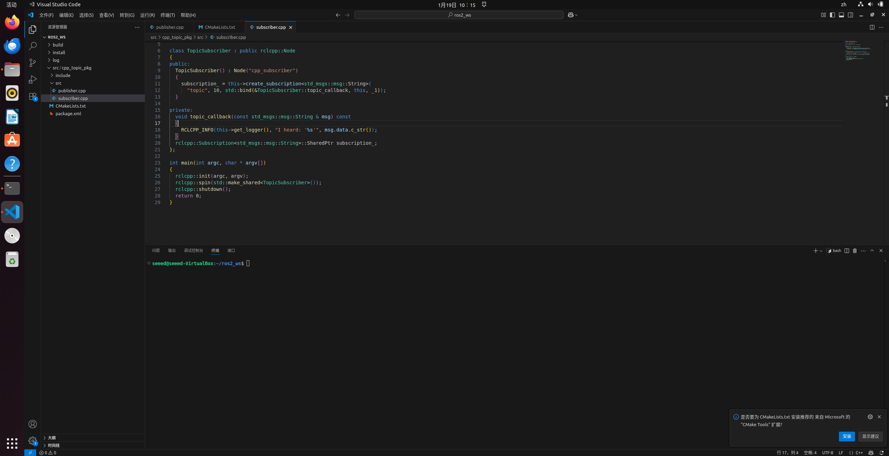
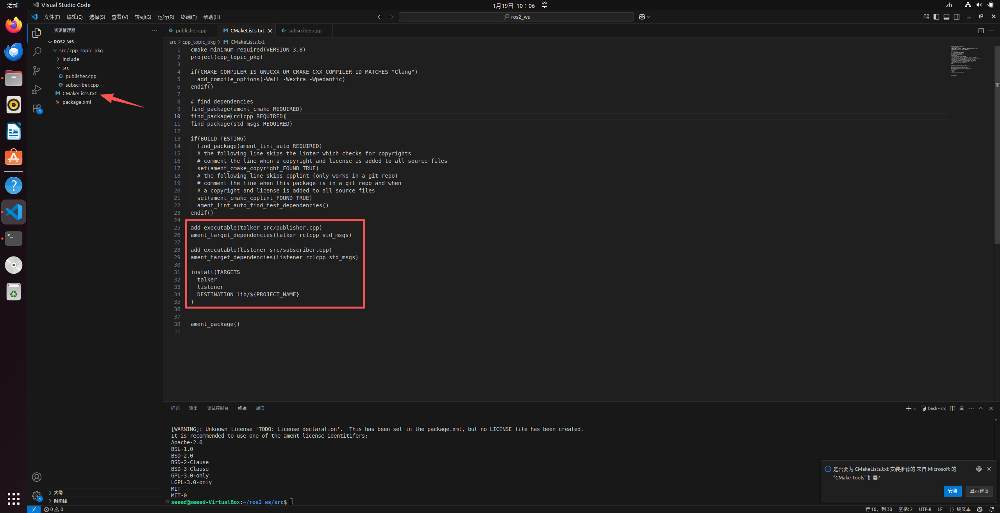
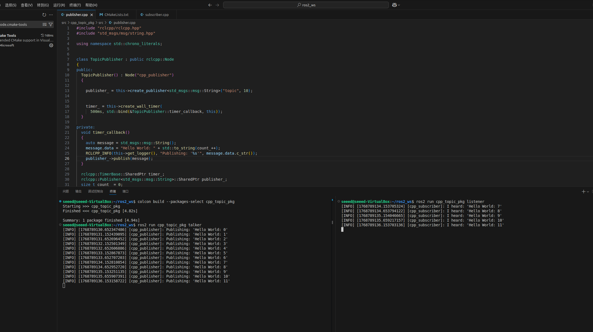
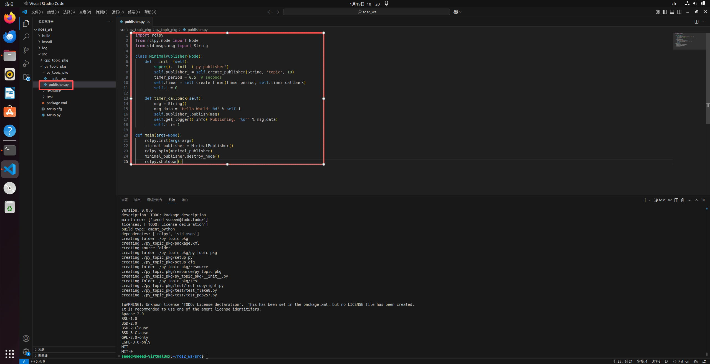
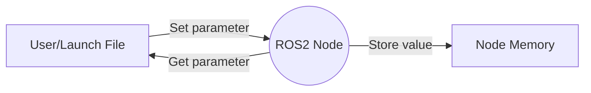

# 2. ROS 2 Communication Mechanisms

In ROS 2, communication between nodes is still based on three pillars: **Topic**, **Service**, and **Parameters**. However, in the underlying implementation, ROS 2 removes the Master node and instead uses DDS-based middleware for decentralized automatic discovery and communication.

## 2.1 Topic Communication

### Introduction to Topic Communication

Topic communication is a way for nodes to exchange data through a **Publish/Subscribe** model. It is suitable for continuous data streams (such as sensor data, robot status).

*   **DDS Automatic Discovery**: In ROS 2, publishers and subscribers can automatically discover each other as long as they are on the same network (same Domain ID), without the need for a Master node.
*   **Communication Model**:
    *   **Publisher**: Sends messages.
    *   **Subscriber**: Receives messages.

<p align="center">
  <a>
  
  </a>
</p>

---

### Hands-on Practice: Topic Communication (C++)

**Goal**: Create a C++ Publisher (sending "Hello World" + count) and a Subscriber.

#### 1. Create a Package
```bash
cd ~/ros2_ws/src
ros2 pkg create --build-type ament_cmake cpp_topic_pkg --dependencies rclcpp std_msgs
```

#### 2. Write the Publisher
Create `src/cpp_topic_pkg/src/publisher.cpp`:

```cpp
#include "rclcpp/rclcpp.hpp"
#include "std_msgs/msg/string.hpp"

using namespace std::chrono_literals;

// Inherit from rclcpp::Node
class TopicPublisher : public rclcpp::Node
{
public:
  TopicPublisher() : Node("cpp_publisher")
  {
    // Create publisher: topic name "topic", queue size 10
    publisher_ = this->create_publisher<std_msgs::msg::String>("topic", 10);
    
    // Create timer: trigger callback every 500ms
    timer_ = this->create_wall_timer(
      500ms, std::bind(&TopicPublisher::timer_callback, this));
  }

private:
  void timer_callback()
  {
    auto message = std_msgs::msg::String();
    message.data = "Hello World: " + std::to_string(count_++);
    RCLCPP_INFO(this->get_logger(), "Publishing: '%s'", message.data.c_str());
    publisher_->publish(message);
  }

  rclcpp::TimerBase::SharedPtr timer_;
  rclcpp::Publisher<std_msgs::msg::String>::SharedPtr publisher_;
  size_t count_ = 0;
};

int main(int argc, char * argv[])
{
  rclcpp::init(argc, argv);
  rclcpp::spin(std::make_shared<TopicPublisher>());
  rclcpp::shutdown();
  return 0;
}
```

<p align="center">
  <a>
    
  </a>
</p>


#### 3. Write the Subscriber
Create `src/cpp_topic_pkg/src/subscriber.cpp`:

```cpp
#include "rclcpp/rclcpp.hpp"
#include "std_msgs/msg/string.hpp"

using std::placeholders::_1;

class TopicSubscriber : public rclcpp::Node
{
public:
  TopicSubscriber() : Node("cpp_subscriber")
  {
    // Create subscriber
    subscription_ = this->create_subscription<std_msgs::msg::String>(
      "topic", 10, std::bind(&TopicSubscriber::topic_callback, this, _1));
  }

private:
  void topic_callback(const std_msgs::msg::String & msg) const
  {
    RCLCPP_INFO(this->get_logger(), "I heard: '%s'", msg.data.c_str());
  }
  rclcpp::Subscription<std_msgs::msg::String>::SharedPtr subscription_;
};

int main(int argc, char * argv[])
{
  rclcpp::init(argc, argv);
  rclcpp::spin(std::make_shared<TopicSubscriber>());
  rclcpp::shutdown();
  return 0;
}
```

<p align="center">
  <a>
    
  </a>
</p>

#### 4. Configure CMakeLists.txt
Add dependencies before `add_executable`, and add installation rules at the end of the file:

```cmake
add_executable(talker src/publisher.cpp)
ament_target_dependencies(talker rclcpp std_msgs)

add_executable(listener src/subscriber.cpp)
ament_target_dependencies(listener rclcpp std_msgs)

install(TARGETS
  talker
  listener
  DESTINATION lib/${PROJECT_NAME}
)
```

<p align="center">
  <a>
    
  </a>
</p>


#### 5. Build and Run Test

After coding and configuration, we need to build the workspace and run the nodes to verify the communication.

**1. Build Workspace**
Return to the workspace root directory. To speed up, we use the `--packages-select` parameter to compile only the current package:

```bash
cd ~/ros2_ws
colcon build --packages-select cpp_topic_pkg
```

**2. Run Publisher (Talker)**
Open the first terminal, source the environment, and start the publisher node:
```bash
# Be sure to source the environment first
source install/setup.bash
# Syntax: ros2 run <package_name> <executable_name>
ros2 run cpp_topic_pkg talker
```
*Expected Output:* The terminal will print a log every 0.5 seconds:
`[INFO] [cpp_publisher]: Publishing: 'Hello World: 0'`
`[INFO] [cpp_publisher]: Publishing: 'Hello World: 1'`...

**3. Run Subscriber (Listener)**
Open the **second** terminal, source the environment (required for every new terminal), then start the subscriber:
```bash
cd ~/ros2_ws
source install/setup.bash
ros2 run cpp_topic_pkg listener
```
*Expected Output:* You will see the subscriber receiving messages from the publisher:
`[INFO] [cpp_subscriber]: I heard: 'Hello World: 0'`
`[INFO] [cpp_subscriber]: I heard: 'Hello World: 1'`...

<p align="center">
  <a>
    
  </a>
</p>

**4. Stop Running**
Press `Ctrl + C` in any terminal to stop the node.

---

### Hands-on Practice: Topic Communication (Python)

**Goal**: Implement the same functionality using Python.

#### 1. Create a Package
```bash
cd ~/ros2_ws/src
ros2 pkg create --build-type ament_python py_topic_pkg --dependencies rclpy std_msgs
```

#### 2. Write the Publisher
Create `src/py_topic_pkg/py_topic_pkg/publisher.py`:

```python
import rclpy
from rclpy.node import Node
from std_msgs.msg import String

class MinimalPublisher(Node):
    def __init__(self):
        super().__init__('py_publisher')
        self.publisher_ = self.create_publisher(String, 'topic', 10)
        timer_period = 0.5  # seconds
        self.timer = self.create_timer(timer_period, self.timer_callback)
        self.i = 0

    def timer_callback(self):
        msg = String()
        msg.data = 'Hello World: %d' % self.i
        self.publisher_.publish(msg)
        self.get_logger().info('Publishing: "%s"' % msg.data)
        self.i += 1

def main(args=None):
    rclpy.init(args=args)
    minimal_publisher = MinimalPublisher()
    rclpy.spin(minimal_publisher)
    minimal_publisher.destroy_node()
    rclpy.shutdown()
```

<p align="center">
  <a>
    
  </a>
</p>

#### 3. Write the Subscriber
Create `src/py_topic_pkg/py_topic_pkg/subscriber.py`:

```python
import rclpy
from rclpy.node import Node
from std_msgs.msg import String

class MinimalSubscriber(Node):
    def __init__(self):
        super().__init__('py_subscriber')
        self.subscription = self.create_subscription(
            String, 'topic', self.listener_callback, 10)

    def listener_callback(self, msg):
        self.get_logger().info('I heard: "%s"' % msg.data)

def main(args=None):
    rclpy.init(args=args)
    minimal_subscriber = MinimalSubscriber()
    rclpy.spin(minimal_subscriber)
    minimal_subscriber.destroy_node()
    rclpy.shutdown()
```


<p align="center">
  <a>
    
  </a>
</p>


#### 4. Configure setup.py
Register nodes in `entry_points`:

```python
    entry_points={
        'console_scripts': [
            'talker = py_topic_pkg.publisher:main',
            'listener = py_topic_pkg.subscriber:main',
        ],
    },
```

<p align="center">
  <a>
    
  </a>
</p>

---

### Build and Run
```bash
cd ~/ros2_ws
colcon build
source install/setup.bash
```

*   **Terminal 1 (C++ Pub):** `ros2 run cpp_topic_pkg talker`
*   **Terminal 2 (Python Sub):** `ros2 run py_topic_pkg listener`

<p align="center">
  <a>
    
  </a>
</p>


### Common ROS 2 Topic Commands

*   `ros2 topic list`: List all topics.
*   `ros2 topic info /topic`: View topic type and number of publishers/subscribers.
*   `ros2 topic echo /topic`: Print message content.
*   `ros2 topic hz /topic`: Check frequency.
*   `ros2 topic pub /topic std_msgs/String "data: 'Hello'"`: Publish a message manually.

----

## 2.2 Service Communication

### 1. Service Communication Principles

Service communication is a mechanism based on the **C/S (Client-Server)** model. Unlike the "broadcast-listen" mode of Topics, service communication is **bidirectional**.

*   **Server**: Provides specific service capabilities (e.g., calculating addition, switching a camera, saving a map). It waits passively for requests.
*   **Client**: Initiates a Request and waits for the server to return a Response after processing.

<p align="center">
  <a href="https://docs.ros.org/en/humble/Tutorials/Beginner-CLI-Tools/Understanding-ROS2-Services/Understanding-ROS2-Services.html">
    
  </a>
</p>

> **Analogy:** A Topic is like a "radio"; the station broadcasts, and it doesn't matter if you listen. A Service is like "ordering takeaway"; you (Client) place an order (Request), the restaurant (Server) cooks, and then delivers it to you (Response).

---

### 2. Prerequisites: Create a Custom Interface Package

In ROS 2, the best practice is to define custom messages (`.msg`) and services (`.srv`) in a separate package.

1.  **Create the interface package**:
    ```bash
    cd ~/ros2_ws/src
    ros2 pkg create --build-type ament_cmake tutorial_interfaces
    mkdir -p tutorial_interfaces/srv
    ```

2.  **Define the service file**:
    Create `tutorial_interfaces/srv/AddTwoInts.srv` with the following content:
    ```text
    int64 a
    int64 b
    ---
    int64 sum
    ```
    *(Note: The area above `---` is request data; below is response data)*

3.  **Modify `CMakeLists.txt`**:
    ```cmake
    find_package(rosidl_default_generators REQUIRED)
    rosidl_generate_interfaces(${PROJECT_NAME}
      "srv/AddTwoInts.srv"
    )
    ```

4.  **Modify `package.xml`**:
    ```xml
    <build_depend>rosidl_default_generators</build_depend>
    <exec_depend>rosidl_default_runtime</exec_depend>
    <member_of_group>rosidl_interface_packages</member_of_group>
    ```

5.  **Build the interface package** (**This step is crucial, otherwise subsequent code won't find the headers**):
    ```bash
    cd ~/ros2_ws
    colcon build --packages-select tutorial_interfaces
    source install/setup.bash
    ```

---

### 3. C++ Implementation of Service Communication

**Goal**: Create a server to calculate the sum of two numbers and a client to send requests.

#### Step 1: Create the Package
```bash
cd ~/ros2_ws/src
# Note that the dependencies include the tutorial_interfaces created earlier
ros2 pkg create --build-type ament_cmake cpp_service_pkg --dependencies rclcpp tutorial_interfaces
```

#### Step 2: Write the Server
Create `src/cpp_service_pkg/src/server.cpp`:
```cpp
#include "rclcpp/rclcpp.hpp"
#include "tutorial_interfaces/srv/add_two_ints.hpp"

using std::placeholders::_1;
using std::placeholders::_2;

// Callback function: process request and assign value to response
void add(const std::shared_ptr<tutorial_interfaces::srv::AddTwoInts::Request> request,
         std::shared_ptr<tutorial_interfaces::srv::AddTwoInts::Response> response)
{
  response->sum = request->a + request->b;
  RCLCPP_INFO(rclcpp::get_logger("rclcpp"), "Incoming request: a=%ld, b=%ld", request->a, request->b);
  RCLCPP_INFO(rclcpp::get_logger("rclcpp"), "Sending back response: sum=%ld", response->sum);
}

int main(int argc, char **argv)
{
  rclcpp::init(argc, argv);
  std::shared_ptr<rclcpp::Node> node = rclcpp::Node::make_shared("add_two_ints_server");

  // Create service: named "add_two_ints"
  rclcpp::Service<tutorial_interfaces::srv::AddTwoInts>::SharedPtr service =
    node->create_service<tutorial_interfaces::srv::AddTwoInts>("add_two_ints", &add);

  RCLCPP_INFO(rclcpp::get_logger("rclcpp"), "Ready to add two ints.");
  
  rclcpp::spin(node);
  rclcpp::shutdown();
}
```

#### Step 3: Write the Client
**Important**: ROS 2 clients are strongly recommended to use **Asynchronous Calls** to prevent deadlocks.

Create `src/cpp_service_pkg/src/client.cpp`:
```cpp
#include "rclcpp/rclcpp.hpp"
#include "tutorial_interfaces/srv/add_two_ints.hpp"

using namespace std::chrono_literals;

int main(int argc, char **argv)
{
  rclcpp::init(argc, argv);

  if (argc != 3) {
      RCLCPP_INFO(rclcpp::get_logger("rclcpp"), "Usage: ros2 run cpp_service_pkg client X Y");
      return 1;
  }

  std::shared_ptr<rclcpp::Node> node = rclcpp::Node::make_shared("add_two_ints_client");
  
  // Create client
  rclcpp::Client<tutorial_interfaces::srv::AddTwoInts>::SharedPtr client =
    node->create_client<tutorial_interfaces::srv::AddTwoInts>("add_two_ints");

  // 1. Build request data
  auto request = std::make_shared<tutorial_interfaces::srv::AddTwoInts::Request>();
  request->a = atoll(argv[1]);
  request->b = atoll(argv[2]);

  // 2. Wait for service to be available
  while (!client->wait_for_service(1s)) {
    if (!rclcpp::ok()) {
      RCLCPP_ERROR(rclcpp::get_logger("rclcpp"), "Interrupted while waiting for the service. Exiting.");
      return 0;
    }
    RCLCPP_INFO(rclcpp::get_logger("rclcpp"), "service not available, waiting again...");
  }

  // 3. Send asynchronous request
  auto result_future = client->async_send_request(request);
  
  // 4. Wait for result (spin_until_future_complete)
  if (rclcpp::spin_until_future_complete(node, result_future) == rclcpp::FutureReturnCode::SUCCESS)
  {
    RCLCPP_INFO(rclcpp::get_logger("rclcpp"), "Sum: %ld", result_future.get()->sum);
  } else {
    RCLCPP_ERROR(rclcpp::get_logger("rclcpp"), "Failed to call service add_two_ints");
  }

  rclcpp::shutdown();
  return 0;
}
```

#### Step 4: Configure CMakeLists.txt
Open `src/cpp_service_pkg/CMakeLists.txt` and add the following after `find_package`:

```cmake
# Add server executable
add_executable(server src/server.cpp)
ament_target_dependencies(server rclcpp tutorial_interfaces)

# Add client executable
add_executable(client src/client.cpp)
ament_target_dependencies(client rclcpp tutorial_interfaces)

# Installation rules
install(TARGETS
  server
  client
  DESTINATION lib/${PROJECT_NAME}
)
```

#### Step 5: Build and Run
```bash
cd ~/ros2_ws
colcon build --packages-select cpp_service_pkg
```

*   **Terminal 1 (Server):**
    ```bash
    source install/setup.bash
    ros2 run cpp_service_pkg server
    ```
*   **Terminal 2 (Client):**
    ```bash
    source install/setup.bash
    # Request calculation for 2 + 3
    ros2 run cpp_service_pkg client 2 3
    ```

---

### 4. Python Implementation of Service Communication

#### Step 1: Create the Package
```bash
cd ~/ros2_ws/src
ros2 pkg create --build-type ament_python py_service_pkg --dependencies rclpy tutorial_interfaces
```

#### Step 2: Write the Server
Create `src/py_service_pkg/py_service_pkg/server.py`:
```python
import rclpy
from rclpy.node import Node
from tutorial_interfaces.srv import AddTwoInts

class MinimalService(Node):
    def __init__(self):
        super().__init__('minimal_service')
        self.srv = self.create_service(AddTwoInts, 'add_two_ints', self.add_two_ints_callback)
        self.get_logger().info("Server is ready.")

    def add_two_ints_callback(self, request, response):
        response.sum = request.a + request.b
        self.get_logger().info('Incoming request: a=%d b=%d' % (request.a, request.b))
        return response

def main():
    rclpy.init()
    service = MinimalService()
    try:
        rclpy.spin(service)
    except KeyboardInterrupt:
        pass
    rclpy.shutdown()
```

#### Step 3: Write the Client
Create `src/py_service_pkg/py_service_pkg/client.py`:
```python
import sys
import rclpy
from rclpy.node import Node
from tutorial_interfaces.srv import AddTwoInts

class MinimalClientAsync(Node):
    def __init__(self):
        super().__init__('minimal_client_async')
        self.cli = self.create_client(AddTwoInts, 'add_two_ints')
        while not self.cli.wait_for_service(timeout_sec=1.0):
            self.get_logger().info('service not available, waiting again...')
        self.req = AddTwoInts.Request()

    def send_request(self, a, b):
        self.req.a = a
        self.req.b = b
        self.future = self.cli.call_async(self.req)
        rclpy.spin_until_future_complete(self, self.future)
        return self.future.result()

def main():
    rclpy.init()
    client = MinimalClientAsync()
    
    # Get command line arguments
    if len(sys.argv) < 3:
        print("Usage: ros2 run py_service_pkg client X Y")
        return

    response = client.send_request(int(sys.argv[1]), int(sys.argv[2]))
    client.get_logger().info('Result: %d' % response.sum)
    client.destroy_node()
    rclpy.shutdown()
```

#### Step 4: Configure setup.py
Open `src/py_service_pkg/setup.py` and modify `entry_points`:

```python
    entry_points={
        'console_scripts': [
            'server = py_service_pkg.server:main',
            'client = py_service_pkg.client:main',
        ],
    },
```


#### Step 5: Build and Run

**1. Build Workspace**
Return to the workspace root and build the Python package:
```bash
cd ~/ros2_ws
colcon build --packages-select py_service_pkg
```

**2. Run Server**
Open **Terminal 1**, source the environment, and start the server node:
```bash
cd ~/ros2_ws
source install/setup.bash
ros2 run py_service_pkg server
```
*Expected Output:*
`[INFO] [minimal_service]: Server is ready.`

**3. Run Client**
Open **Terminal 2**, source the environment, and run the client node (requesting 2 + 3):
```bash
cd ~/ros2_ws
source install/setup.bash
# Syntax: ros2 run <package_name> <client_node> <arg1> <arg2>
ros2 run py_service_pkg client 2 3
```

*Expected Output (Terminal 2 - Client):*
`[INFO] [minimal_client_async]: Result: 5`

*Expected Output (Terminal 1 - Server):*
`[INFO] [minimal_service]: Incoming request: a=2 b=3`


---

## 2.3 Parameters

### 1. Parameter Communication Principles

In ROS 2, parameters are primarily used for **node configuration** (e.g., setting robot movement speed, camera resolution, serial port numbers, etc.).

**Core Difference**: ROS 1 had a global Parameter Server, whereas **ROS 2 parameters are stored locally within each node**.
*   Each node maintains its own parameters.
*   External tools access a node's parameters through service calls.



---

### 2. Hands-on Practice: Parameter Programming (Python)

**Goal**: Create a node containing a `my_str` parameter. We will dynamically modify this string via the command line while the node is running and observe the change in the node's behavior.

#### Step 1: Create the Package
```bash
cd ~/ros2_ws/src
ros2 pkg create --build-type ament_python py_param_pkg --dependencies rclpy
```

#### Step 2: Write Code
Create `src/py_param_pkg/py_param_pkg/param_node.py`:

```python
import rclpy
from rclpy.node import Node

class ParamNode(Node):
    def __init__(self):
        super().__init__('param_node')
        
        # 1. Declare parameters (must be declared before use)
        # Parameter name: 'my_str', default value: 'Hello World'
        self.declare_parameter('my_str', 'Hello World')
        self.declare_parameter('my_int', 10)

        # Create a timer to print the current parameter value every 1 second
        self.timer = self.create_timer(1.0, self.timer_callback)

    def timer_callback(self):
        # 2. Get the current value of the parameter
        my_str_param = self.get_parameter('my_str').get_parameter_value().string_value
        
        self.get_logger().info('Current parameter value: %s' % my_str_param)

def main():
    rclpy.init()
    node = ParamNode()
    try:
        rclpy.spin(node)
    except KeyboardInterrupt:
        pass
    rclpy.shutdown()
```

#### Step 3: Configure setup.py
Modify `src/py_param_pkg/setup.py`:

```python
    entry_points={
        'console_scripts': [
            'param_node = py_param_pkg.param_node:main',
        ],
    },
```

#### Step 4: Build and Run
```bash
cd ~/ros2_ws
colcon build --packages-select py_param_pkg
source install/setup.bash

# Run node
ros2 run py_param_pkg param_node
```

#### Step 5: Dynamic Parameter Verification
**Keep the above node running** and open a new terminal:

1.  **List Parameters**:
    ```bash
    ros2 param list
    ```
    You will see `my_str` and other parameters under `/param_node`.

2.  **Modify Parameter Dynamically**:
    ```bash
    ros2 param set /param_node my_str "Seeed Studio"
    ```

3.  **Observe the first terminal**:
    You will notice the log output changes immediately:
    `[INFO] [param_node]: Current parameter value: Seeed Studio`

This proves that we successfully configured the node dynamically during runtime.