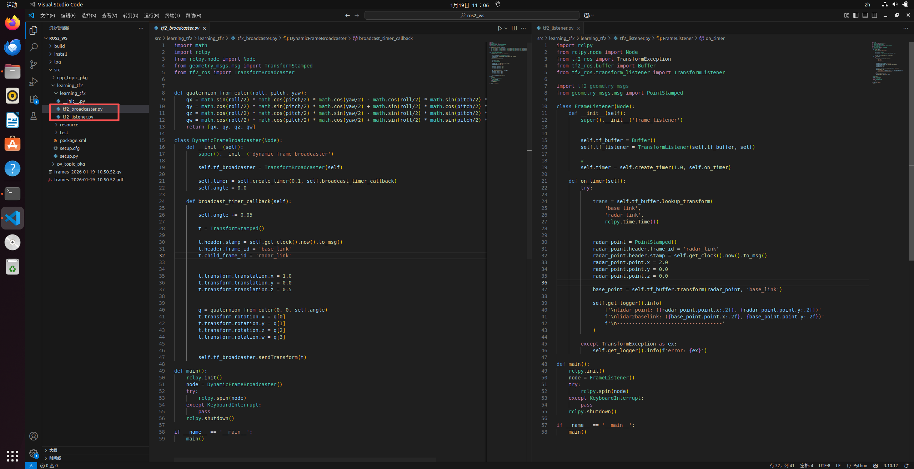
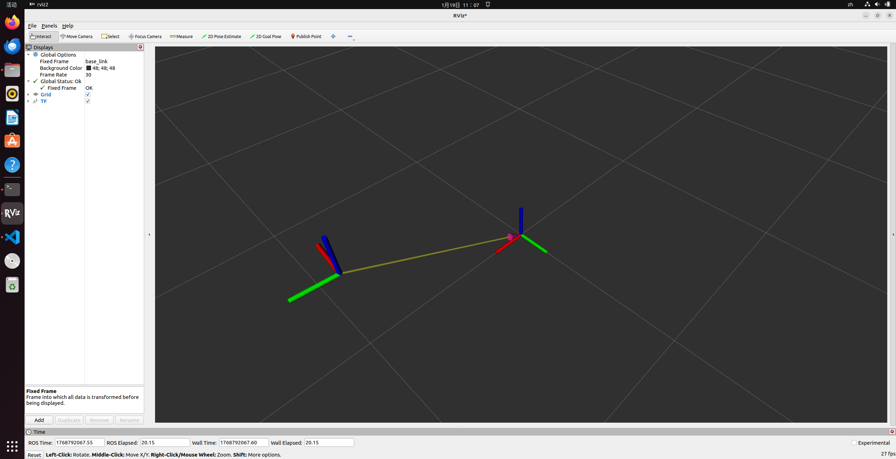

# 1.8 - ROS 2 TF2 Coordinate Transformation Tutorial

## 1. Introduction: Why do we need TF? (A Human Body Analogy)

**Concept:**
"Imagine your eyes see an apple one meter directly in front of you. How does your brain know how far your hand needs to reach to grab it?
1.  The eyes tell the brain: The apple is 1 meter in front of the **eyes**.
2.  The brain knows: The eyes are located on the **head**.
3.  The brain knows: The head is attached to the **body**.
4.  The brain knows: The arm is attached to the **body**.
Through this chain of 'connectivity relationships,' the brain can calculate the position of the 'hand' relative to the 'apple.'

The **TF2 (Transform Framework 2)** in ROS 2 acts as this 'brain.' It maintains the **relative positions** and **relative angles** between various parts of the robot and can perform mathematical conversions between any two coordinate frames."

## 2. Core Concepts: The TF Tree

**Key Knowledge Points:**
*   **Parent/Child Relationship:** TF is a tree structure; **closed loops are strictly forbidden**. Every frame can have only one parent, but it can have multiple children.
*   **Transform:** Includes **Translation (x/y/z)** and **Rotation (Quaternion)**. Essentially: how much the child frame moved and rotated relative to the parent.
*   **Timestamp:** Since the robot moves and coordinate relationships change, every piece of TF data includes a time. The TF2 library automatically handles time interpolation (e.g., "Where was the LiDAR 100 milliseconds ago?").

## 3. Standard ROS Coordinate Frames (REP-105)

<p align="center">
  <a>
    
  </a>
</p>

*   **`map` (Map Frame)**
    *   **Role:** The absolute center of the world, the "God's eye" view.
    *   **Features:** Used for navigation; it is a fixed, non-moving reference frame.
*   **`odom` (Odometry Frame)**
    *   **Role:** The path the robot *thinks* it has traveled.
    *   **Features:** It is continuous (smooth) but accumulates error over time (drift).
*   **`base_link` (Base Frame)**
    *   **Role:** The physical center of the robot (usually the center of the wheel axis).
    *   **Relationship:** The position of `base_link` within `odom` is the robot's **odometry-calculated position**.
*   **`laser_link` / `camera_link` (Sensor Frames)**
    *   **Role:** The mounting position of sensors.
    *   **Features:** Usually fixed relative to `base_link` (Static Transform).

## 4. Example: Projecting LiDAR Data

**Scenario:**
LiDAR (`laser_link`) detects an obstacle ahead. The data says: "Obstacle at x=2.0 meters."

**TF2 Workflow:**
1.  **LiDAR says:** I see something at (2, 0, 0) relative to me (`laser_link`).
2.  **TF2 Queries:** How far is `laser_link` from `base_link`? (Assume LiDAR is 0.5m in front of the center).
    *   Calculation: Obstacle is `2.0 + 0.5 = 2.5` meters from the robot center.
3.  **TF2 Queries:** Where is `base_link` in the `map` right now? (Assume robot is at (10, 10) on the map, facing East).
    *   Calculation: Obstacle is at `(12.5, 10)` on the map.

**Summary:** As long as the TF tree exists, TF2 handles all matrix multiplications and coordinate transformations for you.

## 5. Common Tools

In ROS 2, the TF utility packages are named `tf2_tools` and `tf2_ros`.

1.  **View Tree Structure (Generates a PDF):**
    ```bash
    ros2 run tf2_tools view_frames
    ```
    This generates a `frames.pdf` in the current directory, showing the connectivity of frames.

2.  **Monitor Transform Relationships in Real-time:**
    ```bash
    # Syntax: ros2 run tf2_ros tf2_echo [source_frame] [target_frame]
    ros2 run tf2_ros tf2_echo map base_link
    ```
    *This tells you the robot's current absolute coordinates.*

3.  **Visualizing in Rviz2:**
    *   Start Rviz2: `ros2 run rviz2 rviz2`
    *   Click **Add** (bottom left) -> Find **TF** and add it.
    *   Check `Show Names`.
    *   You will see Red/Green/Blue axes (RGB corresponds to XYZ), visually representing the TF relationships.

## 6. Hands-on Practice: Dynamic Coordinate Transformation

We will design a scenario:
1.  **`base_link`**: The robot base, stationary.
2.  **`radar_link`**: A radar mounted on the base, rotating continuously around the Z-axis.

### Preparation

Create a Python ROS 2 package:
```bash
cd ~/ros2_ws/src
# Note the dependencies
ros2 pkg create --build-type ament_python learning_tf2 --dependencies rclpy tf2_ros geometry_msgs turtlesim
```

---

### Step 1: The Broadcaster

**Task:** Tell ROS 2 where the `radar_link` is relative to the `base_link`.

Create `tf2_broadcaster.py` in the `~/ros2_ws/src/learning_tf2/learning_tf2/` directory.

```python
import math
import rclpy
from rclpy.node import Node
from geometry_msgs.msg import TransformStamped
from tf2_ros import TransformBroadcaster

# Helper function to convert Euler angles to Quaternions
def quaternion_from_euler(roll, pitch, yaw):
    qx = math.sin(roll/2) * math.cos(pitch/2) * math.cos(yaw/2) - math.cos(roll/2) * math.sin(pitch/2) * math.sin(yaw/2)
    qy = math.cos(roll/2) * math.sin(pitch/2) * math.cos(yaw/2) + math.sin(roll/2) * math.cos(pitch/2) * math.sin(yaw/2)
    qz = math.cos(roll/2) * math.cos(pitch/2) * math.sin(yaw/2) - math.sin(roll/2) * math.sin(pitch/2) * math.cos(yaw/2)
    qw = math.cos(roll/2) * math.cos(pitch/2) * math.cos(yaw/2) + math.sin(roll/2) * math.sin(pitch/2) * math.sin(yaw/2)
    return [qx, qy, qz, qw]

class DynamicFrameBroadcaster(Node):
    def __init__(self):
        super().__init__('dynamic_frame_broadcaster')
        
        # Create broadcaster
        self.tf_broadcaster = TransformBroadcaster(self)
        
        # Create timer, 10Hz (0.1s)
        self.timer = self.create_timer(0.1, self.broadcast_timer_callback)
        self.angle = 0.0

    def broadcast_timer_callback(self):
        # 1. Update angle
        self.angle += 0.05
        
        # 2. Create TF message
        t = TransformStamped()

        # Header info
        t.header.stamp = self.get_clock().now().to_msg()
        t.header.frame_id = 'base_link'    # Parent frame
        t.child_frame_id = 'radar_link'    # Child frame

        # Translation: Assume radar is 1.0m forward and 0.5m high
        t.transform.translation.x = 1.0
        t.transform.translation.y = 0.0
        t.transform.translation.z = 0.5

        # Rotation: Rotating around the Z-axis
        q = quaternion_from_euler(0, 0, self.angle)
        t.transform.rotation.x = q[0]
        t.transform.rotation.y = q[1]
        t.transform.rotation.z = q[2]
        t.transform.rotation.w = q[3]

        # 3. Publish
        self.tf_broadcaster.sendTransform(t)

def main():
    rclpy.init()
    node = DynamicFrameBroadcaster()
    try:
        rclpy.spin(node)
    except KeyboardInterrupt:
        pass
    rclpy.shutdown()

if __name__ == '__main__':
    main()
```

---

### Step 2: The Listener

**Task:** The radar detects an obstacle 2 meters ahead. What are the specific coordinates of this obstacle in the robot's base coordinate frame?

Create `tf2_listener.py` in the same directory:

```python
import rclpy
from rclpy.node import Node
from tf2_ros import TransformException
from tf2_ros.buffer import Buffer
from tf2_ros.transform_listener import TransformListener
# Note: tf2_geometry_msgs must be imported to support do_transform_point logic
import tf2_geometry_msgs 
from geometry_msgs.msg import PointStamped

class FrameListener(Node):
    def __init__(self):
        super().__init__('frame_listener')

        # 1. Create Buffer and Listener
        self.tf_buffer = Buffer()
        self.tf_listener = TransformListener(self.tf_buffer, self)

        # Create timer, 1Hz
        self.timer = self.create_timer(1.0, self.on_timer)

    def on_timer(self):
        try:
            # 2. Look up transform (base_link -> radar_link)
            # Meaning: How to convert data from radar_link to base_link
            # Args: Target frame, source frame, time
            trans = self.tf_buffer.lookup_transform(
                'base_link',
                'radar_link',
                rclpy.time.Time())

            # 3. Define a virtual obstacle point (2 meters directly in front of the radar)
            radar_point = PointStamped()
            radar_point.header.frame_id = 'radar_link'
            radar_point.header.stamp = rclpy.time.Time().to_msg()
            radar_point.point.x = 2.0
            radar_point.point.y = 0.0
            radar_point.point.z = 0.0

            # 4. Perform coordinate transformation
            # Use buffer's transform method to convert the message directly
            base_point = self.tf_buffer.transform(radar_point, 'base_link')

            self.get_logger().info(
                f'\nRadar sees point: ({radar_point.point.x:.2f}, {radar_point.point.y:.2f})'
                f'\nBase calculated point: ({base_point.point.x:.2f}, {base_point.point.y:.2f})'
                f'\n-----------------------------------'
            )

        except TransformException as ex:
            self.get_logger().info(f'Could not get transform: {ex}')

def main():
    rclpy.init()
    node = FrameListener()
    try:
        rclpy.spin(node)
    except KeyboardInterrupt:
        pass
    rclpy.shutdown()

if __name__ == '__main__':
    main()
```

<p align="center">
  <a>
    
  </a>
</p>

---

### Step 3: Configure setup.py

For ROS 2 Python packages, nodes must be registered in the `entry_points` of `setup.py`.
Open `~/ros2_ws/src/learning_tf2/setup.py`:

```python
    entry_points={
        'console_scripts': [
            'broadcaster = learning_tf2.tf2_broadcaster:main',
            'listener = learning_tf2.tf2_listener:main',
        ],
    },
```

<p align="center">
  <a>
    
  </a>
</p>

---

### Step 4: Build and Run

1.  **Build the workspace:**
    ```bash
    cd ~/ros2_ws
    colcon build --packages-select learning_tf2
    source install/setup.bash
    ```

2.  **Start the Broadcaster:**
    ```bash
    ros2 run learning_tf2 broadcaster
    ```

3.  **Launch Rviz2 to view (Visualizer):**
    Open a new terminal:
    ```bash
    ros2 run rviz2 rviz2
    ```
    *   Set **Fixed Frame** = `base_link`
    *   **Add** -> **TF**
    *   You will see `radar_link` rotating around `base_link`.

<p align="center">
  <a>
    
  </a>
</p>

4.  **Start the Listener:**
    Open a new terminal:
    ```bash
    source install/setup.bash
    ros2 run learning_tf2 listener
    ```

**Expected Output:**
```text
[INFO] [frame_listener]: 
Radar sees point: (2.00, 0.00)
Base calculated point: (2.99, 0.15)
-----------------------------------
[INFO] [frame_listener]: 
Radar sees point: (2.00, 0.00)
Base calculated point: (2.87, 0.48)
```
You will notice that while the point the radar sees is always (2, 0), its position in the robot's base coordinate frame changes as the radar rotates.

---

## 7. Static Coordinate Transformations (Static TF)

Many times, sensors are fixed onto the robot (e.g., the position of a camera relative to the chassis never changes). In this case, there's no need to write code to broadcast constantly; you can use the **Static Transform Publisher**.

**CLI Command:**
```bash
# Syntax: ros2 run tf2_ros static_transform_publisher x y z yaw pitch roll parent_frame child_frame
# Example: Mounting a camera_link 0.5m above base_link
ros2 run tf2_ros static_transform_publisher 0 0 0.5 0 0 0 base_link camera_link
```

**Launch File Usage (Recommended):**
```python
from launch import LaunchDescription
from launch_ros.actions import Node

def generate_launch_description():
    return LaunchDescription([
        Node(
            package='tf2_ros',
            executable='static_transform_publisher',
            arguments = ['0', '0', '0.5', '0', '0', '0', 'base_link', 'camera_link']
        ),
    ])
```